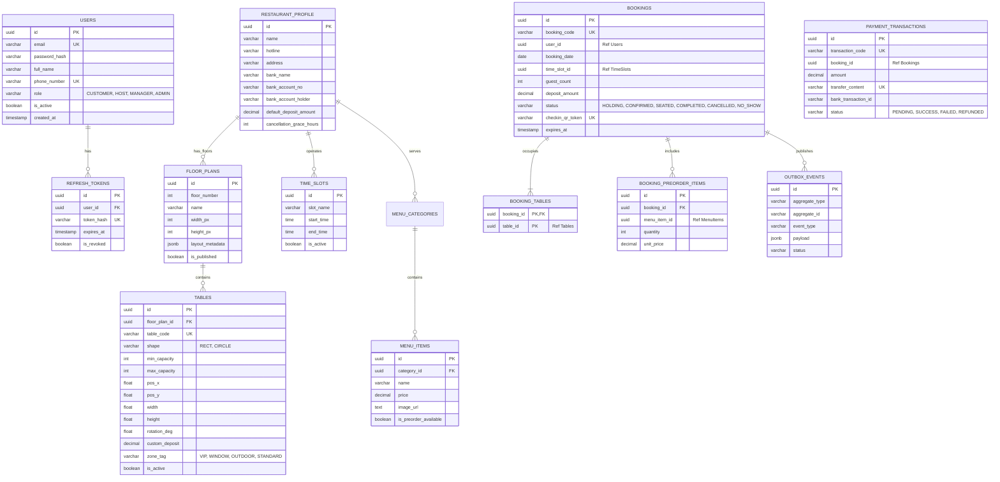

# TÀI LIỆU THIẾT KẾ CƠ SỞ DỮ LIỆU CHUYÊN BIỆT (DATABASE ARCHITECTURE SPECIFICATION)
# HỆ THỐNG: TABLEMASTER – NỀN TẢNG ĐẶT BÀN & ĐIỀU PHỐI MẶT BẰNG 2D THỜI GIAN THỰC
## (DỰ ÁN OUTSOURCE GIA CÔNG ĐỘC QUYỀN CHO NHÀ HÀNG CAO CẤP)

> **Mô hình triển khai:** Single-Tenant (Phần mềm đóng gói / Outsource chuyên biệt cho 01 thương hiệu Nhà hàng cụ thể).  
> **Hệ quản trị CSDL:** PostgreSQL 16+ (Database-per-Service + JSONB), Redis Cluster 7.2 (In-memory Cache & Redlock).  
> **Đặc thù nghiệp vụ:** Quản lý đa tầng (Tầng trệt, Phòng VIP, Rooftop ngoài trời), hỗ trợ đặt trước món ăn (Pre-order menu), thanh toán cọc VietQR trực tiếp về tài khoản chủ quán, đồng bộ màn hình Tablet Lễ tân sàn theo thời gian thực.

---

## MỤC LỤC
1. [BỐI CẢNH DỰ ÁN & ĐỊNH HƯỚNG SINGLE-TENANT OUTSOURCE](#1-bối-cảnh-dự-án--định-hướng-single-tenant-outsource)
2. [SƠ ĐỒ THỰC THỂ QUAN HỆ TỔNG THỂ (MERMAID ERD)](#2-sơ-đồ-thực-thể-quan-hệ-tổng-thể-mermaid-erd)
3. [ĐẶC TẢ CHI TIẾT CÁC CSDL MICROSERVICE (POSTGRESQL SCHEMAS)](#3-đặc-tả-chi-tiết-các-csdl-microservice-postgresql-schemas)
   * [3.1. Database: tablemaster_auth (Tài khoản & Phân quyền nội bộ)](#31-database-tablemaster_auth-tài-khoản--phân-quyền-nội-bộ)
   * [3.2. Database: tablemaster_restaurant (Hồ sơ quán, Đa tầng, Bàn ăn, Menu & Ca giờ)](#32-database-tablemaster_restaurant-hồ-sơ-quán-đa-tầng-bàn-ăn-menu--ca-giờ)
   * [3.3. Database: tablemaster_booking (Đơn đặt bàn, Ghép bàn & Transactional Outbox)](#33-database-tablemaster_booking-đơn-đặt-bàn-ghép-bàn--transactional-outbox)
   * [3.4. Database: tablemaster_payment (Giao dịch VietQR & Webhook trực tiếp)](#34-database-tablemaster_payment-giao-dịch-vietqr--webhook-trực-tiếp)
   * [3.5. Database: tablemaster_analytics (Báo cáo doanh thu, RevPASH & Khách VIP)](#35-database-tablemaster_analytics-báo-cáo-doanh-thu-revpash--khách-vip)
4. [ĐẶC TẢ CẤU TRÚC JSONB MẶT BẰNG 2D (FLOOR PLAN METADATA)](#4-đặc-tả-cấu-trúc-jsonb-mặt-bằng-2d-floor-plan-metadata)
5. [THIẾT KẾ CẤU TRÚC DỮ LIỆU REDIS (IN-MEMORY DATA STRUCTURES)](#5-thiết-kế-cấu-trúc-dữ-liệu-redis-in-memory-data-structures)
6. [TỐI ƯU HIỆU NĂNG TRUY VẤN BÀN TRỐNG (INDEXING STRATEGY)](#6-tối-ưu-hiệu-năng-truy-vấn-bàn-trống-indexing-strategy)
7. [SCRIPT KHỞI TẠO TỰ ĐỘNG DOCKER COMPOSE](#7-script-khởi-tạo-tự-động-docker-compose)

---

## 1. BỐI CẢNH DỰ ÁN & ĐỊNH HƯỚNG SINGLE-TENANT OUTSOURCE

Dự án này là sản phẩm **gia công phần mềm trọn gói (Outsource / Bespoke Development)** theo đơn đặt hàng độc quyền của một thương hiệu nhà hàng cao cấp (Ví dụ: *The Prime Bistro & Steakhouse*).

### So sánh Sự khác biệt với Mô hình SaaS đại trà:
| Tiêu chí | Mô hình SaaS đại trà (PasGo, TableNow) | Mô hình Outsource Độc quyền của TableMaster |
| :--- | :--- | :--- |
| **Đối tượng sử dụng** | Hàng ngàn nhà hàng cùng chia sẻ 1 hệ thống | **Chỉ phục vụ duy nhất 01 nhà hàng đặt hàng** |
| **Nhận diện thương hiệu** | Bị loãng trong danh sách tìm kiếm chung | **100% Brand Identity riêng** (Logo, Màu sắc, Tên miền riêng) |
| **Dòng tiền tiền cọc** | Về ví trung gian của sàn, đối soát cuối tháng | **Chuyển thẳng vào tài khoản ngân hàng của Nhà hàng** |
| **Chi phí vận hành** | Nhà hàng mất 10% - 15% hoa hồng trên mỗi khách | **Không mất phí hoa hồng**; chỉ trả phí hạ tầng server |
| **Độ phức tạp Database** | Phải kèm `restaurant_id` ở mọi bảng (Multi-tenant) | **Tinh gọn, tập trung sâu vào nghiệp vụ Đa tầng, Menu & Sàn** |

---

## 2. SƠ ĐỒ THỰC THỂ QUAN HỆ TỔNG THỂ (MERMAID ERD)



---

## 3. ĐẶC TẢ CHI TIẾT CÁC CSDL MICROSERVICE (POSTGRESQL SCHEMAS)

---

### 3.1. Database: `tablemaster_auth` (Tài khoản & Phân quyền nội bộ)

Quản lý thực khách thành viên, lễ tân tại sảnh (Host), quản lý ca trực (Manager) và chủ nhà hàng (Admin).

```sql
\c tablemaster_auth;

CREATE EXTENSION IF NOT EXISTS "uuid-ossp";

-- 1. BẢNG NGƯỜI DÙNG & NHÂN VIÊN
CREATE TABLE users (
    id UUID PRIMARY KEY DEFAULT uuid_generate_v4(),
    email VARCHAR(120) UNIQUE NOT NULL,
    password_hash VARCHAR(255) NOT NULL,
    full_name VARCHAR(100) NOT NULL,
    phone_number VARCHAR(20) UNIQUE NOT NULL,
    role VARCHAR(30) NOT NULL DEFAULT 'ROLE_CUSTOMER', 
    -- Phân quyền nội bộ:
    -- 'ROLE_CUSTOMER': Thực khách xem sơ đồ, cọc bàn, nhận vé QR.
    -- 'ROLE_HOST'    : Lễ tân cầm Tablet quét QR, xếp khách vãng lai, chuyển bàn, thanh toán.
    -- 'ROLE_WAITER'  : Nhân viên phục vụ dùng Mobile App: Gọi món tại bàn, nhập món riêng, chuyển/ghép bàn.
    -- 'ROLE_MANAGER' : Quản lý ca điều phối sơ đồ, xử lý hoàn hủy tiền cọc.
    -- 'ROLE_ADMIN'   : Chủ nhà hàng cấu hình sơ đồ tầng, xem báo cáo doanh thu.
    is_active BOOLEAN NOT NULL DEFAULT TRUE,
    loyalty_points INT DEFAULT 0, -- Tích điểm thành viên thân thiết cho nhà hàng
    avatar_url TEXT,
    created_at TIMESTAMP WITH TIME ZONE DEFAULT CURRENT_TIMESTAMP,
    updated_at TIMESTAMP WITH TIME ZONE DEFAULT CURRENT_TIMESTAMP
);

-- 2. BẢNG REFRESH TOKENS (Quản lý phiên đăng nhập thiết bị)
CREATE TABLE refresh_tokens (
    id UUID PRIMARY KEY DEFAULT uuid_generate_v4(),
    user_id UUID NOT NULL REFERENCES users(id) ON DELETE CASCADE,
    token_hash VARCHAR(255) UNIQUE NOT NULL,
    device_info VARCHAR(255),
    expires_at TIMESTAMP WITH TIME ZONE NOT NULL,
    is_revoked BOOLEAN NOT NULL DEFAULT FALSE,
    created_at TIMESTAMP WITH TIME ZONE DEFAULT CURRENT_TIMESTAMP
);

CREATE INDEX idx_users_email ON users(email);
CREATE INDEX idx_users_phone ON users(phone_number);
CREATE INDEX idx_refresh_tokens_user ON refresh_tokens(user_id, is_revoked);
```

---

### 3.2. Database: `tablemaster_restaurant` (Hồ sơ quán, Đa tầng, Bàn ăn, Menu & Ca giờ)

Lưu trữ thông tin chuyên biệt của nhà hàng: cài đặt tài khoản ngân hàng nhận tiền cọc, sơ đồ các tầng lầu (Tầng 1, Phòng VIP, Rooftop), danh sách bàn vật lý và menu món đặt trước.

```sql
\c tablemaster_restaurant;

CREATE EXTENSION IF NOT EXISTS "uuid-ossp";

-- 1. BẢNG HỒ SƠ & THIẾT LẬP NHÀ HÀNG (Duy nhất 1 bản ghi cấu hình)
CREATE TABLE restaurant_profile (
    id UUID PRIMARY KEY DEFAULT uuid_generate_v4(),
    name VARCHAR(150) NOT NULL DEFAULT 'The Prime Bistro & Steakhouse',
    hotline VARCHAR(20) NOT NULL DEFAULT '0901234567',
    address TEXT NOT NULL DEFAULT '123 Nguyễn Huệ, Phường Bến Nghé, Quận 1, TP. Hồ Chí Minh',
    cover_image_url TEXT,
    -- Thiết lập Tài khoản Ngân hàng nhận tiền cọc VietQR trực tiếp
    bank_bin VARCHAR(10) NOT NULL DEFAULT '970422', -- Mã định danh ngân hàng (vd: MBBank 970422)
    bank_name VARCHAR(50) NOT NULL DEFAULT 'MBBank (Ngân hàng Quân Đội)',
    bank_account_no VARCHAR(30) NOT NULL DEFAULT '0388999999',
    bank_account_holder VARCHAR(100) NOT NULL DEFAULT 'CONG TY TNHH THE PRIME BISTRO',
    -- Chính sách cọc & hoàn hủy của nhà hàng
    default_deposit_amount DECIMAL(12, 2) NOT NULL DEFAULT 200000.00,
    cancellation_grace_hours INT NOT NULL DEFAULT 6, -- Hủy trước 6 tiếng mới hoàn 100%
    hold_timeout_seconds INT NOT NULL DEFAULT 300,    -- Thời gian giữ bàn tạm (5 phút)
    updated_at TIMESTAMP WITH TIME ZONE DEFAULT CURRENT_TIMESTAMP
);

-- 2. BẢNG KHUNG GIỜ / CA PHỤC VỤ TRONG NGÀY (TIME SLOTS)
CREATE TABLE time_slots (
    id UUID PRIMARY KEY DEFAULT uuid_generate_v4(),
    slot_name VARCHAR(60) NOT NULL, -- "Ca trưa 1 (11:00 - 13:00)", "Ca tối Giờ Vàng (18:30 - 20:30)"
    start_time TIME NOT NULL,
    end_time TIME NOT NULL,
    is_active BOOLEAN NOT NULL DEFAULT TRUE,
    created_at TIMESTAMP WITH TIME ZONE DEFAULT CURRENT_TIMESTAMP,
    CONSTRAINT uq_slot_time UNIQUE (start_time, end_time)
);

-- 3. BẢNG SƠ ĐỒ CÁC TẦNG LẦU CỦA NHÀ HÀNG (FLOOR PLANS)
CREATE TABLE floor_plans (
    id UUID PRIMARY KEY DEFAULT uuid_generate_v4(),
    floor_number INT UNIQUE NOT NULL, -- 1: Tầng trệt, 2: Tầng lửng VIP, 3: Rooftop ngoài trời
    name VARCHAR(100) NOT NULL,       -- "Tầng 1 - Sảnh Vòm Cổ Điển", "Tầng 3 - Sky Lounge"
    width_px INT NOT NULL DEFAULT 1600,
    height_px INT NOT NULL DEFAULT 900,
    grid_size INT NOT NULL DEFAULT 20,
    layout_metadata JSONB NOT NULL DEFAULT '{"walls":[], "windows":[], "doors":[], "facilities":[]}'::jsonb,
    is_published BOOLEAN NOT NULL DEFAULT TRUE,
    updated_at TIMESTAMP WITH TIME ZONE DEFAULT CURRENT_TIMESTAMP
);

-- 4. BẢNG BÀN ĂN VẬT LÝ THEO TỪNG TẦNG (TABLES)
CREATE TABLE tables (
    id UUID PRIMARY KEY DEFAULT uuid_generate_v4(),
    floor_plan_id UUID NOT NULL REFERENCES floor_plans(id) ON DELETE CASCADE,
    table_code VARCHAR(30) UNIQUE NOT NULL, -- Mã bàn duy nhất của quán: "T-01", "VIP-01", "ROOF-05"
    shape VARCHAR(20) NOT NULL DEFAULT 'RECT', -- 'RECT' (Chữ nhật/Vuông), 'CIRCLE' (Tròn)
    min_capacity INT NOT NULL DEFAULT 2,
    max_capacity INT NOT NULL DEFAULT 4,
    pos_x FLOAT NOT NULL DEFAULT 100.0,
    pos_y FLOAT NOT NULL DEFAULT 100.0,
    width FLOAT NOT NULL DEFAULT 80.0,
    height FLOAT NOT NULL DEFAULT 80.0,
    rotation_deg FLOAT NOT NULL DEFAULT 0.0,
    custom_deposit DECIMAL(12, 2), -- Tiền cọc riêng cho bàn đắc địa (nếu NULL sẽ lấy mặc định của quán)
    zone_tag VARCHAR(50) DEFAULT 'STANDARD', -- 'WINDOW_VIEW', 'PRIVATE_VIP', 'OUTDOOR_BALCONY', 'STANDARD'
    is_active BOOLEAN NOT NULL DEFAULT TRUE,
    updated_at TIMESTAMP WITH TIME ZONE DEFAULT CURRENT_TIMESTAMP
);

-- 5. BẢNG DANH MỤC & MÓN ĂN ĐẶT TRƯỚC (PRE-ORDER MENU)
CREATE TABLE menu_categories (
    id UUID PRIMARY KEY DEFAULT uuid_generate_v4(),
    name VARCHAR(100) NOT NULL, -- "Steak & Bò Mỹ", "Rượu Vang", "Set Sinh Nhật"
    display_order INT DEFAULT 0
);

CREATE TABLE menu_items (
    id UUID PRIMARY KEY DEFAULT uuid_generate_v4(),
    category_id UUID NOT NULL REFERENCES menu_categories(id) ON DELETE CASCADE,
    name VARCHAR(150) NOT NULL,
    description TEXT,
    price DECIMAL(12, 2) NOT NULL,
    image_url TEXT,
    is_preorder_available BOOLEAN DEFAULT TRUE, -- Món cho phép khách cọc trước để nhà hàng chuẩn bị
    is_active BOOLEAN DEFAULT TRUE
);

-- CHỈ MỤC
CREATE INDEX idx_tables_floor_zone ON tables(floor_plan_id, zone_tag, is_active);
CREATE INDEX idx_floor_layout_gin ON floor_plans USING GIN (layout_metadata);
```

---

### 3.3. Database: `tablemaster_booking` (Đơn đặt bàn, Ghép bàn & Transactional Outbox)

```sql
\c tablemaster_booking;

CREATE EXTENSION IF NOT EXISTS "uuid-ossp";

-- 1. BẢNG ĐƠN ĐẶT BÀN CHÍNH (BOOKINGS)
CREATE TABLE bookings (
    id UUID PRIMARY KEY DEFAULT uuid_generate_v4(),
    booking_code VARCHAR(20) UNIQUE NOT NULL, -- Mã hiển thị cho khách: "PB-20261024-001"
    user_id UUID NOT NULL,                   -- Ref tablemaster_auth.users(id)
    booking_date DATE NOT NULL,
    time_slot_id UUID NOT NULL,              -- Ref tablemaster_restaurant.time_slots(id)
    guest_count INT NOT NULL CHECK (guest_count > 0),
    total_deposit DECIMAL(12, 2) NOT NULL DEFAULT 0.00,
    status VARCHAR(30) NOT NULL DEFAULT 'HOLDING',
    -- 'HOLDING'   : Đang khóa bàn 5 phút chờ cọc
    -- 'CONFIRMED' : Đã cọc thành công, có vé QR
    -- 'SEATED'    : Lễ tân đã quét QR cho khách vào bàn
    -- 'COMPLETED' : Khách đã dùng bữa xong và thanh toán bill
    -- 'CANCELLED' : Hủy trước giờ quy định (có thể được hoàn cọc)
    -- 'NO_SHOW'   : Quá 15 phút không đến, tịch thu cọc
    special_notes TEXT,                      -- Ghi chú tiệc: "Setup nến sinh nhật góc cửa sổ", "Tiếp đối tác"
    checkin_qr_token VARCHAR(255) UNIQUE,     -- Mã Token bảo mật sinh mã QR Check-in
    expires_at TIMESTAMP WITH TIME ZONE NOT NULL, -- Mốc hết hạn 5 phút cho HOLDING
    seated_at TIMESTAMP WITH TIME ZONE,
    completed_at TIMESTAMP WITH TIME ZONE,
    created_at TIMESTAMP WITH TIME ZONE DEFAULT CURRENT_TIMESTAMP,
    updated_at TIMESTAMP WITH TIME ZONE DEFAULT CURRENT_TIMESTAMP
);

-- 2. BẢNG LIÊN KẾT ĐẶT BÀN - BÀN ĂN (Hỗ trợ chọn 1 bàn hoặc GỢI Ý GHÉP NHIỀU BÀN)
CREATE TABLE booking_tables (
    booking_id UUID NOT NULL REFERENCES bookings(id) ON DELETE CASCADE,
    table_id UUID NOT NULL, -- Ref tablemaster_restaurant.tables(id)
    PRIMARY KEY (booking_id, table_id)
);

-- 3. BẢNG MÓN ĂN ĐẶT TRƯỚC THEO ĐƠN (PRE-ORDER ITEMS)
CREATE TABLE booking_preorder_items (
    id UUID PRIMARY KEY DEFAULT uuid_generate_v4(),
    booking_id UUID NOT NULL REFERENCES bookings(id) ON DELETE CASCADE,
    menu_item_id UUID NOT NULL, -- Ref tablemaster_restaurant.menu_items(id)
    quantity INT NOT NULL CHECK (quantity > 0),
    unit_price DECIMAL(12, 2) NOT NULL,
    subtotal DECIMAL(12, 2) NOT NULL
);

-- 4. BẢNG MÓN GỌI THÊM TẠI BÀN & MÓN NHẬP RIÊNG (TABLE ORDER ITEMS)
CREATE TABLE table_order_items (
    id UUID PRIMARY KEY DEFAULT uuid_generate_v4(),
    booking_id UUID NOT NULL REFERENCES bookings(id) ON DELETE CASCADE,
    table_id UUID NOT NULL,      -- Ref tablemaster_restaurant.tables(id)
    menu_item_id UUID,          -- Ref menu_items (NULL nếu là món nhập ngoài menu)
    item_name VARCHAR(150) NOT NULL,
    quantity INT NOT NULL CHECK (quantity > 0),
    unit_price DECIMAL(12, 2) NOT NULL,
    status VARCHAR(30) NOT NULL DEFAULT 'PREPARING', -- 'PREPARING', 'SERVED', 'CANCELLED'
    category VARCHAR(80) DEFAULT 'Món Gọi Thêm',
    notes TEXT,                 -- Ghi chú chế biến bếp (Medium rare, ít đá...)
    is_custom_item BOOLEAN NOT NULL DEFAULT FALSE,
    ordered_by_user_id UUID,    -- Ref tablemaster_auth.users(id) (Nhân viên phục vụ)
    created_at TIMESTAMP WITH TIME ZONE DEFAULT CURRENT_TIMESTAMP
);

-- 5. BẢNG LỊCH SỬ CHUYỂN BÀN & GHÉP BÀN (TABLE OPERATIONS AUDIT)
CREATE TABLE table_operations_audit (
    id UUID PRIMARY KEY DEFAULT uuid_generate_v4(),
    operation_type VARCHAR(30) NOT NULL, -- 'TRANSFER' (Chuyển bàn), 'MERGE' (Ghép bàn)
    booking_id UUID NOT NULL REFERENCES bookings(id) ON DELETE CASCADE,
    source_table_id UUID NOT NULL,
    target_table_id UUID NOT NULL,
    performed_by UUID NOT NULL,          -- Ref tablemaster_auth.users(id) (Lễ tân / Phục vụ)
    reason TEXT,
    created_at TIMESTAMP WITH TIME ZONE DEFAULT CURRENT_TIMESTAMP
);

-- 6. BẢNG TRANSACTIONAL OUTBOX (Đảm bảo bắn Event lên Kafka không bao giờ mất)
CREATE TABLE outbox_events (
    id UUID PRIMARY KEY DEFAULT uuid_generate_v4(),
    aggregate_type VARCHAR(50) NOT NULL, -- 'BOOKING', 'TABLE'
    aggregate_id VARCHAR(50) NOT NULL,
    event_type VARCHAR(60) NOT NULL,    -- 'TableHeldEvent', 'BookingConfirmedEvent', 'TableTransferredEvent'
    payload JSONB NOT NULL,
    status VARCHAR(20) NOT NULL DEFAULT 'PENDING',
    retry_count INT DEFAULT 0,
    created_at TIMESTAMP WITH TIME ZONE DEFAULT CURRENT_TIMESTAMP,
    processed_at TIMESTAMP WITH TIME ZONE
);

CREATE INDEX idx_bookings_date_slot ON bookings(booking_date, time_slot_id, status);
CREATE INDEX idx_bookings_user ON bookings(user_id, status);
CREATE INDEX idx_table_order_items ON table_order_items(booking_id, table_id, status);
CREATE INDEX idx_bookings_holding ON bookings(status, expires_at) WHERE status = 'HOLDING';
CREATE INDEX idx_outbox_pending ON outbox_events(status, created_at) WHERE status = 'PENDING';
```

---

### 3.4. Database: `tablemaster_payment` (Giao dịch VietQR & Webhook trực tiếp)

Toàn bộ tiền cọc được chuyển thẳng vào tài khoản ngân hàng của nhà hàng mà không qua trung gian.

```sql
\c tablemaster_payment;

CREATE EXTENSION IF NOT EXISTS "uuid-ossp";

-- 1. BẢNG GIAO DỊCH TIỀN CỌC (PAYMENT TRANSACTIONS)
CREATE TABLE payment_transactions (
    id UUID PRIMARY KEY DEFAULT uuid_generate_v4(),
    transaction_code VARCHAR(30) UNIQUE NOT NULL, -- "TXN-20261024-001"
    booking_id UUID NOT NULL,                     -- Ref tablemaster_booking.bookings(id)
    user_id UUID NOT NULL,                        -- Ref tablemaster_auth.users(id)
    amount DECIMAL(12, 2) NOT NULL,
    payment_method VARCHAR(30) NOT NULL DEFAULT 'VIETQR',
    transfer_content VARCHAR(100) UNIQUE NOT NULL, -- Cú pháp định danh: "PB BK001"
    bank_provider VARCHAR(50) DEFAULT 'MBBANK',
    bank_transaction_id VARCHAR(100),              -- Mã bút toán phía Ngân hàng bắn về
    status VARCHAR(30) NOT NULL DEFAULT 'PENDING', 
    -- 'PENDING'       : Chờ khách quét QR cọc
    -- 'ESCROW_HOLDING': Webhook xác thực thành công, tiền giữ trong tài khoản tạm giữ
    -- 'SUCCESS'       : Tiền cọc đã ghi nhận thành công
    -- 'DISBURSED'     : Đơn ăn xong, tiền cọc đã giải ngân về tài khoản công ty
    -- 'REFUNDED'      : Hoàn cọc cho khách do hủy đúng hạn
    -- 'FAILED'        : Giao dịch lỗi / hết hạn
    paid_at TIMESTAMP WITH TIME ZONE,
    escrow_disbursed_at TIMESTAMP WITH TIME ZONE,
    created_at TIMESTAMP WITH TIME ZONE DEFAULT CURRENT_TIMESTAMP,
    updated_at TIMESTAMP WITH TIME ZONE DEFAULT CURRENT_TIMESTAMP
);

-- 2. BẢNG HOÀN TIỀN CỌC KHI HỦY BÀN HỢP LỆ (REFUNDS)
CREATE TABLE payment_refunds (
    id UUID PRIMARY KEY DEFAULT uuid_generate_v4(),
    payment_transaction_id UUID NOT NULL REFERENCES payment_transactions(id) ON DELETE RESTRICT,
    refund_amount DECIMAL(12, 2) NOT NULL,
    refund_ratio FLOAT NOT NULL, -- 1.0 (Hoàn 100% nếu hủy trước 6h), 0.5 (Hoàn 50%)
    refund_status VARCHAR(30) NOT NULL DEFAULT 'PROCESSING',
    reason TEXT,
    created_at TIMESTAMP WITH TIME ZONE DEFAULT CURRENT_TIMESTAMP
);

-- 3. BẢNG LOG WEBHOOK NGÂN HÀNG (AUDIT LOG CHỐNG GIAN LẬN CHUYỂN KHOẢN)
CREATE TABLE webhook_audit_logs (
    id UUID PRIMARY KEY DEFAULT uuid_generate_v4(),
    provider VARCHAR(50) NOT NULL, -- "PAYOS", "CASSO", "SEAPAY"
    payload JSONB NOT NULL,
    signature_header TEXT,
    is_signature_valid BOOLEAN NOT NULL,
    created_at TIMESTAMP WITH TIME ZONE DEFAULT CURRENT_TIMESTAMP
);

CREATE INDEX idx_payment_booking ON payment_transactions(booking_id);
CREATE INDEX idx_payment_content ON payment_transactions(transfer_content);
CREATE INDEX idx_payment_status ON payment_transactions(status);
```

---

### 3.5. Database: `tablemaster_analytics` (Báo cáo doanh thu, RevPASH & Khách VIP)

```sql
\c tablemaster_analytics;

CREATE EXTENSION IF NOT EXISTS "uuid-ossp";

-- 1. BẢNG TỔNG HỢP HIỆU SUẤT TỪNG CA PHỤC VỤ (SHIFT PERFORMANCE)
CREATE TABLE daily_shift_metrics (
    id UUID PRIMARY KEY DEFAULT uuid_generate_v4(),
    metric_date DATE NOT NULL,
    time_slot_id UUID NOT NULL,
    slot_name VARCHAR(60) NOT NULL,
    total_bookings INT DEFAULT 0,
    total_seated INT DEFAULT 0,
    total_no_shows INT DEFAULT 0,
    total_deposit_collected DECIMAL(14, 2) DEFAULT 0.00,
    no_show_penalty_income DECIMAL(14, 2) DEFAULT 0.00,
    revpash_score DECIMAL(10, 2) DEFAULT 0.00, -- Doanh thu trên mỗi ghế khả dụng theo giờ
    occupancy_rate FLOAT DEFAULT 0.0,          -- Tỷ lệ lấp đầy bàn (%)
    created_at TIMESTAMP WITH TIME ZONE DEFAULT CURRENT_TIMESTAMP,
    CONSTRAINT uq_date_slot UNIQUE (metric_date, time_slot_id)
);

-- 2. BẢNG XẾP HẠNG BÀN "HOT" TRONG QUÁN (TABLE POPULARITY)
CREATE TABLE table_popularity_stats (
    id UUID PRIMARY KEY DEFAULT uuid_generate_v4(),
    table_id UUID UNIQUE NOT NULL,
    table_code VARCHAR(30) NOT NULL,
    total_reservations INT DEFAULT 0,
    cancel_count INT DEFAULT 0,
    total_revenue_generated DECIMAL(14, 2) DEFAULT 0.00,
    updated_at TIMESTAMP WITH TIME ZONE DEFAULT CURRENT_TIMESTAMP
);

CREATE INDEX idx_shift_metrics_date ON daily_shift_metrics(metric_date);
```

---

## 4. ĐẶC TẢ CẤU TRÚC JSONB MẶT BẰNG 2D (FLOOR PLAN METADATA)

Cột `layout_metadata` trong bảng `floor_plans` lưu toàn bộ tọa độ đồ họa của tầng tương ứng:

```json
{
  "canvas": {
    "width": 1600,
    "height": 900,
    "gridSize": 20,
    "backgroundColor": "#0b0f17"
  },
  "walls": [
    { "id": "w-01", "points": [50, 50, 1550, 50], "strokeWidth": 6, "strokeColor": "#334155" },
    { "id": "w-02", "points": [50, 50, 50, 850], "strokeWidth": 6, "strokeColor": "#334155" }
  ],
  "windows": [
    { "id": "win-01", "x": 300, "y": 50, "width": 400, "height": 8, "label": "Cửa kính View Phố Đi Bộ" },
    { "id": "win-02", "x": 900, "y": 50, "width": 400, "height": 8, "label": "Góc ngắm Hoàng Hôn" }
  ],
  "doors": [
    { "id": "door-01", "x": 50, "y": 400, "width": 80, "label": "Thang máy & Cửa chính" }
  ],
  "facilities": [
    { "id": "bar-01", "type": "BAR_COUNTER", "x": 200, "y": 650, "width": 300, "height": 100, "label": "Quầy Bar Pha Chế & Thu Ngân" },
    { "id": "stage-01", "type": "STAGE", "x": 1200, "y": 650, "width": 250, "height": 120, "label": "Sân khấu Acoustic Cuối tuần" }
  ]
}
```

---

## 5. THIẾT KẾ CẤU TRÚC DỮ LIỆU REDIS (IN-MEMORY DATA STRUCTURES)

Vì chỉ phục vụ cho **01 nhà hàng**, tiền tố Redis được tinh giản tối đa, không cần lặp lại `restaurant_id`:

```
+---------------------------------------------------------------------------------------------------+
|                                  REDIS KEY PATTERN SPECIFICATION                                  |
+----------------------------------------------------+------------+--------+------------------------+
| MẪU ĐỊNH DANH KEY                                  | KIỂU REDIS | TTL    | MỤC ĐÍCH NGHIỆP VỤ     |
+----------------------------------------------------+------------+--------+------------------------+
| `lock:table:{tableId}:{date}:{slotId}`             | String/Lock| 4000ms | Redlock phân tán       |
| `state:table:{tableId}:{date}:{slotId}`            | String     | 300s   | Trạng thái bàn tức thì |
| `holding:booking:{bookingId}`                      | Hash       | 300s   | Dữ liệu giữ bàn 5 phút |
| `ratelimit:ip:{clientIp}:{minuteTimestamp}`        | Integer    | 60s    | Giới hạn 20 req/s      |
| `blacklist:token:{jwtTokenId}`                     | String     | 900s   | Thu hồi JWT đăng xuất  |
+----------------------------------------------------+------------+--------+------------------------+
```

---

## 6. TỐI ƯU HIỆU NĂNG TRUY VẤN BÀN TRỐNG (INDEXING STRATEGY)

Truy vấn tìm kiếm bàn trống của nhà hàng khi khách chọn ngày, ca giờ và số lượng người:

```sql
SELECT t.id, t.table_code, t.shape, t.pos_x, t.pos_y, t.width, t.height, t.zone_tag, t.custom_deposit
FROM tables t
WHERE t.floor_plan_id = :floorPlanId
  AND t.is_active = TRUE
  AND :guestCount BETWEEN t.min_capacity AND t.max_capacity
  AND t.id NOT IN (
      SELECT bt.table_id 
      FROM booking_tables bt
      JOIN bookings b ON bt.booking_id = b.id
      WHERE b.booking_date = :selectedDate
        AND b.time_slot_id = :selectedSlotId
        AND b.status IN ('HOLDING', 'CONFIRMED', 'SEATED')
  );
```

**Chỉ mục hỗ trợ:**
* `idx_tables_capacity ON tables(floor_plan_id, min_capacity, max_capacity) WHERE is_active = TRUE;`
* `idx_bookings_date_slot ON bookings(booking_date, time_slot_id, status);`

---

## 7. SCRIPT KHỞI TẠO TỰ ĐỘNG DOCKER COMPOSE

File `init-multiple-dbs.sh` tại thư mục gốc tự động tạo 5 database khi chạy `docker compose up`:

```bash
#!/bin/bash
set -e
set -u

function create_user_and_database() {
    local database=$1
    echo "  Creating database '$database'..."
    psql -v ON_ERROR_STOP=1 --username "$POSTGRES_USER" <<-EOSQL
        CREATE DATABASE $database;
        GRANT ALL PRIVILEGES ON DATABASE $database TO $POSTGRES_USER;
EOSQL
}

if [ -n "${POSTGRES_MULTIPLE_DATABASES:-}" ]; then
    echo "Creating databases for single-restaurant project: $POSTGRES_MULTIPLE_DATABASES"
    for db in $(echo $POSTGRES_MULTIPLE_DATABASES | tr ',' ' '); do
        create_user_and_database $db
    done
    echo "All databases initialized successfully!"
fi
```
