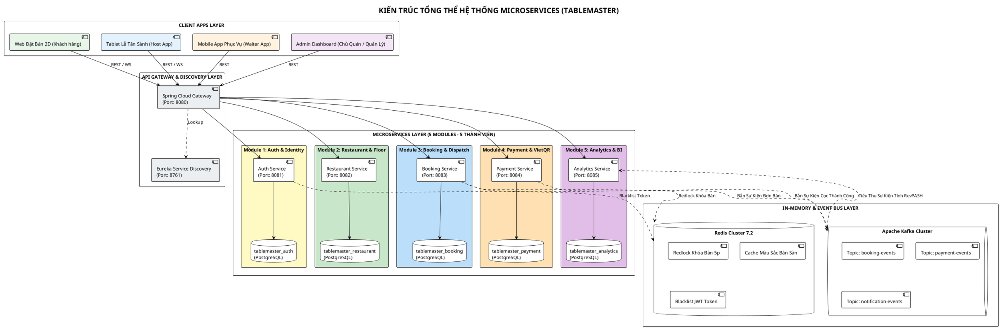

# TÀI LIỆU THIẾT KẾ KIẾN TRÚC HỆ THỐNG TỔNG THỂ (MASTER SYSTEM DESIGN BLUEPRINT)
# HỆ THỐNG: TABLEMASTER – NỀN TẢNG ĐẶT BÀN & ĐIỀU PHỐI MẶT BẰNG 2D THỜI GIAN THỰC
## (TÀI LIỆU QUY CHUẨN KỸ THUẬT DÀNH CHO TOÀN BỘ 5 THÀNH VIÊN DỰ ÁN)

> **Mã tài liệu:** MASTER-ARCH-SPEC-01  
> **Phiên bản:** 3.0.0 (Bản quy chuẩn thống nhất toàn diện)  
> **Loại tài liệu:** Master System Architecture, Database Schemas, API Contract & Team Blueprint  
> **Tech Stack:** Spring Boot 3.x, Spring Cloud Gateway, Netflix Eureka, PostgreSQL 16 (Database-per-Service), Redis 7.2 (Redlock), Apache Kafka, React 18 / Next.js, Konva.js 2D Canvas, WebSocket STOMP, VietQR.

---

## MỤC LỤC
1. [BỐI CẢNH DỰ ÁN & TRIẾT LÝ SINGLE-TENANT OUTSOURCE](#1-bối-cảnh-dự-án--triết-lý-single-tenant-outsource)
2. [5 NGUYÊN TẮC THIẾT KẾ CỐT LÕI (CORE PRINCIPLES)](#2-5-nguyên-tắc-thiết-kế-cốt-lõi-core-principles)
3. [SƠ ĐỒ KIẾN TRÚC TỔNG THỂ HỆ THỐNG (PLANTUML ARCHITECTURE)](#3-sơ-đồ-kiến-trúc-tổng-thể-hệ-thống-plantuml-architecture)
4. [QUY CHUẨN 5 MICROSERVICES & PHÂN CHIA CHO 5 THÀNH VIÊN](#4-quy-chuẩn-5-microservices--phân-chia-cho-5-thành-viên)
   * [4.1. Module 1 (Thành viên 1): Auth & Identity Service (Port: 8081)](#41-module-1-thành-viên-1-auth--identity-service-port-8081)
   * [4.2. Module 2 (Thành viên 2): Restaurant & Floor Service (Port: 8082)](#42-module-2-thành-viên-2-restaurant--floor-service-port-8082)
   * [4.3. Module 3 (Thành viên 3): Booking & Dispatch Service (Port: 8083)](#43-module-3-thành-viên-3-booking--dispatch-service-port-8083)
   * [4.4. Module 4 (Thành viên 4): Payment & VietQR Service (Port: 8084)](#44-module-4-thành-viên-4-payment--vietqr-service-port-8084)
   * [4.5. Module 5 (Thành viên 5): Analytics & BI Service (Port: 8085)](#45-module-5-thành-viên-5-analytics--bi-service-port-8085)
5. [SƠ ĐỒ TOÀN CẢNH CƠ SỞ DỮ LIỆU TỔNG HỢP (MASTER ERD)](#5-sơ-đồ-toàn-cảnh-cơ-sở-dữ-liệu-tổng-hợp-master-erd)
6. [QUY CHUẨN GIAO TIẾP LIÊN DỊCH VỤ (API CONTRACT & KAFKA TOPICS)](#6-quy-chuẩn-giao-tiếp-liên-dịch-vụ-api-contract--kafka-topics)
7. [CẤU TRÚC THƯ MỤC SOURCE CODE DỰ ÁN (MONOREPO GUIDELINES)](#7-cấu-trúc-thư-mục-source-code-dự-án-monorepo-guidelines)
8. [LỘ TRÌNH TRIỂN KHAI PHỐI HỢP NHÓM (DEVELOPMENT ROADMAP)](#8-lộ-trình-triển-khai-phối-hợp-nhóm-development-roadmap)

---

## 1. BỐI CẢNH DỰ ÁN & TRIẾT LÝ SINGLE-TENANT OUTSOURCE

Dự án **TableMaster** là sản phẩm phần mềm gia công đóng gói chuyên biệt (Outsource/Bespoke) cho 01 thương hiệu Nhà hàng cao cấp (ví dụ: *The Prime Bistro & Steakhouse*).

### Điểm khác biệt sống còn với mô hình sàn SaaS (PasGo, TableNow):
1. **Dữ liệu Tinh gọn:** Không cần kèm `restaurant_id` ở mọi bảng.
2. **Dòng tiền trực tiếp:** Tiền cọc VietQR về thẳng số tài khoản của Nhà hàng (MBBank/Vietcombank), không bị giam vốn và không mất phí hoa hồng 10%–15%.
3. **Thương hiệu Độc quyền:** 100% Brand Identity riêng, tích điểm VIP và chăm sóc khách hàng độc quyền.

---

## 2. 5 NGUYÊN TẮC THIẾT KẾ CỐT LÕI (CORE PRINCIPLES)

* 🎯 **Nguyên tắc 1 (Hybrid Identity):** Thực khách đặt bàn 1-chạm **không cần đăng ký mật khẩu**, hệ thống tự động làm sạch SĐT chuẩn **E.164** và tích điểm VIP ngầm. Nhân viên nội bộ bắt buộc đăng nhập bảo mật bằng **JWT + Refresh Token đa thiết bị + Redis Blacklist**.
* 🎯 **Nguyên tắc 2 (Real-time Zone Availability & Bàn cố định):** Vị trí bàn cố định trên sơ đồ 2D (Admin quản lý bảng CRUD, không làm builder phức tạp). Hệ thống tính toán và hiển thị tình trạng bàn trống theo thời gian thực cho từng khu vực (`OUTDOOR`, `BAR_COUNTER`, `PRIVATE_VIP`, `WINDOW_VIEW`, `STANDARD`). Nếu hết bàn ngoài trời $\rightarrow$ Khóa và báo đỏ [FULL].
* 🎯 **Nguyên tắc 3 (Telesales Verification & Vé QR Email):** Khách gửi đơn web (`PENDING_REVIEW`) $\rightarrow$ Lễ tân gọi điện tư vấn chốt đơn $\rightarrow$ Gửi link cọc VietQR (`AWAITING_PAYMENT`) $\rightarrow$ Khách cọc xong $\rightarrow$ Phát hành **Vé điện tử có mã QR qua Email** (`CONFIRMED`) $\rightarrow$ Quét Camera QR vào bàn (`SEATED`) $\rightarrow$ Hoàn tất bill (`COMPLETED`).
* 🎯 **Nguyên tắc 4 (Direct VietQR & Webhook Idempotency):** Sinh mã VietQR động theo chuẩn Napas247, đối soát biến động số dư qua Webhook trong 1 giây có chữ ký số HMAC-SHA256 và chống xử lý trùng.
* 🎯 **Nguyên tắc 5 (Database-per-Service & Async BI Analytics):** 5 Database PostgreSQL độc lập cho 5 Microservice. Số liệu báo cáo doanh thu, RevPASH và Heatmap bàn Hot được tổng hợp bất đồng bộ qua **Kafka Events**, không làm nghẽn luồng đặt bàn thời gian thực.

---

## 3. SƠ ĐỒ KIẾN TRÚC TỔNG THỂ HỆ THỐNG (PLANTUML ARCHITECTURE)



---

## 4. QUY CHUẨN 5 MICROSERVICES & PHÂN CHIA CHO 5 THÀNH VIÊN

---

### 4.1. Module 1 (Thành viên 1): Auth & Identity Service (Port: 8081)
* **Tài liệu chi tiết:** [doc/auth/DATABASE_DESIGN_AUTH.md](file:///d:/SBA301/Projec_Cuoi_Ki/doc/auth/DATABASE_DESIGN_AUTH.md)
* **Database:** `tablemaster_auth` (Bảng: `users`, `refresh_tokens`).
* **Nhiệm vụ cốt lõi:**
  1. Xây dựng bộ tiền xử lý số điện thoại chuẩn quốc tế **E.164** (`+84...`).
  2. Cung cấp API nhận diện/tự tạo User ngầm khi khách đặt bàn 1-chạm (`POST /internal/users/resolve-by-phone`).
  3. Xây dựng tính năng Đăng nhập cho Nhân sự nội bộ (BCrypt + JWT Access Token 15p + Refresh Token 30d).
  4. Đăng xuất & Quản lý thiết bị từ xa qua `device_info` và đẩy token vào **Redis Blacklist**.
  5. Cấu hình xác thực tập trung trên **Spring Cloud Gateway**.

---

### 4.2. Module 2 (Thành viên 2): Restaurant & Floor Service (Port: 8082)
* **Tài liệu chi tiết:** [doc/restaurant/DATABASE_DESIGN_RESTAURANT.md](file:///d:/SBA301/Projec_Cuoi_Ki/doc/restaurant/DATABASE_DESIGN_RESTAURANT.md)
* **Database:** `tablemaster_restaurant` (Bảng: `restaurant_profile`, `time_slots`, `floor_plans`, `tables`, `menu_categories`, `menu_items`).
* **Nhiệm vụ cốt lõi:**
  1. CRUD Hồ sơ nhà hàng, tài khoản ngân hàng nhận tiền VietQR và cấu hình thời gian ca giờ (`time_slots`).
  2. Quản lý sơ đồ tầng đa tầng và lưu trữ vật thể kiến trúc tĩnh dạng **JSONB** (`layout_metadata`).
  3. Quản lý danh mục Bàn ăn cố định theo bảng CRUD tiêu chuẩn (Mã bàn, Sức chứa, Giá cọc, Bật/Tắt).
  4. Xây dựng API Real-time tính toán số bàn trống theo từng khu vực: `OUTDOOR`, `BAR_COUNTER`, `PRIVATE_VIP`, `WINDOW_VIEW`, `STANDARD` (`GET /api/v1/restaurant/zones/availability`).
  5. Quản lý Thực đơn món ăn và cờ đặt trước `is_preorder_available`.

---

### 4.3. Module 3 (Thành viên 3): Booking & Dispatch Service (Port: 8083)
* **Tài liệu chi tiết:** [doc/booking/DATABASE_DESIGN_BOOKING.md](file:///d:/SBA301/Projec_Cuoi_Ki/doc/booking/DATABASE_DESIGN_BOOKING.md)
* **Database:** `tablemaster_booking` (Bảng: `bookings`, `booking_tables`, `booking_preorder_items`, `table_order_items`, `table_operations_audit`, `outbox_events`).
* **Nhiệm vụ cốt lõi:**
  1. Xử lý Vòng đời 9 trạng thái đơn đặt bàn (`PENDING_REVIEW` $\rightarrow$ `AWAITING_PAYMENT` $\rightarrow$ `CONFIRMED` $\rightarrow$ `SEATED` $\rightarrow$ `COMPLETED`).
  2. Màn hình Lễ tân Telesales: Gọi điện thoại tư vấn khách, ghi chú `staff_notes`, duyệt đơn và phát hành link cọc VietQR có thời hạn `payment_deadline`.
  3. Sinh mã `checkin_qr_token` và gửi Email vé điện tử đính kèm Mã QR sau khi cọc thành công.
  4. Quét Camera QR Check-in khách vào bàn tại sảnh và API Chuyển bàn (`table_operations_audit`).
  5. Hỗ trợ Ghép 2–3 bàn cho khách đoàn (`booking_tables`) và Phục vụ gọi thêm món tại bàn (`table_order_items`).
  6. Áp dụng Transactional Outbox Pattern đẩy sự kiện lên Kafka.

---

### 4.4. Module 4 (Thành viên 4): Payment & VietQR Service (Port: 8084)
* **Tài liệu chi tiết:** [doc/payment/DATABASE_DESIGN_PAYMENT.md](file:///d:/SBA301/Projec_Cuoi_Ki/doc/payment/DATABASE_DESIGN_PAYMENT.md)
* **Database:** `tablemaster_payment` (Bảng: `payment_transactions`, `payment_refunds`, `webhook_audit_logs`).
* **Nhiệm vụ cốt lõi:**
  1. Sinh mã VietQR động chuẩn Napas247 chuyển tiền trực tiếp về tài khoản chủ quán (kèm cú pháp định danh duy nhất: `PB BK001`).
  2. Endpoint tiếp nhận Webhook ngân hàng biến động số dư, xác thực chữ ký số HMAC-SHA256 và xử lý **Idempotency** chống trùng lặp.
  3. Bắn sự kiện `DepositPaidSuccessEvent` qua Kafka để Booking Service kích hoạt gửi Email vé QR.
  4. Xử lý luồng Hoàn tiền cọc (`payment_refunds`) khi khách hủy bàn trước 6 tiếng và lưu nhật ký đối soát.

---

### 4.5. Module 5 (Thành viên 5): Analytics & BI Service (Port: 8085)
* **Tài liệu chi tiết:** [doc/analytics/DATABASE_DESIGN_ANALYTICS.md](file:///d:/SBA301/Projec_Cuoi_Ki/doc/analytics/DATABASE_DESIGN_ANALYTICS.md)
* **Database:** `tablemaster_analytics` (Bảng: `daily_shift_metrics`, `table_popularity_stats`, `vip_customer_insights`).
* **Nhiệm vụ cốt lõi:**
  1. Lắng nghe Kafka Events (`BookingCompletedEvent`, `NoShowReportedEvent`, `DepositPaidEvent`) để tự động tổng hợp số liệu báo cáo.
  2. Tính toán chỉ số tiêu chuẩn vàng **RevPASH** (Doanh thu / Ghế khả dụng / Giờ) và Tỷ lệ lấp đầy sàn **Occupancy Rate (%)**.
  3. Xếp hạng vị trí Bàn Hot mang lại nhiều doanh thu nhất (Heatmap không gian: Outdoor vs VIP vs Bar).
  4. Thống kê chi tiêu Khách VIP và phân hạng thành viên tự động (Bronze, Silver, Gold, Platinum).
  5. Xây dựng Dashboard biểu đồ trực quan (Recharts / Chart.js) cho Chủ nhà hàng và Quản lý ca.

---

## 5. SƠ ĐỒ TOÀN CẢNH CƠ SỞ DỮ LIỆU TỔNG HỢP (MASTER ERD)

```plantuml
@startuml TableMaster_Master_ERD
!theme plain
skinparam linetype ortho
skinparam roundcorner 8
skinparam shadowing false
skinparam classFontSize 11

title TOÀN CẢNH CƠ SỞ DỮ LIỆU 5 MICROSERVICES (TABLEMASTER)

package "1. tablemaster_auth" #FFF9C4 {
  entity "users" as users {
    * **id** : UUID [PK]
    --
    * **phone_number** : VARCHAR(20) [UK, E.164]
    * **full_name** : VARCHAR(100)
    **email** : VARCHAR(120) [UK]
    **password_hash** : VARCHAR(255)
    * **role** : VARCHAR(30)
    * **is_active** : BOOLEAN = TRUE
    **loyalty_points** : INT = 0
  }
  entity "refresh_tokens" as tokens {
    * **id** : UUID [PK]
    --
    * **user_id** : UUID [FK -> users.id]
    * **token_hash** : VARCHAR(255) [UK]
    **device_info** : VARCHAR(255)
    * **expires_at** : TIMESTAMP WITH TIME ZONE
    * **is_revoked** : BOOLEAN = FALSE
  }
  users ||--o{ tokens
}

package "2. tablemaster_restaurant" #C8E6C9 {
  entity "restaurant_profile" as profile {
    * **id** : UUID [PK]
    --
    * **name** : VARCHAR(150)
    * **bank_bin** : VARCHAR(10)
    * **bank_account_no** : VARCHAR(30)
    * **default_deposit_amount** : DECIMAL(12,2)
    * **cancellation_grace_hours** : INT = 6
  }
  entity "time_slots" as slots {
    * **id** : UUID [PK]
    --
    * **slot_name** : VARCHAR(60)
    * **start_time** : TIME
    * **end_time** : TIME
  }
  entity "floor_plans" as floors {
    * **id** : UUID [PK]
    --
    * **floor_number** : INT [UK]
    * **name** : VARCHAR(100)
    * **layout_metadata** : JSONB
  }
  entity "tables" as tables {
    * **id** : UUID [PK]
    --
    * **floor_plan_id** : UUID [FK -> floors.id]
    * **table_code** : VARCHAR(30) [UK]
    * **zone_type** : VARCHAR(50)
    * **min_capacity** : INT
    * **max_capacity** : INT
    **custom_deposit** : DECIMAL(12,2)
    * **is_active** : BOOLEAN = TRUE
  }
  entity "menu_items" as menu {
    * **id** : UUID [PK]
    --
    * **name** : VARCHAR(150)
    * **price** : DECIMAL(12,2)
    * **is_preorder_available** : BOOLEAN
  }
  floors ||--o{ tables
}

package "3. tablemaster_booking" #BBDEFB {
  entity "bookings" as bookings {
    * **id** : UUID [PK]
    --
    * **booking_code** : VARCHAR(20) [UK]
    * **user_id** : UUID
    * **guest_name** : VARCHAR(100)
    * **guest_phone** : VARCHAR(20)
    * **guest_email** : VARCHAR(120)
    * **booking_date** : DATE
    * **time_slot_id** : UUID
    * **guest_count** : INT
    * **total_deposit** : DECIMAL(12,2)
    * **status** : VARCHAR(30)
    **staff_notes** : TEXT
    **payment_deadline** : TIMESTAMP WITH TIME ZONE
    **checkin_qr_token** : VARCHAR(255) [UK]
  }
  entity "booking_tables" as bk_tables {
    * **booking_id** : UUID [PK, FK]
    * **table_id** : UUID [PK]
  }
  entity "table_order_items" as orders {
    * **id** : UUID [PK]
    --
    * **booking_id** : UUID [FK]
    * **item_name** : VARCHAR(150)
    * **quantity** : INT
    * **unit_price** : DECIMAL(12,2)
    * **status** : VARCHAR(30)
  }
  bookings ||--|{ bk_tables
  bookings ||--o{ orders
}

package "4. tablemaster_payment" #FFE0B2 {
  entity "payment_transactions" as txn {
    * **id** : UUID [PK]
    --
    * **transaction_code** : VARCHAR(30) [UK]
    * **booking_id** : UUID
    * **amount** : DECIMAL(12,2)
    * **transfer_content** : VARCHAR(100) [UK]
    * **status** : VARCHAR(30)
  }
  entity "payment_refunds" as refunds {
    * **id** : UUID [PK]
    --
    * **payment_transaction_id** : UUID [FK]
    * **refund_amount** : DECIMAL(12,2)
    * **refund_ratio** : FLOAT
    * **refund_status** : VARCHAR(30)
  }
  txn ||--o{ refunds
}

package "5. tablemaster_analytics" #E1BEE7 {
  entity "daily_shift_metrics" as metrics {
    * **id** : UUID [PK]
    --
    * **metric_date** : DATE
    * **time_slot_id** : UUID
    * **total_food_revenue** : DECIMAL(14,2)
    * **revpash_score** : DECIMAL(10,2)
    * **occupancy_rate** : FLOAT
  }
  entity "table_popularity_stats" as pop {
    * **id** : UUID [PK]
    --
    * **table_id** : UUID [UK]
    * **zone_type** : VARCHAR(50)
    * **total_revenue_generated** : DECIMAL(14,2)
  }
  entity "vip_customer_insights" as vip {
    * **id** : UUID [PK]
    --
    * **user_id** : UUID [UK]
    * **total_spent** : DECIMAL(14,2)
    * **loyalty_tier** : VARCHAR(30)
  }
}

@enduml
```



---

## 6. QUY CHUẨN GIAO TIẾP LIÊN DỊCH VỤ (API CONTRACT & KAFKA TOPICS)

### 6.1. Quy chuẩn HTTP Headers qua API Gateway
Mọi request sau khi đi qua API Gateway sẽ được đính kèm các Header chuẩn hóa:
* `X-User-Id`: UUID của người gọi API.
* `X-User-Role`: `ROLE_CUSTOMER`, `ROLE_HOST`, `ROLE_WAITER`, `ROLE_MANAGER`, `ROLE_ADMIN`.
* `X-Correlation-Id`: Mã UUID truy vết lỗi (Distributed Tracing).

### 6.2. Cấu trúc Response Chuẩn JSON (API Standard Response)
```json
{
  "success": true,
  "code": 200,
  "message": "Thao tác thành công",
  "data": { ... },
  "timestamp": "2026-10-24T18:30:00.000Z"
}
```

### 6.3. Danh mục Kafka Topics & Event Payloads
| Topic Name | Producer | Consumer | Payload chính |
| :--- | :--- | :--- | :--- |
| `booking-events` | Booking Service | Analytics, Notification | `{ bookingId, userId, date, slotId, status, tableIds, guestCount }` |
| `payment-events` | Payment Service | Booking, Analytics | `{ transactionId, bookingId, amount, status: "SUCCESS" }` |
| `order-events` | Booking Service | Analytics, Kitchen | `{ bookingId, tableId, items: [...], totalAmount }` |

---

## 7. CẤU TRÚC THƯ MỤC SOURCE CODE DỰ ÁN (MONOREPO GUIDELINES)

```
TableMaster/
├── doc/                                 # Trọn bộ tài liệu thiết kế & phân tích CSDL
│   ├── auth/DATABASE_DESIGN_AUTH.md
│   ├── restaurant/DATABASE_DESIGN_RESTAURANT.md
│   ├── booking/DATABASE_DESIGN_BOOKING.md
│   ├── payment/DATABASE_DESIGN_PAYMENT.md
│   ├── analytics/DATABASE_DESIGN_ANALYTICS.md
│   └── MASTER_SYSTEM_DESIGN_TABLEMASTER.md
│
├── infrastructure/                      # Hạ tầng & Cấu hình Docker
│   ├── docker-compose.yml               # Chạy đồng thời Postgres, Redis, Kafka, Eureka
│   └── init-multiple-dbs.sh             # Script tự động tạo 5 databases
│
├── backend/                             # 5 Spring Boot Microservices
│   ├── gateway-service/                 # Spring Cloud Gateway (Port: 8080)
│   ├── discovery-service/               # Netflix Eureka Server (Port: 8761)
│   ├── auth-service/                    # Member 1: Auth & Identity (Port: 8081)
│   ├── restaurant-service/              # Member 2: Restaurant & Floor (Port: 8082)
│   ├── booking-service/                 # Member 3: Booking & Dispatch (Port: 8083)
│   ├── payment-service/                 # Member 4: Payment & VietQR (Port: 8084)
│   └── analytics-service/               # Member 5: Analytics & BI (Port: 8085)
│
└── frontend/                            # Giao diện người dùng
    ├── customer-web/                    # Web đặt bàn 2D cho Khách hàng (Next.js)
    ├── staff-tablet-app/                # App iPad Lễ tân sảnh & Phục vụ (React Konva)
    └── admin-dashboard/                 # Quản trị & Báo cáo doanh thu cho Chủ quán
```

---

## 8. LỘ TRÌNH TRIỂN KHAI PHỐI HỢP NHÓM (DEVELOPMENT ROADMAP)

```
[ TUẦN 1: KHỞI TẠO CSDL & HẠ TẦNG CHUNG ]
- Chạy docker-compose tạo 5 PostgreSQL DBs, Redis & Kafka.
- Khởi tạo khung dự án Spring Boot & Eureka/Gateway.
                         │
                         ▼
[ TUẦN 2: PHÁT TRIỂN ĐỘC LẬP TỪNG SERVICE (5 THÀNH VIÊN) ]
- Member 1: Auth JWT & E.164 Validator.
- Member 2: CRUD Floor 2D JSONB & Zone Availability API.
- Member 3: Booking State Machine & Ghép bàn.
- Member 4: Sinh mã VietQR & Webhook HMAC.
- Member 5: Consumer Kafka & Công thức tính RevPASH.
                         │
                         ▼
[ TUẦN 3: TÍCH HỢP LIÊN DỊCH VỤ & WEBSOCKET REAL-TIME ]
- Kết nối luồng: Đặt bàn -> Lễ tân gọi chốt -> Cọc VietQR -> Sinh Vé QR Email.
- Bật WebSocket STOMP đổi màu bàn thời gian thực trên Canvas.
                         │
                         ▼
[ TUẦN 4: TEST TOÀN DIỆN, BẢO MẬT & BẢO VỆ ĐỒ ÁN ]
- Chạy Test kịch bản thực tế: Trùng bàn, Đổi bàn, Hủy cọc hoàn tiền, Khách VIP.
- Xuất báo cáo đồ án từ các file Markdown kiến trúc đã chuẩn bị!
```
