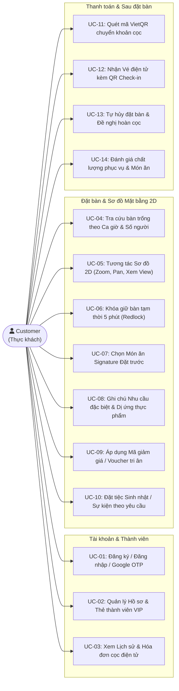
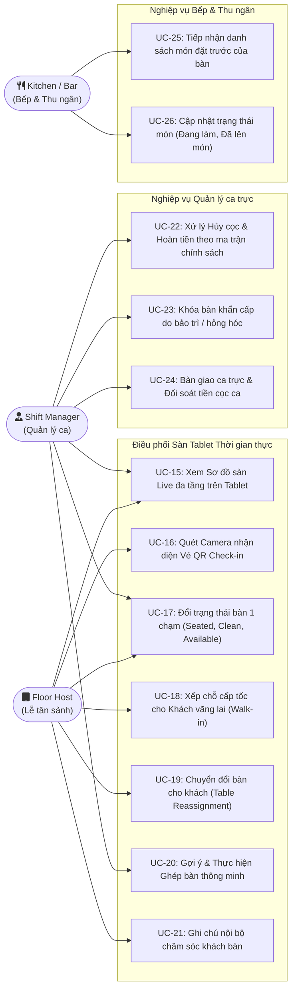
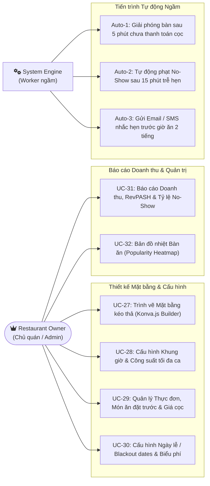
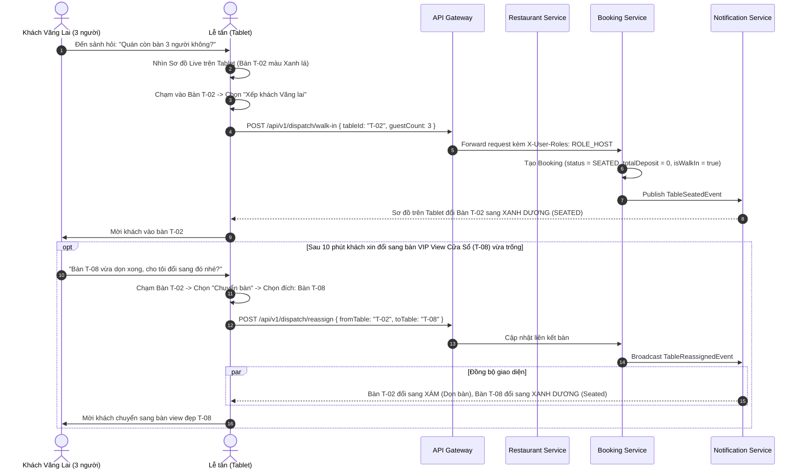
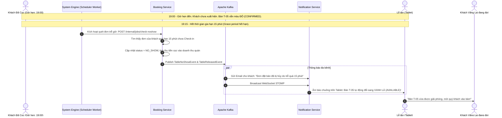

# TÀI LIỆU ĐẶC TẢ USE CASE & MA TRẬN CHỨC NĂNG TOÀN DIỆN
# HỆ THỐNG QUẢN LÝ ĐẶT BÀN & ĐIỀU PHỐI MẶT BẰNG NHÀ HÀNG CAO CẤP (TABLEMASTER)
## (HỆ THỐNG GIA CÔNG PHẦN MỀM CHUYÊN BIỆT CHO NHÀ HÀNG ĐA TẦNG)

> **Mã tài liệu:** SRS-UC-FULL-TABLEMASTER-01  
> **Phiên bản:** 2.0.0 (Bản phân tích toàn diện chuẩn công nghiệp)  
> **Loại tài liệu:** Software Requirements Specification (SRS) & Use Case Catalog  
> **Công nghệ:** Microservices Spring Boot 3.x (Gateway, Eureka, Kafka, Redis Redlock), PostgreSQL 16 (JSONB), React Konva.js, WebSocket STOMP, VietQR.

---

## MỤC LỤC
1. [TỔNG QUAN BÀI TOÁN QUẢN TRỊ BOOKING NHÀ HÀNG THỰC TẾ](#1-tổng-quan-bài-toán-quản-trị-booking-nhà-hàng-thực-tế)
2. [HỆ THỐNG TÁC NHÂN (ACTOR MODEL & RESPONSIBILITY MATRIX)](#2-hệ-thống-tác-nhân-actor-model--responsibility-matrix)
3. [SƠ ĐỒ TỔNG THỂ USE CASE (SYSTEM-WIDE USE CASE DIAGRAMS)](#3-sơ-đồ-tổng-thể-use-case-system-wide-use-case-diagrams)
4. [MA TRẬN PHÂN RÃ CHỨC NĂNG CHI TIẾT (10 PHÂN HỆ NGHIỆP VỤ)](#4-ma-trận-phân-rã-chức-năng-chi-tiết-10-phân-hệ-nghiệp-vụ)
   * [Module 1: Định danh, Tài khoản & Thành viên VIP (Auth & Loyalty)](#module-1-định-danh-tài-khoản--thành-viên-vip-auth--loyalty)
   * [Module 2: Khám phá Không gian & Thực đơn số (Experience & Menu Catalog)](#module-2-khám-phá-không-gian--thực-đơn-số-experience--menu-catalog)
   * [Module 3: Đặt bàn Sơ đồ 2D & Đặt món trước (Interactive 2D Booking Engine)](#module-3-đặt-bàn-sơ-đồ-2d--đặt-món-trước-interactive-2d-booking-engine)
   * [Module 4: Đặt tiệc Sự kiện & Yêu cầu Đặc biệt (Private Banquet & Special Events)](#module-4-đặt-tiệc-sự-kiện--yêu-cầu-đặc-biệt-private-banquet--special-events)
   * [Module 5: Thanh toán Cọc, VietQR & Hóa đơn (Payment, Webhook & Invoicing)](#module-5-thanh-toán-cọc-vietqr--hóa-đơn-payment-webhook--invoicing)
   * [Module 6: Lễ tân Sảnh & Điều phối Tablet (Host Dispatch & Floor Management)](#module-6-lễ-tân-sảnh--điều-phối-tablet-host-dispatch--floor-management)
   * [Module 7: Trình vẽ Mặt bằng Đa tầng (2D Canvas Floor Plan Builder)](#module-7-trình-vẽ-mặt-bằng-đa-tầng-2d-canvas-floor-plan-builder)
   * [Module 8: Quản trị Thực đơn, Khung ca & Biểu phí (Menu & Shift Operations)](#module-8-quản-trị-thực-đơn-khung-ca--biểu-phí-menu--shift-operations)
   * [Module 9: Báo cáo Doanh thu, RevPASH & Phân tích Sàn (Analytics & BI)](#module-9-báo-cáo-doanh-thu-revpash--phân-tích-sàn-analytics--bi)
   * [Module 10: Thông báo Đa kênh & Chăm sóc Khách hàng (CRM & Notifications)](#module-10-thông-báo-đa-kênh--chăm-sóc-khách-hàng-crm--notifications)
5. [ĐẶC TẢ CHI TIẾT 32 USE CASES CHUẨN CÔNG NGHIỆP](#5-đặc-tả-chi-tiết-32-use-cases-chuẩn-công-nghiệp)
6. [SƠ ĐỒ TRÌNH TỰ NGHIỆP VỤ PHỨC TẠP (COMPLEX SEQUENCE DIAGRAMS)](#6-sơ-đồ-trình-tự-nghiệp-vụ-phức-tạp-complex-sequence-diagrams)
7. [TỪ ĐIỂN QUY TẮC NGHIỆP VỤ & RÀNG BUỘC TOÀN VẸN (BUSINESS RULES)](#7-từ-điển-quy-tắc-nghiệp-vụ--ràng-buộc-toàn-vẹn-business-rules)

---

## 1. TỔNG QUAN BÀI TOÁN QUẢN TRỊ BOOKING NHÀ HÀNG THỰC TẾ

Một hệ thống quản lý đặt bàn nhà hàng chuyên nghiệp **không chỉ đơn thuần là form đăng ký ngày giờ**, mà là một giải pháp quản trị vận hành khép kín (End-to-End Restaurant Booking Ecosystem) xử lý 4 giai đoạn sống còn:

```
[ GIAI ĐOẠN 1: TRƯỚC BỮA ĂN (PRE-DINING) ]
Khách chọn không gian qua Sơ đồ 2D -> Khóa bàn 5p chống tranh chấp -> Đặt trước món đắt tiền (Wagyu, Rượu)
-> Chuyển khoản cọc VietQR -> Nhận vé QR điện tử qua Email/App -> Nhắc lịch tự động trước 2h.
                           │
                           ▼
[ GIAI ĐOẠN 2: LÚC KHÁCH ĐẾN (AT-ARRIVAL & CHECK-IN) ]
Lễ tân dùng Tablet quét Camera QR nhận diện vé trong 1s -> Dẫn vào bàn -> Khách vãng lai xếp bàn nhanh
-> Xử lý khách đến trễ (Grace period 15p) -> Gợi ý ghép bàn khi phát sinh thêm người.
                           │
                           ▼
[ GIAI ĐOẠN 3: TRONG BỮA ĂN (DURING-SERVICE) ]
Tablet cập nhật trạng thái: Đang ăn -> Gọi thanh toán bill -> Dọn bàn -> Bàn trống sẵn sàng đón ca sau.
                           │
                           ▼
[ GIAI ĐOẠN 4: SAU BỮA ĂN (POST-DINING & ANALYTICS) ]
Tích điểm thành viên VIP -> Khảo sát mức độ hài lòng (CSAT) -> Báo cáo doanh thu ca, RevPASH và Heatmap bàn.
```

---

## 2. HỆ THỐNG TÁC NHÂN (ACTOR MODEL & RESPONSIBILITY MATRIX)

```
+-------------------------------------------------------------------------------------------------------+
|                                        HỆ THỐNG TÁC NHÂN DỰ ÁN                                        |
+-------------------+--------------------+--------------------------------------------------------------+
| TÁC NHÂN (ACTOR)  | LOẠI TÁC NHÂN      | QUYỀN HẠN & MỤC TIÊU SỬ DỤNG CHÍNH                           |
+-------------------+--------------------+--------------------------------------------------------------+
| 1. Customer       | Người dùng B2C     | Khách xem sơ đồ, tự chọn bàn, cọc VietQR, đặt món trước,     |
|    (Thực khách)   | (Vãng lai hoặc VIP)| nhận vé QR, tra cứu lịch sử, đánh giá sau bữa ăn.            |
+-------------------+--------------------+--------------------------------------------------------------+
| 2. Floor Host     | Nhân sự vận hành   | Lễ tân sảnh dùng Tablet: Quét QR Check-in, xếp khách vãng    |
|    (Lễ tân sảnh)  | (Host / Greeter)   | lai, đổi trạng thái bàn 1 chạm, thanh toán trừ cọc tự động.  |
+-------------------+--------------------+--------------------------------------------------------------+
| 3. Waitstaff      | Nhân sự phục vụ    | Nhân viên phục vụ bàn dùng App Mobile: Gọi món tại bàn,      |
|    (Phục vụ bàn)  | (Mobile POS Staff) | tự nhập món riêng, ghi chú bếp, chuyển bàn & ghép bàn nhanh. |
+-------------------+--------------------+--------------------------------------------------------------+
| 4. Shift Manager  | Nhân sự điều hành  | Quản lý ca trực: Xử lý khiếu nại, duyệt hủy cọc theo chính   |
|    (Quản lý ca)   | (Floor Supervisor) | sách, kích hoạt ghép bàn cho đoàn đông, khóa bàn khẩn cấp.   |
+-------------------+--------------------+--------------------------------------------------------------+
| 5. Head Chef / F&B| Nhân sự bếp        | Bếp trưởng / Bar: Nhận danh sách món đặt trước & order từ    |
|    (Bếp / Bar)    | (Kitchen / Bar)    | phục vụ bàn để sơ chế, cập nhật trạng thái chế biến.         |
+-------------------+--------------------+--------------------------------------------------------------+
| 6. General Admin  | Ban giám đốc quán  | Chủ nhà hàng: Dựng sơ đồ tầng kéo-thả (Konva.js), cấu hình   |
|    (Chủ / Quản trị|(Owner / Director)  | ca giờ, biểu phí cọc, quản lý menu, đối soát giải ngân cọc.  |
+-------------------+--------------------+--------------------------------------------------------------+
| 7. Bank & Escrow  | Cổng thanh toán    | PayOS/VietQR Webhook: Tự động xác thực cọc, giữ tiền trong   |
|    (Cổng VietQR)  | (Auto Webhook)     | tài khoản tạm giữ và giải ngân khi hóa đơn hoàn tất.         |
+-------------------+--------------------+--------------------------------------------------------------+
| 8. System Engine  | Hệ thống tự động   | Tiến trình ngầm: Auto-confirm & gửi Email vé, nhả bàn sau    |
|    (Cron / Worker)| (Background Worker)| 5p chưa cọc, tự động phạt No-Show sau 15p trễ, nhắc hẹn 2h.  |
+-------------------+--------------------+--------------------------------------------------------------+
```

---

## 3. SƠ ĐỒ TỔNG THỂ USE CASE (SYSTEM-WIDE USE CASE DIAGRAMS)

### 3.1. Phân hệ Khách hàng (Customer & Public Portal)



---

### 3.2. Phân hệ Lễ tân, Quản lý ca & Bếp (Host Floor Dispatch & Operations)



---

### 3.3. Phân hệ Quản trị, Thiết kế Mặt bằng & Báo cáo (Admin & Analytics)



---

## 4. MA TRẬN PHÂN RÃ CHỨC NĂNG CHI TIẾT (10 PHÂN HỆ NGHIỆP VỤ)

| Nhóm phân hệ | Mã Chức năng | Tên chức năng chi tiết | Mô tả hành vi & Nghiệp vụ | Độ ưu tiên |
| :--- | :--- | :--- | :--- | :--- |
| **1. Auth & Loyalty** | `FR-AUTH-01` | Đăng ký & Đăng nhập đa kênh | Hỗ trợ Email/Mật khẩu, Google One-tap, đăng nhập bằng OTP SMS điện thoại. | **P0 (Bắt buộc)** |
| | `FR-AUTH-02` | Quản lý Hồ sơ & Sở thích ẩm thực | Lưu ghi chú khách (dị ứng tôm cua, ăn chay, thích vang đỏ, kỷ niệm ngày cưới). | **P1 (Quan trọng)** |
| | `FR-AUTH-03` | Hệ thống Tích điểm & Hạng thẻ VIP | Tích điểm sau mỗi hóa đơn (Đồng, Bạc, Vàng, Kim Cương), miễn giảm cọc cho VIP. | **P1 (Quan trọng)** |
| | `FR-AUTH-04` | Sổ lịch sử đặt bàn & Đặt lại 1 chạm | Xem danh sách đơn cũ, tải hóa đơn cọc điện tử, re-book lại đúng bàn cũ dễ dàng. | **P0 (Bắt buộc)** |
| **2. Experience** | `FR-EXP-01` | Showcase Không gian Nhà hàng | Giới thiệu hình ảnh độ nét cao của từng tầng (Sảnh chính, Phòng VIP, Rooftop). | **P1 (Quan trọng)** |
| | `FR-EXP-02` | Thực đơn Điện tử (Digital Menu) | Phân loại danh mục món, ảnh món ăn, giá bán, thành phần dị ứng, tag Best Seller. | **P0 (Bắt buộc)** |
| | `FR-EXP-03` | Đánh giá & Phản hồi sau ăn | Khách gửi đánh giá 1-5 sao, viết nhận xét và upload hình ảnh sau bữa ăn. | **P1 (Quan trọng)** |
| **3. 2D Booking** | `FR-BOOK-01` | Bộ lọc Tìm kiếm Bàn thông minh | Lọc theo Ngày, Khung ca, Số người lớn, Trẻ em (yêu cầu ghế em bé), Chọn tầng. | **P0 (Bắt buộc)** |
| | `FR-BOOK-02` | Xem Sơ đồ 2D Tương tác Canvas | Render mặt bằng bằng Konva.js: Zoom, Pan, hiển thị trạng thái màu bàn thời gian thực. | **P0 (Bắt buộc)** |
| | `FR-BOOK-03` | Khóa giữ bàn 5 phút (Redlock) | Bấm chọn bàn $\rightarrow$ Redis Redlock khóa bàn trong 100ms, bộ đếm ngược 05:00. | **P0 (Bắt buộc)** |
| | `FR-BOOK-04` | Đặt trước Món ăn Signature | Chọn các món đặc biệt (Bò Wagyu A5, Set Rượu vang) trong cùng luồng cọc bàn. | **P1 (Quan trọng)** |
| | `FR-BOOK-05` | Ghi chú Tiệc & Nhu cầu đặc biệt | Khách ghi chú: "Bàn kỷ niệm ngày cưới", "Yêu cầu setup nến thơm góc cửa sổ". | **P0 (Bắt buộc)** |
| | `FR-BOOK-06` | Áp dụng Mã giảm giá (Promo Code) | Kiểm tra mã voucher hợp lệ, trừ tiền cọc trực tiếp trên hóa đơn tạm tính. | **P1 (Quan trọng)** |
| **4. Private Event** | `FR-EVT-01` | Form Đặt tiệc & Sự kiện riêng | Khách đăng ký bao trọn tầng Rooftop/Phòng VIP cho tiệc sinh nhật, cầu hôn, tiệc cty. | **P1 (Quan trọng)** |
| | `FR-EVT-02` | Yêu cầu Dịch vụ Trang trí | Đặt gói hoa tươi, bóng bay, bánh sinh nhật, nhạc công Acoustic biểu diễn. | **P2 (Nâng cao)** |
| **5. Payment** | `FR-PAY-01` | Sinh mã VietQR động chuẩn EMVCo | Tự động tạo ảnh mã QR chứa đúng số tiền cọc, nội dung định danh chuyển khoản. | **P0 (Bắt buộc)** |
| | `FR-PAY-02` | Tiếp nhận Webhook Ngân hàng tự động | Nhận thông báo tiền về từ PayOS/Casso/Ngân hàng trong 1-3s, xác thực chữ ký HMAC. | **P0 (Bắt buộc)** |
| | `FR-PAY-03` | Phát hành Vé điện tử QR Check-in | Sinh mã QR bảo mật động gửi qua màn hình và Email của khách sau khi cọc xong. | **P0 (Bắt buộc)** |
| | `FR-PAY-04` | Hủy đặt bàn & Hoàn cọc tự động | Xử lý hoàn tiền 100% nếu hủy trước 24h, hoàn 50% nếu hủy trước 6h theo ma trận. | **P1 (Quan trọng)** |
| | `FR-PAY-05` | Yêu cầu Xuất Hóa đơn đỏ VAT | Nhập thông tin Mã số thuế, Tên công ty để xuất hóa đơn điện tử cho doanh nghiệp. | **P2 (Nâng cao)** |
| **6. Host Dispatch** | `FR-DISP-01` | Màn hình Sơ đồ Sàn Live trên Tablet | Giao diện cảm ứng tối ưu cho iPad/Android Tablet xem toàn bộ bàn đa tầng. | **P0 (Bắt buộc)** |
| | `FR-DISP-02` | Quét Camera QR Check-in đón khách | Quét mã QR trên điện thoại khách để đối soát đơn, chuyển trạng thái sang `SEATED`. | **P0 (Bắt buộc)** |
| | `FR-DISP-03` | Đổi trạng thái bàn 1 chạm | Chạm vào bàn để chuyển đổi: `AVAILABLE` $\rightarrow$ `OCCUPIED` $\rightarrow$ `CLEANING`. | **P0 (Bắt buộc)** |
| | `FR-DISP-04` | Tiếp nhận Khách vãng lai (Walk-in) | Lễ tân tự nhập nhanh khách tại cửa vào bàn trống mà không cần thanh toán cọc. | **P0 (Bắt buộc)** |
| | `FR-DISP-05` | Đổi bàn giữa chừng (Re-assignment) | Cho phép chuyển đoàn khách sang bàn khác theo yêu cầu khi bàn kia đang trống. | **P1 (Quan trọng)** |
| | `FR-DISP-06` | Gợi ý & Ghép bàn thông minh | Thuật toán tính khoảng cách Euclidean giữa 2 bàn gần nhau để ghép phục vụ đoàn đông. | **P2 (Nâng cao)** |
| | `FR-DISP-07` | Ghi chú Nội bộ ca trực | Lễ tân lưu ghi chú: "Bàn VIP hay uống rượu nặng", "Khách phàn nàn máy lạnh". | **P1 (Quan trọng)** |
| **7. Floor Builder** | `FR-BLD-01` | Trình vẽ Canvas Kéo thả Bàn & Tường | Kéo thả bàn tròn, bàn vuông, quầy bar, cửa kính, vách tường lên lưới tọa độ 20px. | **P0 (Bắt buộc)** |
| | `FR-BLD-02` | Bắt dính lưới & Xoay góc tự do | Hỗ trợ Snap to grid và xoay góc bàn $0^\circ - 360^\circ$ theo kiến trúc quán. | **P1 (Quan trọng)** |
| | `FR-BLD-03` | Cấu hình Sức chứa & Phí cọc riêng | Đặt Min/Max ghế cho từng bàn và thiết lập phí cọc riêng cho các bàn đắc địa. | **P0 (Bắt buộc)** |
| | `FR-BLD-04` | Quản lý Đa tầng lầu (Multi-floors) | Thêm tầng mới (Tầng 1, Tầng 2, Tầng 3), chỉnh sửa tên tầng, xuất bản sơ đồ mới. | **P0 (Bắt buộc)** |
| **8. Operations** | `FR-OPER-01` | Quản lý Thực đơn & Trạng thái món | Thêm/sửa món ăn, bật tắt cờ hết hàng (Out of stock), cờ cho phép đặt trước. | **P0 (Bắt buộc)** |
| | `FR-OPER-02` | Cấu hình Khung giờ (Time Slots) | Thiết lập ca trưa, ca tối, thời lượng mỗi ca, số lượng khách tối đa trong cả ca. | **P0 (Bắt buộc)** |
| | `FR-OPER-03` | Cấu hình Ngày lễ & Blackout Dates | Tăng tiền cọc vào dịp Tết/Valentine/Giáng sinh, hoặc chặn đặt ngày quán bảo trì. | **P1 (Quan trọng)** |
| | `FR-OPER-04` | Màn hình Bếp hiển thị món đặt trước | Danh sách món ăn đặt trước của các bàn sắp đến để bếp chuẩn bị nguyên liệu. | **P1 (Quan trọng)** |
| **9. Analytics** | `FR-ANA-01` | Báo cáo Doanh thu & Tiền cọc | Thống kê số tiền cọc thu được, tiền hoàn hủy, và doanh thu phạt No-Show. | **P0 (Bắt buộc)** |
| | `FR-ANA-02` | Biểu đồ Hiệu suất ghế RevPASH | Phân tích doanh thu trên mỗi ghế khả dụng theo từng giờ để tối ưu hóa giá. | **P1 (Quan trọng)** |
| | `FR-ANA-03` | Bản đồ nhiệt Bàn ăn (Heatmap) | Tô màu bàn trên sơ đồ 2D theo tần suất đặt để nhận biết vị trí "hot" nhất quán. | **P2 (Nâng cao)** |
| | `FR-ANA-04` | Báo cáo Tỷ lệ No-Show (Bùng hẹn) | Đo lường tỷ lệ bùng bàn theo ngày/tháng để chứng minh hiệu quả giảm bùng hẹn. | **P1 (Quan trọng)** |
| **10. CRM & Engine** | `FR-SYS-01` | Auto-release Bàn quá hạn 5 phút | Worker tự động hủy đơn và giải phóng bàn về Xanh nếu sau 5p chưa cọc. | **P0 (Bắt buộc)** |
| | `FR-SYS-02` | Auto-penalty Khách trễ quá 15 phút | Tự động chuyển đơn sang `NO_SHOW` sau 15p giờ hẹn, thu hồi bàn cho khách vãng lai. | **P0 (Bắt buộc)** |
| | `FR-SYS-03` | Email & SMS Nhắc hẹn tự động | Gửi thông báo nhắc giờ hẹn trước 2 tiếng kèm chỉ dẫn đỗ xe và mã QR. | **P1 (Quan trọng)** |
| | `FR-SYS-04` | Đồng bộ WebSocket STOMP tức thì | Broadcast tức thời mọi sự kiện đổi màu bàn tới Web khách và Tablet lễ tân (< 300ms).| **P0 (Bắt buộc)** |

---

## 5. ĐẶC TẢ CHI TIẾT 32 USE CASES CHUẨN CÔNG NGHIỆP

Dưới đây là đặc tả chi tiết của từng Use Case nghiệp vụ chính:

---

### UC-01: Đăng ký & Đăng nhập Đa kênh (Multi-channel Authentication)
* **Tác nhân:** Customer.
* **Mô tả:** Khách hàng đăng ký tài khoản mới hoặc đăng nhập bằng Email/Mật khẩu, Google One-tap, hoặc số điện thoại OTP.
* **Luồng chính:**
  1. Khách bấm nút "Đăng nhập" tại góc trên bên phải trang web.
  2. Khách chọn đăng nhập nhanh bằng Google hoặc nhập Email + Mật khẩu.
  3. Hệ thống gửi yêu cầu qua API Gateway đến `Auth Service`.
  4. Backend kiểm tra mật khẩu (BCrypt), cấp phát cặp mã **RSA256 Access Token** (TTL 15 phút) và **Refresh Token** (TTL 7 ngày trong Redis).
  5. Trình duyệt lưu Access Token trong bộ nhớ và tự động cập nhật tên, hạng thẻ VIP trên Navbar.

---

### UC-02: Quản lý Hồ sơ & Sở thích Ẩm thực (Diner Profile & Preferences)
* **Tác nhân:** Customer.
* **Mô tả:** Cho phép khách hàng lưu trữ các thói quen ăn uống để nhà hàng phục vụ chu đáo nhất.
* **Dữ liệu lưu trữ:** 
  * Dị ứng thực phẩm (Hải sản, Đậu phộng, Gluten, Sữa bò).
  * Chế độ ăn đặc biệt (Ăn chay chay trường, Eat-clean, Không ăn cay).
  * Vị trí ngồi ưa thích (Thích góc riêng tư, Thích view kính nhìn phố, Thích ngoài trời).
  * Ngày sinh nhật & Ngày kỷ niệm hôn nhân (Hệ thống tự động gửi Voucher giảm giá cọc 20% trước 7 ngày).

---

### UC-03: Xem Lịch sử & Hóa đơn Cọc Điện tử (Booking History & Invoices)
* **Tác nhân:** Customer.
* **Mô tả:** Xem lại tất cả các đơn đặt bàn trong quá khứ và hiện tại.
* **Hành động hỗ trợ:**
  * Xem lại mã vé QR Check-in của đơn sắp tới.
  * Tải file PDF Hóa đơn xác nhận tiền cọc đã chuyển khoản.
  * Bấm nút **"Đặt lại bàn này" (Re-book)**: Tự động điền lại cấu hình số người và vị trí bàn cũ để đặt cho tuần tới chỉ bằng 1 cú nhấp chuột.

---

### UC-04: Tra cứu Bàn trống theo Ca giờ & Số người (Availability Search Engine)
* **Tác nhân:** Customer.
* **Luồng chính:**
  1. Khách chọn: Ngày đặt (Date Picker), Khung ca (Ca trưa 11:30 - 13:30 hoặc Ca tối 18:30 - 20:30), Số lượng khách (ví dụ: 4 người lớn, 1 trẻ em).
  2. Chọn tầng: Tầng 1 (Sảnh chính), Tầng 2 (Phòng VIP) hoặc Tầng 3 (Rooftop).
  3. Client gửi request tới backend `Restaurant Service` và `Booking Service`.
  4. Hệ thống quét PostgreSQL và Redis Cache, chỉ trả về danh sách các bàn thỏa mãn:
     $$\text{Min\_Capacity} \le \text{Số khách} \le \text{Max\_Capacity}$$
     và không có đơn nào ở trạng thái `HOLDING`, `CONFIRMED`, `SEATED` trong khung ca đó.

---

### UC-05: Tương tác Sơ đồ 2D Mặt bằng (Interactive Canvas Floor Map)
* **Tác nhân:** Customer.
* **Mô tả:** Trải nghiệm không gian sống động qua thư viện React-Konva.
* **Tính năng:**
  * **Zoom in / Zoom out:** Phóng to xem từng chi tiết ly tách, góc bàn hoặc thu nhỏ xem toàn cảnh tầng.
  * **Pan / Drag canvas:** Dùng chuột kéo rê mặt bằng dễ dàng.
  * **Hover Tooltip:** Di chuột vào từng bàn hiển thị Popup: Số bàn, Sức chứa, Tiền cọc yêu cầu, Mô tả góc view (vd: *"Bàn T-08: Sát cửa kính ngắm trọn hoàng hôn phố đi bộ"*).
  * **Màu sắc trạng thái trực quan:** Xanh lá (Trống), Đỏ (Đã cọc), Vàng nhấp nháy (Đang giữ cọc), Xám (Không khả dụng).

---

### UC-06: Khóa Giữ bàn 5 phút & Xử lý Tranh chấp (Redlock Concurrency Hold)
* **Tác nhân:** Customer.
* **Tác nhân phụ:** Redis Redlock, Notification Service (WebSocket).
* **Mô tả:** Đảm bảo khi hàng chục người cùng bấm 1 bàn vào cùng 1 tích tắc, chỉ đúng 1 người duy nhất được giữ bàn.
* **Quy trình:**
  1. Khách click chọn bàn T-08.
  2. Backend kích hoạt `RLock lock = redissonClient.getLock("lock:table:T-08:date:slot")`.
  3. Try-lock trong 200ms. Nếu thành công:
     * Chuyển trạng thái đơn sang `HOLDING`, set TTL 300 giây trong Redis.
     * Bắn event Kafka $\rightarrow$ WebSocket STOMP đẩy tới mọi client khác: Bàn T-08 chuyển màu Vàng nhấp nháy, bị vô hiệu hóa click.
     * Màn hình của khách hiển thị đồng hồ đếm ngược **05:00** và Popup thanh toán VietQR.
  4. Nếu tranh chấp thất bại: Trả về mã lỗi `409 Conflict`, báo khách bàn vừa có người chọn trước.

---

### UC-07: Chọn Món ăn Signature Đặt trước (Pre-order Signature Menu)
* **Tác nhân:** Customer.
* **Mục đích:** Giúp nhà hàng cao cấp chuẩn bị chu đáo các món đòi hỏi chế biến công phu.
* **Hành vi:**
  * Trong bước xác nhận đặt bàn, hệ thống hiển thị danh sách các món ăn signature:
    * Thăn lưng bò Wagyu Úc A5 (Cần ủ nhiệt 45 phút).
    * Rượu vang đỏ Chateau Margaux (Cần chiết thở decanter trước 30 phút).
    * Bánh kem sinh nhật viết tên theo yêu cầu.
  * Khách chọn số lượng món $\rightarrow$ Hệ thống cộng tổng tiền cọc món ăn vào tổng tiền cọc bàn.

---

### UC-08: Ghi chú Nhu cầu Đặc biệt & Dị ứng (Special Requests & Dietary Notes)
* **Tác nhân:** Customer.
* **Mô tả:** Khách điền thông tin bổ sung:
  * Loại tiệc: Hẹn hò lãng mạn, Tiếp đối tác làm ăn, Tiệc sinh nhật gia đình.
  * Yêu cầu thêm: Chuẩn bị 01 ghế ăn cho trẻ em (Baby high-chair), setup nến thơm, không rắc tiêu vào thức ăn vì có trẻ nhỏ.
  * Dữ liệu ghi chú này được in trực tiếp lên màn hình Tablet của Lễ tân và phiếu order của Bếp.

---

### UC-09: Áp dụng Mã giảm giá & Điểm thưởng VIP (Promo Code & Loyalty Redeem)
* **Tác nhân:** Customer.
* **Mô tả:** Nhập mã khuyến mãi (ví dụ: `WELCOME20`, `VIPDINER`) hoặc chọn đổi 500 điểm tích lũy thành viên.
* **Hệ thống xử lý:**
  * Kiểm tra hạn dùng, số lượt sử dụng còn lại, điều kiện áp dụng (áp dụng cho ca trưa hay ca tối).
  * Tự động khấu trừ số tiền giảm giá trực tiếp vào số tiền cần đặt cọc.

---

### UC-10: Đặt tiệc Sinh nhật / Sự kiện Bao trọn tầng (Private Banquet Booking)
* **Tác nhân:** Customer / Corporate Client.
* **Mô tả:** Dành cho khách đặt tiệc đông người (từ 20 đến 100 người) hoặc bao trọn gói Tầng 3 Rooftop.
* **Luồng nghiệp vụ:**
  1. Khách chọn hình thức: "Đặt tiệc trọn gói / Sự kiện công ty".
  2. Nhập số khách ước tính, ngân sách dự kiến, yêu cầu âm thanh ánh sáng.
  3. Hệ thống tự động tạo đơn ở trạng thái `EVENT_INQUIRY` và thông báo chuông tới tài khoản của Quản lý nhà hàng (Shift Manager) để gọi điện thoại tư vấn trực tiếp cho khách trong 15 phút.

---

### UC-11: Quét mã VietQR Thanh toán cọc Tự động (Dynamic VietQR Auto-Deposit)
* **Tác nhân:** Customer, Payment Gateway (Ngân hàng).
* **Mô tả:** Thanh toán cọc tự động không cần nhập tay số tài khoản hay số tiền.
* **Luồng nghiệp vụ:**
  1. Màn hình hiện mã VietQR động chứa mã định danh (vd: `PB BK001`).
  2. Khách mở App ngân hàng quét mã và chuyển tiền.
  3. Webhook ngân hàng bắn về `Payment Service` trong 1-3 giây.
  4. Backend kiểm tra chữ ký HMAC-SHA256, đối soát số tiền $\ge$ số tiền yêu cầu.
  5. Chuyển đơn sang `CONFIRMED`, tiền vào thẳng tài khoản ngân hàng của nhà hàng.

---

### UC-12: Nhận Vé điện tử QR Check-in (E-Ticket with Dynamic QR Code)
* **Tác nhân:** Customer.
* **Mô tả:** Ngay sau khi cọc thành công, khách nhận vé điện tử:
  * Hiển thị trực tiếp trên trình duyệt.
  * Tự động gửi một bản sao về Email và tin nhắn Zalo ZNS của khách.
  * Vé chứa mã QR Code bảo mật (Token 64 ký tự chống làm giả) dùng để quét khi bước vào cửa nhà hàng.

---

### UC-13: Tự hủy Đặt bàn & Yêu cầu Hoàn cọc (Self-cancellation & Refund)
* **Tác nhân:** Customer.
* **Mô tả:** Khách bận việc đột xuất cần hủy bàn trước giờ hẹn.
* **Hệ thống áp dụng Ma trận hoàn cọc tự động (BR-04):**
  * Hủy trước $\ge$ 24 tiếng: Tự động hoàn lại **100% tiền cọc**.
  * Hủy trước từ 6 đến 24 tiếng: Hoàn lại **50% tiền cọc** (50% giữ lại bù đắp chi phí chuẩn bị nguyên liệu).
  * Hủy trước $<$ 6 tiếng: **Không hoàn tiền cọc (0%)**.
  * Trạng thái bàn ngay lập tức được nhả về **XANH LÁ (AVAILABLE)** để đón khách khác.

---

### UC-14: Đánh giá Chất lượng Phục vụ & Món ăn (Post-dining Review & Rating)
* **Tác nhân:** Customer.
* **Mô tả:** Sau khi khách dùng bữa xong và rời bàn 2 tiếng, hệ thống gửi Email cảm ơn kèm link khảo sát:
  * Chấm điểm 1-5 sao về: Độ ngon của món ăn, Thái độ phục vụ của nhân viên, Không gian và tầm view của bàn đã ngồi.
  * Tặng 50 điểm tích lũy thành viên sau khi hoàn thành đánh giá.

---

### UC-15: Xem Sơ đồ Sàn Live Đa tầng trên Tablet (Host Floor Live View)
* **Tác nhân:** Floor Host (Lễ tân ca).
* **Thiết bị:** iPad / Android Tablet gắn giá đỡ tại cửa đón khách.
* **Mô tả:** Màn hình cảm ứng hiển thị sơ đồ trực quan của quán theo thời gian thực:
  * Cho phép chạm chuyển đổi nhanh giữa Tầng 1, Tầng 2 và Tầng 3.
  * Mỗi bàn hiển thị rõ: Số bàn, Sức chứa, Tên khách đã cọc, Giờ hẹn đến, Đồng hồ đếm thời gian khách đã ngồi ăn được bao nhiêu phút.
  * Đồng bộ tự động qua WebSocket STOMP không độ trễ.

---

### UC-16: Quét Camera nhận diện Vé QR Check-in (Host Camera QR Scanner)
* **Tác nhân:** Floor Host.
* **Mô tả:** 
  1. Khách đến sảnh đưa màn hình điện thoại có vé QR.
  2. Lễ tân dùng camera của Tablet quét qua mã QR trong 1 giây.
  3. Hệ thống kiểm tra tính hợp lệ:
     * Báo âm thanh "Tít" thành công: Hiện tên khách, bàn số mấy, các món đã đặt trước.
     * Chuyển trạng thái bàn từ ĐỎ sang **XANH DƯƠNG (SEATED)**.
     * Lễ tân tươi cười dẫn khách vào đúng vị trí bàn đã đặt.

---

### UC-17: Đổi trạng thái bàn 1 chạm trên Tablet (One-touch Table Status)
* **Tác nhân:** Floor Host / Shift Manager.
* **Hành vi:**
  * Chạm 1 chạm vào bàn đang xanh $\rightarrow$ Menu popover mở ra:
    * `[SEATED - Khách đã vào ngồi]`
    * `[CALL_BILL - Khách gọi thanh toán]`
    * `[CLEANING - Nhân viên đang dọn bàn]`
    * `[AVAILABLE - Bàn sạch, sẵn sàng đón khách]`
  * Giúp đồng bộ nhịp nhàng giữa Lễ tân cửa, Nhân viên phục vụ bàn và Thu ngân.

---

### UC-18: Xếp chỗ Cấp tốc cho Khách vãng lai (Walk-in Fast Allocation)
* **Tác nhân:** Floor Host.
* **Bối cảnh:** Khách không đặt trước trên web mà đi bộ thẳng vào quán (Walk-in).
* **Thao tác:**
  1. Lễ tân nhìn sơ đồ, chạm vào bàn màu xanh trống phù hợp.
  2. Bấm chọn **"Khách vãng lai (Walk-in)"**.
  3. Nhập nhanh số lượng khách (vd: 3 người).
  4. Bàn lập tức chuyển sang trạng thái **`OCCUPIED`** mà không cần qua luồng cọc tiền.

---

### UC-19: Chuyển đổi Vị trí Bàn giữa chừng (Table Re-assignment)
* **Tác nhân:** Floor Host / Shift Manager.
* **Bối cảnh:** Khách đã đặt bàn T-01 ở giữa sảnh, nhưng khi đến thấy bàn T-08 view cửa sổ đang trống và xin được đổi sang bàn T-08.
* **Thao tác:** Lễ tân kéo thả hoặc chọn "Đổi bàn": Hệ thống chuyển toàn bộ thông tin đơn cọc và món ăn đặt trước sang bàn T-08, giải phóng bàn T-01 về màu xanh cho khách khác.

---

### UC-20: Gợi ý & Thực hiện Ghép bàn Thông minh (Smart Table Merging)
* **Tác nhân:** Shift Manager.
* **Bối cảnh:** Đoàn khách 10 người đến nhưng quán không có bàn đơn 10 chỗ.
* **Thao tác:**
  1. Quản lý chọn tính năng **"Ghép bàn (Merge Tables)"**.
  2. Thuật toán quét và gợi ý các cặp bàn cạnh nhau (ví dụ: Bàn T-03 và Bàn T-04 cùng trống).
  3. Bấm **"Xác nhận Ghép"**: Hệ thống liên kết 2 bàn thành một đơn duy nhất, đổi màu cả 2 bàn trên sơ đồ và hiển thị ký hiệu nối liền.

---

### UC-21: Ghi chú Nội bộ Chăm sóc Khách Bàn (Internal Host VIP Notes)
* **Tác nhân:** Floor Host / Shift Manager.
* **Mô tả:** Ghi chú các thông tin tế nhị trong ca:
  * "Khách bàn VIP-02 là đối tác thân thiết của Chủ nhà hàng $\rightarrow$ Giảm giá 10% đồ uống".
  * "Khách bàn T-06 đang phàn nàn điều hòa phả thẳng vào đầu $\rightarrow$ Chỉnh lại cánh hướng gió".

---

### UC-22: Xử lý Hủy cọc & Hoàn tiền theo Chính sách (Refund Approval Workflow)
* **Tác nhân:** Shift Manager.
* **Mô tả:** Đối với các trường hợp khách xin hoàn cọc đặc biệt (sự cố bất khả kháng, tang gia, hoãn chuyến bay):
  * Quản lý ca có quyền xem lại lý do hủy của khách.
  * Bấm nút **"Duyệt Hoàn Cọc (Approve Refund)"**: Hệ thống gọi API cổng thanh toán hoàn tiền tự động về tài khoản ngân hàng của khách trong 24 giờ.

---

### UC-23: Khóa bàn Khẩn cấp do Bảo trì (Emergency Table Maintenance Lock)
* **Tác nhân:** Shift Manager.
* **Mô tả:** Khi một bàn bị gãy chân ghế, hỏng đèn rọi hoặc đổ nước bẩn chưa kịp xử lý:
  * Quản lý chuyển trạng thái bàn sang **`MAINTENANCE (Khóa bảo trì)`**.
  * Bàn bị khóa cứng trên trang web của khách, không ai có thể đặt bàn này cho đến khi quản lý mở khóa.

---

### UC-24: Bàn giao Ca trực & Đối soát Tiền cọc Ca (Shift Handover & Reconciliation)
* **Tác nhân:** Shift Manager, Thu ngân.
* **Mô tả:** Khi hết ca trưa hoặc ca tối:
  * Hệ thống xuất báo cáo tóm tắt ca: Tổng số bàn đã phục vụ, Tổng số tiền cọc qua VietQR, Số đơn No-Show bị phạt, Số khách vãng lai.
  * Quản lý ca ký bàn giao số liệu cho ca kế tiếp trên phần mềm.

---

### UC-25: Tiếp nhận Danh sách Món Đặt trước (Kitchen Pre-order Board)
* **Tác nhân:** Head Chef / F&B Staff.
* **Mô tả:** Màn hình KDS (Kitchen Display System) trong khu vực bếp hiển thị:
  * Danh sách các bàn sắp đến trong 30 phút tới có món đặt trước.
  * Chi tiết: Bàn T-08 (18:30) - 2 phần Steak Wagyu A5 độ chín Medium-rare, 1 chai Vang đỏ.
  * Bếp trưởng chủ động rã đông và tẩm ướp trước, tránh để khách phải chờ lâu khi vào quán.

---

### UC-26: Cập nhật Trạng thái Chế biến Món (Food Preparation Status)
* **Tác nhân:** Kitchen Staff.
* **Mô tả:** Đầu bếp chạm nút trên màn hình bếp: `[Đang chế biến]` $\rightarrow$ `[Sẵn sàng lên món]`. Lễ tân tại sảnh nhìn thấy tín hiệu để phục vụ món ngay khi khách vừa yên vị tại bàn.

---

### UC-27: Trình vẽ Mặt bằng Kéo thả (Konva.js Floor Plan Builder)
* **Tác nhân:** Restaurant Owner / Admin.
* **Mô tả:** Công cụ chuyên nghiệp giúp chủ quán tự do bố trí lại không gian quán:
  * Kéo thả Bàn tròn, Bàn vuông, Bàn sofa dài.
  * Vẽ vách tường ngăn cách, cửa sổ kính, cửa ra vào, cầu thang máy, quầy bar, nhà vệ sinh.
  * Bắt dính lưới tọa độ 20px (Snap to grid), tự do xoay góc bàn $0^\circ - 360^\circ$.
  * Lưu trữ cấu trúc dưới dạng JSONB trong PostgreSQL và xuất bản tức thời lên trang web.

---

### UC-28: Cấu hình Khung giờ & Công suất Tối đa Ca (Shift & Capacity Setup)
* **Tác nhân:** Restaurant Owner / Admin.
* **Mô tả:**
  * Thiết lập giờ bắt đầu và kết thúc của từng ca (ví dụ: Ca tối 1 từ 17:30 - 19:30, Ca tối 2 từ 19:30 - 21:30).
  * Cài đặt **Giới hạn công suất tối đa (Max Capacity Ceiling)**: Ví dụ ca tối tối đa 80 khách cùng lúc để đảm bảo bếp không bị "cháy vé" (quá tải).

---

### UC-29: Quản lý Thực đơn, Món Đặt trước & Biểu phí Cọc (Menu & Deposit Management)
* **Tác nhân:** Restaurant Owner / Admin.
* **Mô tả:**
  * Thêm, sửa, xóa danh mục món ăn (Khai vị, Món chính, Tráng miệng, Đồ uống).
  * Bật cờ "Cho phép đặt trước khi cọc bàn" đối với các món đặc biệt.
  * Cấu hình số tiền cọc mặc định của quán (ví dụ: 200.000 VNĐ / bàn) hoặc cài đặt cọc riêng cho các bàn VIP (ví dụ: Bàn VIP Rooftop cọc 500.000 VNĐ).

---

### UC-30: Cấu hình Ngày lễ & Blackout Dates (Special Events & Holiday Pricing)
* **Tác nhân:** Restaurant Owner / Admin.
* **Mô tả:**
  * Thiết lập chính sách riêng cho các ngày đặc biệt: Ngày 14/02 (Valentine), 24/12 (Giáng sinh), 31/12 (Countdown Tết Dương lịch).
  * Vào các ngày này: Tự động nâng mức tiền cọc lên 500.000 VNĐ và yêu cầu bắt buộc đặt trước Set Menu đặc biệt.
  * Chặn ngày (Blackout date) khi nhà hàng tổ chức tiệc nội bộ hoặc bảo dưỡng định kỳ.

---

### UC-31: Báo cáo Doanh thu, RevPASH & Phân tích Sàn (Revenue & RevPASH Analytics)
* **Tác nhân:** Restaurant Owner / Admin.
* **Các biểu đồ phân tích chuyên sâu:**
  1. **RevPASH (Doanh thu trên mỗi ghế khả dụng theo giờ):**
     $$\text{RevPASH} = \frac{\text{Doanh thu ca phục vụ}}{\text{Tổng số ghế} \times \text{Số giờ phục vụ}}$$
  2. **Tỷ lệ Xoay vòng Bàn (Table Turnover Rate):** Số lượt khách ngồi trên mỗi bàn trong một đêm.
  3. **Tỷ lệ Bùng bàn (No-Show Rate):** Đo lường xu hướng khách bùng hẹn theo ngày trong tuần, chứng minh hiệu quả giảm thiểu thiệt hại từ khi dùng TableMaster.

---

### UC-32: Bản đồ Nhiệt Vị trí Bàn ăn (Table Popularity Heatmap)
* **Tác nhân:** Restaurant Owner / Admin.
* **Mô tả:** Trực quan hóa trực tiếp trên sơ đồ 2D của nhà hàng:
  * Các bàn có tần suất khách đặt nhiều nhất được tô màu **Đỏ cam rực rỡ** (thường là bàn cạnh cửa kính ngắm phố hoặc góc sofa lãng mạn).
  * Các bàn ít được khách chọn tô màu **Xanh nhạt** (thường là bàn cạnh lối đi bếp hoặc gần nhà vệ sinh).
  * Giúp chủ nhà hàng đưa ra quyết định: Bố trí thêm vách ngăn cây xanh cho bàn ế ẩm, hoặc tăng tiền cọc đối với các bàn góc view đẹp.

---

### UC-33: App Phục Vụ Tại Bàn Di Động (Mobile Waitstaff Ordering & Actions)
* **Tác nhân:** Waitstaff (Nhân viên phục vụ sàn).
* **Thiết bị:** Smartphone / Máy cầm tay chuyên dụng của nhân viên.
* **Mô tả:** 
  * Chọn bàn đang phục vụ qua thanh lướt nhanh ngang (hiển thị trạng thái màu bàn và số món đang ăn).
  * Xem thực đơn theo danh mục (Set Menu, Bò & Steak, Rượu vang, Tráng miệng) và tìm kiếm món ăn nhanh.
  * Thêm món vào khay order, nhập ghi chú chế biến riêng cho từng món (VD: Medium Rare, ít cay, không hành...).
  * **Tự nhập món riêng ngoài menu / Phụ thu đặc biệt** (Tên món, giá tiền, ghi chú pha chế).
  * Bấm **"Gửi Order Về Thu Ngân & Bếp"**: Bắn tín hiệu WebSocket tức thì đến màn hình KDS nhà Bếp và Quầy Thu Ngân.
  * Thực hiện **Chuyển Bàn** hoặc **Ghép Bàn** trực tiếp trên điện thoại khi khách yêu cầu đổi chỗ ngồi.

---

### UC-A1: Tiến trình Tự động Giải phóng Bàn quá hạn 5 phút (Background Auto-Release Worker)
* **Tác nhân:** System Engine (RabbitMQ / Redis Worker ngầm).
* **Mô tả:** Kích hoạt tự động sau 300 giây khi khách giữ bàn mà không quét mã thanh toán VietQR:
  * Xóa đơn giữ chỗ tạm, nhả khóa phân tán.
  * Publish sự kiện `TableReleasedEvent` lên Kafka.
  * WebSocket STOMP đẩy lệnh chuyển màu bàn từ Vàng nhấp nháy về **XANH LÁ (AVAILABLE)** ngay lập tức trên toàn hệ thống.

---

### UC-A2: Tiến trình Tự động Phạt No-Show sau 15 phút Trễ hẹn (Auto No-Show Penalty Worker)
* **Tác nhân:** System Engine.
* **Mô tả:** Quét định kỳ mỗi phút:
  * Nếu sau **15 phút kể từ giờ hẹn đã đặt** mà khách chưa xuất trình vé QR check-in:
  * Đơn tự động chuyển sang trạng thái **`NO_SHOW`**.
  * Tiền cọc được tịch thu chuyển thành Doanh thu phạt bù đắp của nhà hàng.
  * Bàn được giải phóng về **XANH LÁ** trên màn hình Tablet của Lễ tân để xếp cho khách vãng lai đang chờ.
  * Gửi email thông báo hủy vé cho khách hàng.

---

### UC-A3: Tiến trình Gửi Email & SMS Nhắc hẹn Tự động (Automated Booking Reminder)
* **Tác nhân:** System Engine.
* **Mô tả:** 
  * Đúng **120 phút (2 tiếng) trước giờ hẹn**, hệ thống tự động gửi Email và tin nhắn ZNS cho khách hàng:
  * Nội dung: *"Nhắc hẹn: Nhà hàng The Prime Bistro đón bạn lúc 19:00 tối nay tại Bàn T-08. Hướng dẫn đỗ xe ô tô tại tầng hầm tòa nhà..."* kèm mã QR check-in để khách mở nhanh khi đến cửa.

---

## 6. SƠ ĐỒ TRÌNH TỰ NGHIỆP VỤ PHỨC TẠP (COMPLEX SEQUENCE DIAGRAMS)

### 6.1. Trình tự Luồng Xếp Khách Vãng lai & Chuyển đổi Bàn tại Sảnh



---

### 6.2. Trình tự Tự động Hủy đơn & Phạt No-Show khi Khách Trễ quá 15 phút



---

## 7. TỪ ĐIỂN QUY TẮC NGHIỆP VỤ & RÀNG BUỘC TOÀN VẸN (BUSINESS RULES)

```
+---------------------------------------------------------------------------------------------------------------+
|                                      TỪ ĐIỂN QUY TẮC NGHIỆP VỤ CHUYÊN SÂU                                      |
+--------+--------------------------+---------------------------------------------------------------------------+
| MÃ BR  | TÊN QUY TẮC              | ĐẶC TẢ CHI TIẾT NGHIỆP VỤ & CÔNG THỨC TOÁN HỌC                            |
+--------+--------------------------+---------------------------------------------------------------------------+
| BR-01  | Ràng buộc Sức chứa       | Khách không được chọn bàn có min_capacity > số khách đi thực tế trong     |
|        | (Capacity Enforcement)   | khung ca cao điểm:                                                        |
|        |                          | Min_Capacity <= Số_Khách_Thực_Tế <= Max_Capacity                         |
|        |                          | (Ví dụ: Đi 2 người không được đặt bàn 6 chỗ trong ca tối cuối tuần).      |
+--------+--------------------------+---------------------------------------------------------------------------+
| BR-02  | Khóa Giữ chỗ Phân tán    | Khi khách bấm chọn bàn, Redis Redlock cấp phát thời hạn đúng 300 giây     |
|        | (Lock Hold TTL 300s)     | (05:00). Đồng hồ đếm ngược trên Client phải đồng bộ theo mốc expires_at   |
|        |                          | UTC tuyệt đối từ server. Quá 300 giây tự động nhả khóa về Xanh.           |
+--------+--------------------------+---------------------------------------------------------------------------+
| BR-03  | Thời gian Gia hạn Trễ    | Nhà hàng bảo lưu bàn đúng 15 phút sau giờ hẹn đã đặt.                     |
|        | (Grace Period 15 phút)   | Hạn chót check-in = Giờ_Hẹn + 15 phút.                                    |
|        |                          | Quá mốc này, đơn tự động chuyển sang NO_SHOW và bàn được giải phóng.     |
+--------+--------------------------+---------------------------------------------------------------------------+
| BR-04  | Ma trận Hoàn tiền Cọc    | Tỷ lệ hoàn cọc dựa trên khoảng thời gian hủy trước giờ hẹn:              |
|        | (Cancellation Matrix)    | - Delta_Time >= 24 giờ : Hoàn lại 100% tiền cọc.                          |
|        |                          | - 6 giờ <= Delta_Time < 24 giờ : Hoàn lại 50% tiền cọc.                   |
|        |                          | - Delta_Time < 6 giờ : Không hoàn tiền cọc (0%).                          |
|        |                          | - Trễ hẹn quá 15 phút (No-Show) : Không hoàn tiền cọc (0%).               |
+--------+--------------------------+---------------------------------------------------------------------------+
| BR-05  | Thuật toán Ghép bàn Gần  | Điều kiện tự động gợi ý ghép 2 bàn A và B cho đoàn khách đông:            |
|        | (Euclidean Table Merging)| 1. Bàn A và B cùng trống trong khung ca đó.                               |
|        |                          | 2. Khoảng cách tâm d = sqrt((x2 - x1)^2 + (y2 - y1)^2) <= 120 pixel.      |
|        |                          | 3. Không có vách tường (Wall) ngăn cách giữa hai tọa độ.                  |
+--------+--------------------------+---------------------------------------------------------------------------+
| BR-06  | Giới hạn Trần Công suất  | Tổng số khách được phép đặt cọc trong 1 ca không được vượt quá            |
|        | (Shift Capacity Ceiling) | max_reservation_capacity đã thiết lập của ca đó, nhằm bảo vệ công suất     |
|        |                          | phục vụ của bộ phận Bếp và Lễ tân.                                        |
+--------+--------------------------+---------------------------------------------------------------------------+
| BR-07  | Xác thực Webhook Chữ ký  | Mọi Webhook chuyển khoản từ ngân hàng bắt buộc phải có Header chữ ký      |
|        | (HMAC-SHA256 Security)   | HMAC-SHA256 tính toán từ Raw Payload và Secret Key. Request sai chữ ký    |
|        |                          | bị từ chối ngay lập tức (HTTP 401) để chống giả mạo chuyển khoản.         |
+--------+--------------------------+---------------------------------------------------------------------------+
| BR-08  | Số khách Đặt bàn Online  | Đặt bàn trực tuyến (Booking Online) chỉ tiếp nhận từ 2 khách trở lên:     |
|        | (Minimum 2 Guests Rule)  | Guest_Count >= 2. Trường hợp khách 1 người áp dụng hình thức Walk-in      |
|        |                          | trực tiếp tại nhà hàng (ngồi quầy bar / bàn đơn tùy điều phối).           |
+--------+--------------------------+---------------------------------------------------------------------------+
| BR-09  | Tạm giữ & Giải ngân Cọc  | Tiền cọc sau khi Webhook PayOS/VietQR xác nhận sẽ nằm trong Tài khoản     |
|        | (Escrow & Disbursement)  | Tạm giữ (Escrow Ledger) và tự động kích hoạt Auto-Confirm + gửi Email vé. |
|        |                          | Tiền cọc được giải ngân về TK Ngân hàng Doanh nghiệp khi đơn COMPLETED.   |
+--------+--------------------------+---------------------------------------------------------------------------+
| BR-10  | Quy tắc Chuyển Bàn       | Khi chuyển từ Bàn A sang Bàn B: Toàn bộ danh sách món đã gọi, tiền cọc     |
|        | (Table Transfer Rule)    | và thông tin khách chuyển trọn vẹn sang Bàn B. Bàn A tự động trả về        |
|        |                          | trạng thái Trống (AVAILABLE) ngay lập tức.                                 |
+--------+--------------------------+---------------------------------------------------------------------------+
| BR-11  | Quy tắc Ghép Bàn/Gộp Bill| Khi ghép Bàn A vào Bàn B: Số lượng món trùng nhau tự động cộng dồn,       |
|        | (Table Merge & Bill Join)| các món riêng lẻ gom chung, tổng tiền cọc của 2 bàn được cộng gộp. Bàn A  |
|        |                          | được giải phóng về AVAILABLE, Bàn B lưu giữ hóa đơn hợp nhất.             |
+--------+--------------------------+---------------------------------------------------------------------------+
```
