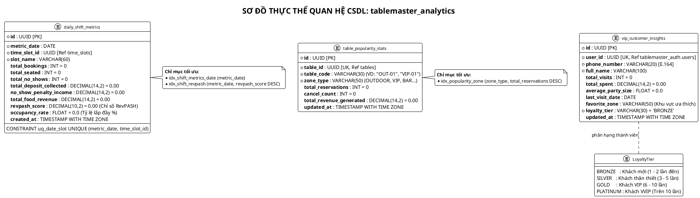
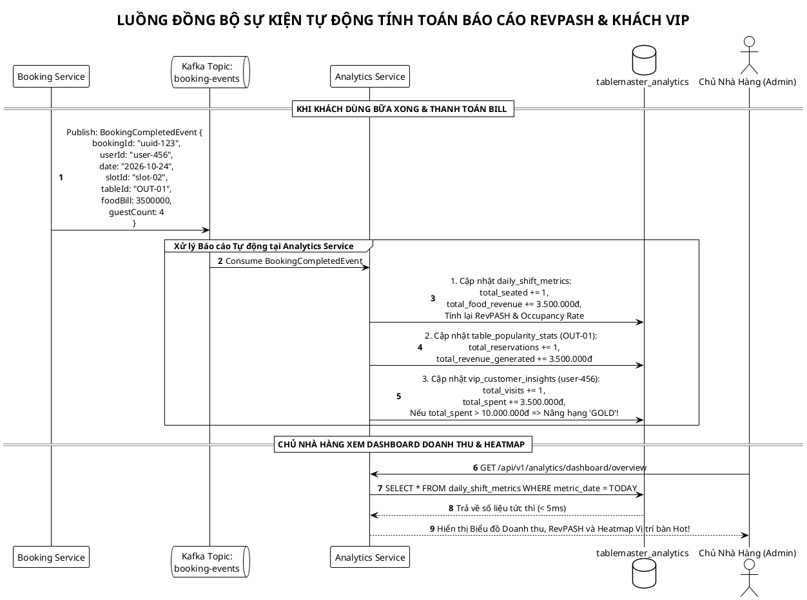

# TÀI LIỆU THIẾT KẾ CƠ SỞ DỮ LIỆU (ANALYTICS SERVICE)
# DỊCH VỤ: ANALYTICS & BI SERVICE (`tablemaster_analytics`)
## HỆ THỐNG: TABLEMASTER – NỀN TẢNG ĐẶT BÀN & ĐIỀU PHỐI MẶT BẰNG 2D

> **Mã tài liệu:** DB-SPEC-ANL-01  
> **Phiên bản:** 2.1.0 (Bản đặc tả Báo cáo Doanh thu, RevPASH, Heatmap Bàn Hot & Khách VIP)  
> **Hệ quản trị CSDL:** PostgreSQL 16+ (Database-per-Service)  
> **Đặc tả kiến trúc:** Phân tích hiệu suất ca trực (Shift Metrics), Tính toán chỉ số RevPASH & Tỷ lệ lấp đầy sàn (Occupancy Rate), Thống kê độ ưa chuộng vị trí bàn (Zone Heatmap) & Hồ sơ chi tiêu Khách VIP (CRM Insights).

---

## MỤC LỤC
1. [BỐI CẢNH & TẦM QUAN TRỌNG CỦA DATABASE ANALYTICS](#1-bối-cảnh--tầm-quan-trọng-của-database-analytics)
2. [SƠ ĐỒ THỰC THỂ QUAN HỆ CSDL (PLANTUML ERD)](#2-sơ-đồ-thực-thể-quan-hệ-csdl-plantuml-erd)
3. [ĐẶC TẢ CHI TIẾT CÁC BẢNG DỮ LIỆU (POSTGRESQL DDL)](#3-đặc-tả-chi-tiết-các-bảng-dữ-liệu-postgresql-ddl)
   * [3.1. Bảng `daily_shift_metrics` (Báo cáo Hiệu suất & Doanh thu theo Ca phục vụ)](#31-bảng-daily_shift_metrics-báo-cáo-hiệu-suất--doanh-thu-theo-ca-phục-vụ)
   * [3.2. Bảng `table_popularity_stats` (Xếp hạng Bàn Hot & Phân tích Vị trí Không gian)](#32-bảng-table_popularity_stats-xếp-hạng-bàn-hot--phân-tích-vị-trí-không-gian)
   * [3.3. Bảng `vip_customer_insights` (Thống kê Chi tiêu & Phân hạng Khách VIP)](#33-bảng-vip_customer_insights-thống-kê-chi-tiêu--phân-hạng-khách-vip)
4. [CÔNG THỨC TÍNH TOÁN CÁC CHỈ SỐ VÀNG TRONG NGÀNH F&B](#4-công-thức-tính-toán-các-chỉ-số-vàng-trong-ngành-fb)
   * [4.1. Chỉ số RevPASH (Revenue Per Available Seat Hour)](#41-chỉ-số-revpash-revenue-per-available-seat-hour)
   * [4.2. Tỷ lệ lấp đầy sàn (Occupancy Rate)](#42-tỷ-lệ-lấp-đầy-sàn-occupancy-rate)
5. [CÁC SƠ ĐỒ LUỒNG ĐỒNG BỘ DỮ LIỆU BI (PLANTUML SEQUENCES)](#5-các-sơ-đồ-luồng-đồng-bộ-dữ-liệu-bi-plantuml-sequences)
6. [CHIẾN LƯỢC ĐÁNH CHỈ MỤC & TỐI ƯU HIỆU NĂNG](#6-chiến-lược-đánh-chỉ-mục--tối-ưu-hiệu-năng)
7. [SCRIPT KHỞI TẠO SQL HOÀN CHỈNH (DDL & SEED DATA)](#7-script-khởi-tạo-sql-hoàn-chỉnh-ddl--seed-data)

---

## 1. BỐI CẢNH & TẦM QUAN TRỌNG CỦA DATABASE ANALYTICS

Trong kiến trúc Microservices của **TableMaster**, Database `tablemaster_analytics` được tách rời hoàn toàn khỏi CSDL giao dịch (OLTP):

* **Không làm chậm tốc độ đặt bàn:** Các câu truy vấn báo cáo tài chính nặng (tổng hợp doanh thu theo tháng/năm, tính toán tỷ lệ lấp đầy) chạy trên CSDL riêng, **không làm chậm dù chỉ 1ms** trải nghiệm đặt bàn thời gian thực của khách trên web.
* **Đồng bộ phi đồng bộ qua Kafka Events:** Dữ liệu tự động tổng hợp khi nhận các sự kiện:
  * `DepositPaidSuccessEvent` $\rightarrow$ Tích lũy tiền cọc.
  * `BookingCompletedEvent` $\rightarrow$ Cập nhật tổng doanh thu ca, chỉ số RevPASH và điểm tích lũy của khách.
  * `NoShowReportedEvent` $\rightarrow$ Ghi nhận doanh thu từ tiền phạt tịch thu cọc.

---

## 2. SƠ ĐỒ THỰC THỂ QUAN HỆ CSDL (PLANTUML ERD)



---

## 3. ĐẶC TẢ CHI TIẾT CÁC BẢNG DỮ LIỆU (POSTGRESQL DDL)

```sql
CREATE EXTENSION IF NOT EXISTS "uuid-ossp";

-- 1. BẢNG HIỆU SUẤT TỪNG CA PHỤC VỤ (SHIFT PERFORMANCE & REVPASH)
CREATE TABLE daily_shift_metrics (
    id UUID PRIMARY KEY DEFAULT uuid_generate_v4(),
    metric_date DATE NOT NULL,
    time_slot_id UUID NOT NULL,
    slot_name VARCHAR(60) NOT NULL,              -- "Ca tối Giờ Vàng (18:30 - 20:30)"
    total_bookings INT DEFAULT 0,                -- Tổng đơn đặt trong ca
    total_seated INT DEFAULT 0,                  -- Số bàn thực tế khách đã đến ăn
    total_no_shows INT DEFAULT 0,                -- Số bàn khách bùng kèo (không đến)
    total_deposit_collected DECIMAL(14, 2) DEFAULT 0.00, -- Tổng tiền cọc nhận được
    no_show_penalty_income DECIMAL(14, 2) DEFAULT 0.00,  -- Tiền cọc tịch thu từ khách bùng
    total_food_revenue DECIMAL(14, 2) DEFAULT 0.00,      -- Doanh thu món ăn & đồ uống
    revpash_score DECIMAL(10, 2) DEFAULT 0.00,   -- Doanh thu / (Ghế x Giờ)
    occupancy_rate FLOAT DEFAULT 0.0,            -- Tỷ lệ lấp đầy ghế (%)
    created_at TIMESTAMP WITH TIME ZONE DEFAULT CURRENT_TIMESTAMP,
    CONSTRAINT uq_date_slot UNIQUE (metric_date, time_slot_id)
);

-- 2. BẢNG XẾP HẠNG VỊ TRÍ BÀN HOT (TABLE POPULARITY & HEATMAP)
CREATE TABLE table_popularity_stats (
    id UUID PRIMARY KEY DEFAULT uuid_generate_v4(),
    table_id UUID UNIQUE NOT NULL,               -- Ref tablemaster_restaurant.tables(id)
    table_code VARCHAR(30) NOT NULL,             -- "OUT-01", "VIP-01"
    zone_type VARCHAR(50) NOT NULL,              -- 'OUTDOOR', 'PRIVATE_VIP', 'BAR_COUNTER'...
    total_reservations INT DEFAULT 0,            -- Số lượt khách chọn đặt bàn này
    cancel_count INT DEFAULT 0,                  -- Số lượt bị hủy
    total_revenue_generated DECIMAL(14, 2) DEFAULT 0.00, -- Doanh thu bàn này mang lại
    updated_at TIMESTAMP WITH TIME ZONE DEFAULT CURRENT_TIMESTAMP
);

-- 3. BẢNG HỒ SƠ & PHÂN HẠNG KHÁCH VIP (VIP CUSTOMER INSIGHTS)
CREATE TABLE vip_customer_insights (
    id UUID PRIMARY KEY DEFAULT uuid_generate_v4(),
    user_id UUID UNIQUE NOT NULL,                -- Ref tablemaster_auth.users(id)
    phone_number VARCHAR(20) NOT NULL,           -- SĐT chuẩn E.164
    full_name VARCHAR(100) NOT NULL,
    total_visits INT DEFAULT 0,                  -- Số lần đến nhà hàng dùng bữa
    total_spent DECIMAL(14, 2) DEFAULT 0.00,     -- Tổng tiền chi tiêu tích lũy
    average_party_size FLOAT DEFAULT 0.0,        -- Số lượng khách đi cùng trung bình (VD: 4.2 người)
    last_visit_date DATE,                        -- Lần cuối cùng ghé quán
    favorite_zone VARCHAR(50) DEFAULT 'STANDARD',-- Khu vực ngồi yêu thích (VD: 'OUTDOOR')
    loyalty_tier VARCHAR(30) NOT NULL DEFAULT 'BRONZE', -- 'BRONZE', 'SILVER', 'GOLD', 'PLATINUM'
    updated_at TIMESTAMP WITH TIME ZONE DEFAULT CURRENT_TIMESTAMP
);
```

---

## 4. CÔNG THỨC TÍNH TOÁN CÁC CHỈ SỐ VÀNG TRONG NGÀNH F&B

### 4.1. Chỉ số RevPASH (Revenue Per Available Seat Hour)
RevPASH là thước đo tiêu chuẩn vàng để đo lường khả năng sinh lời của nhà hàng cao cấp trên mỗi mét vuông mặt bằng:

$$\text{RevPASH} = \frac{\text{Tổng Doanh Thu Ca (Tiền ăn + Phạt No-Show)}}{\text{Tổng Số Ghế Khả Dụng} \times \text{Thời Lượng Ca (Giờ)}}$$

* *Ý nghĩa:* Giúp chủ nhà hàng biết ca tối 18:30 – 20:30 mỗi chiếc ghế mang về bao nhiêu tiền so với ca trưa 11:30 – 13:30.

### 4.2. Tỷ lệ Lấp Đầy Sàn (Occupancy Rate)

$$\text{Occupancy Rate (\%)} = \left( \frac{\text{Tổng Số Ghế Thực Tế Đã Phục Vụ}}{\text{Tổng Số Ghế Tối Đa Của Toàn Quán}} \right) \times 100$$

* *Ý nghĩa:* Đánh giá hiệu suất điều phối sàn của Lễ tân.

---

## 5. CÁC SƠ ĐỒ LUỒNG ĐỒNG BỘ DỮ LIỆU BI (PLANTUML SEQUENCES)



---

## 6. CHIẾN LƯỢC ĐÁNH CHỈ MỤC & TỐI ƯU HIỆU NĂNG

```sql
-- 1. Tối ưu vẽ biểu đồ doanh thu theo khoảng ngày (Date Range)
CREATE INDEX idx_shift_metrics_date ON daily_shift_metrics(metric_date DESC);

-- 2. Tối ưu truy vấn Top bàn Hot nhất quán theo Doanh thu
CREATE INDEX idx_popularity_revenue ON table_popularity_stats(total_revenue_generated DESC);

-- 3. Tối ưu lọc danh sách Khách hàng VIP theo Hạng thành viên
CREATE INDEX idx_vip_tier_spent ON vip_customer_insights(loyalty_tier, total_spent DESC);
```

---

## 7. SCRIPT KHỞI TẠO SQL HOÀN CHỈNH (DDL & SEED DATA)

```sql
\c tablemaster_analytics;

-- SEED DATA MẪU
INSERT INTO daily_shift_metrics (
    metric_date, time_slot_id, slot_name, total_bookings,
    total_seated, total_no_shows, total_deposit_collected,
    total_food_revenue, revpash_score, occupancy_rate
) VALUES (
    '2026-10-24',
    'b1000000-0000-0000-0000-000000000002',
    'Ca tối Giờ Vàng (18:30 - 20:30)',
    18, 17, 1, 3600000.00, 45000000.00, 375000.00, 94.4
);

INSERT INTO table_popularity_stats (
    table_id, table_code, zone_type, total_reservations, cancel_count, total_revenue_generated
) VALUES (
    'b2000000-0000-0000-0000-000000000003',
    'OUT-01',
    'OUTDOOR',
    42, 2, 86000000.00
);

INSERT INTO vip_customer_insights (
    user_id, phone_number, full_name, total_visits, total_spent,
    average_party_size, last_visit_date, favorite_zone, loyalty_tier
) VALUES (
    'a0000000-0000-0000-0000-000000000005',
    '+84901234567',
    'Nguyễn Văn A (Khách VIP)',
    8, 28500000.00, 4.5, '2026-10-24', 'OUTDOOR', 'GOLD'
);
```
