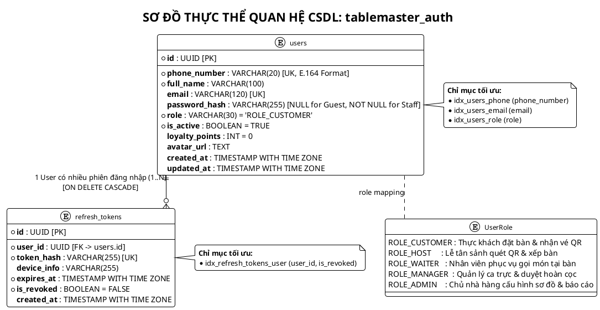
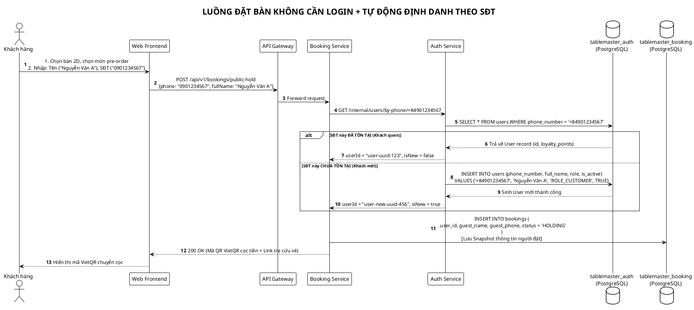
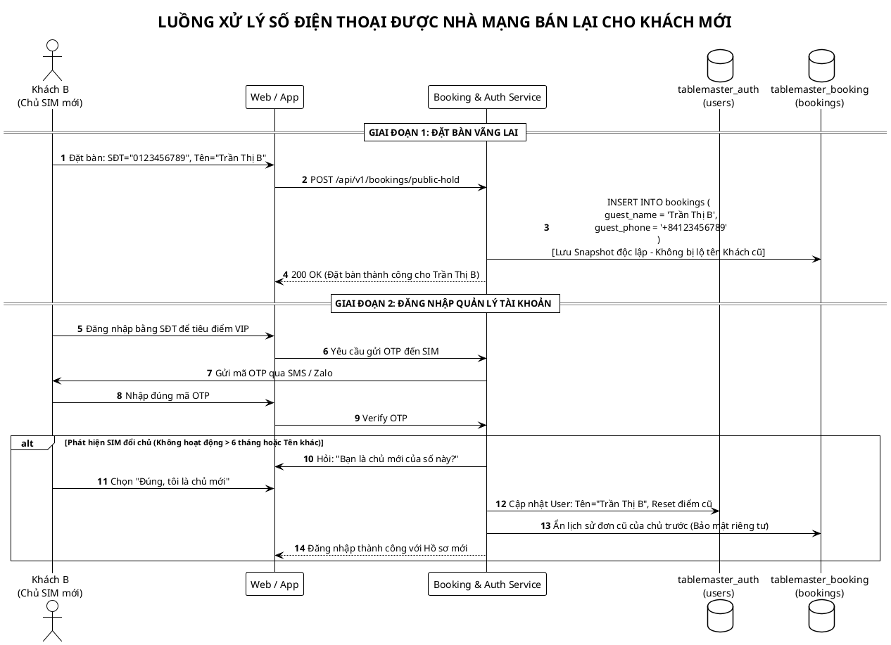
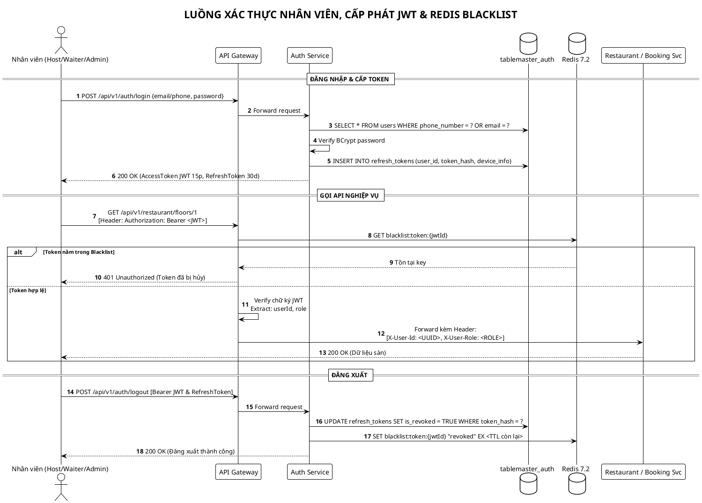
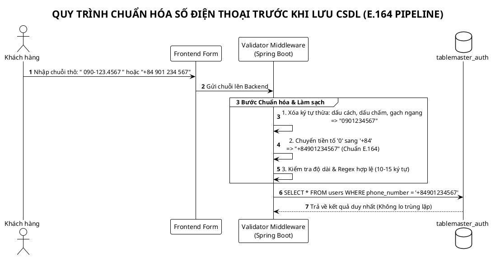

# TÀI LIỆU THIẾT KẾ CƠ SỞ DỮ LIỆU & KIẾN TRÚC ĐỊNH DANH (AUTH SERVICE)
# DỊCH VỤ: AUTH & IDENTITY SERVICE (`tablemaster_auth`)
## HỆ THỐNG: TABLEMASTER – NỀN TẢNG ĐẶT BÀN & ĐIỀU PHỐI MẶT BẰNG 2D

> **Mã tài liệu:** DB-SPEC-AUTH-01  
> **Phiên bản:** 2.1.0 (Bản cập nhật Kiến trúc Hybrid Auth & Seamless Phone Identity)  
> **Hệ quản trị CSDL:** PostgreSQL 16+ & Redis Cluster 7.2 (In-Memory Session & Blacklist)  
> **Đặc tả kiến trúc:** Microservices Database-per-Service, RBAC (5 Roles), Chuẩn hóa E.164, Hỗ trợ Đặt bàn 1-chạm không cần tạo mật khẩu (Seamless Guest Booking).

---

## MỤC LỤC
1. [BỐI CẢNH & TRIẾT LÝ THIẾT KẾ HYBRID AUTH](#1-bối-cảnh--triết-lý-thiết-kế-hybrid-auth)
2. [SƠ ĐỒ THỰC THỂ QUAN HỆ CSDL (PLANTUML ERD)](#2-sơ-đồ-thực-thể-quan-hệ-csdl-plantuml-erd)
3. [ĐẶC TẢ CHI TIẾT CÁC BẢNG DỮ LIỆU (POSTGRESQL DDL)](#3-đặc-tả-chi-tiết-các-bảng-dữ-liệu-postgresql-ddl)
   * [3.1. Bảng `users` (Hồ sơ người dùng, Nhân sự & Điểm VIP)](#31-bảng-users-hồ-sơ-người-dùng-nhân-sự--điểm-vip)
   * [3.2. Bảng `refresh_tokens` (Quản lý phiên đăng nhập & Đa thiết bị)](#32-bảng-refresh_tokens-quản-lý-phiên-đăng-nhập--đa-thiết-bị)
4. [MA TRẬN PHÂN QUYỀN VAI TRÒ (RBAC MATRIX)](#4-ma-trận-phân-quyền-vai-trò-rbac-matrix)
5. [CÁC SƠ ĐỒ LUỒNG NGHIỆP VỤ NÂNG CAO (PLANTUML SEQUENCES)](#5-các-sơ-đồ-luồng-nghiệp-vụ-nâng-cao-plantuml-sequences)
   * [5.1. Luồng đặt bàn 1-chạm & Tự động nhận diện SĐT ngầm](#51-luồng-đặt-bàn-1-chạm--tự-động-nhận-diện-sđt-ngầm)
   * [5.2. Luồng xử lý SIM tái sử dụng (Recycled Phone Numbers)](#52-luồng-xử-lý-sim-tái-sử-dụng-recycled-phone-numbers)
   * [5.3. Luồng đăng nhập, cấp phát JWT & Thu hồi phiên qua Redis](#53-luồng-đăng-nhập-cấp-phát-jwt--thu-hồi-phiên-qua-redis)
   * [5.4. Quy trình tiền xử lý chuẩn hóa số điện thoại (E.164 Pipeline)](#54-quy-trình-tiền-xử-lý-chuẩn-hóa-số-điện-thoại-e164-pipeline)
6. [CHIẾN LƯỢC ĐÁNH CHỈ MỤC & TỐI ƯU HIỆU NĂNG (INDEXING STRATEGY)](#6-chiến-lược-đánh-chỉ-mục--tối-ưu-hiệu-năng-indexing-strategy)
7. [SCRIPT KHỞI TẠO SQL HOÀN CHỈNH (DDL & SEED DATA)](#7-script-khởi-tạo-sql-hoàn-chỉnh-ddl--seed-data)

---

## 1. BỐI CẢNH & TRIẾT LÝ THIẾT KẾ HYBRID AUTH

Trong ngành F&B (Nhà hàng cao cấp), bài toán định danh người dùng gặp phải một mâu thuẫn lớn:
* **Nếu Bắt buộc Đăng ký/Đăng nhập (Strict Login):** Thực khách đang đói, vội đặt bàn tiếp khách sẽ thấy cực kỳ phiền toái khi phải nhập mật khẩu $\rightarrow$ **Tỷ lệ bỏ trang (Drop-off Rate) lên tới 50%**.
* **Nếu Bỏ hoàn toàn Login (No Auth / Pure Guest):** Nhà hàng **không thể nhận diện khách quen**, không tích điểm VIP, không có hệ thống bảo mật nội bộ cho Lễ tân, Phục vụ và Quản lý.

### Giải pháp Kiến trúc: "Hybrid Identity Architecture"
Tách biệt trải nghiệm thành 2 luồng rõ ràng:
1. **Dành cho Thực khách (`ROLE_CUSTOMER`):** 
   * Đặt bàn không cần tạo mật khẩu (Seamless Phone Booking).
   * Hệ thống tự động làm sạch và chuẩn hóa số điện thoại theo chuẩn quốc tế **E.164**.
   * Tự động nhận diện khách quen để tích điểm `loyalty_points`.
   * Quản lý vé qua Link/Token gửi về Email/SMS hoặc OTP xác thực nhanh.
2. **Dành cho Nhân sự nội bộ (`HOST`, `WAITER`, `MANAGER`, `ADMIN`):**
   * Bắt buộc xác thực bảo mật với mật khẩu mã hóa BCrypt.
   * Cấp phát cặp token JWT (Stateless) + Refresh Token có cơ chế lưu vết thiết bị (`device_info`).
   * Thu hồi phiên tức thì qua Redis Token Blacklist.

---

## 2. SƠ ĐỒ THỰC THỂ QUAN HỆ CSDL (PLANTUML ERD)



---

## 3. ĐẶC TẢ CHI TIẾT CÁC BẢNG DỮ LIỆU (POSTGRESQL DDL)

### 3.1. Bảng `users` (Hồ sơ người dùng, Nhân sự & Điểm VIP)

```sql
CREATE EXTENSION IF NOT EXISTS "uuid-ossp";

CREATE TABLE users (
    id UUID PRIMARY KEY DEFAULT uuid_generate_v4(),
    phone_number VARCHAR(20) UNIQUE NOT NULL, -- Định dạng chuẩn quốc tế E.164 (+84901234567)
    email VARCHAR(120) UNIQUE,                -- Có thể NULL lúc khách đặt nhanh
    password_hash VARCHAR(255),               -- NULL: Khách vãng lai, NOT NULL: Nhân sự / Khách có pass
    full_name VARCHAR(100) NOT NULL,
    role VARCHAR(30) NOT NULL DEFAULT 'ROLE_CUSTOMER',
    is_active BOOLEAN NOT NULL DEFAULT TRUE,
    loyalty_points INT DEFAULT 0,             -- Điểm tích lũy thành viên VIP
    avatar_url TEXT,
    created_at TIMESTAMP WITH TIME ZONE DEFAULT CURRENT_TIMESTAMP,
    updated_at TIMESTAMP WITH TIME ZONE DEFAULT CURRENT_TIMESTAMP
);
```

| Cột (Column) | Kiểu dữ liệu | Ràng buộc | Mô tả & Nghiệp vụ |
| :--- | :--- | :--- | :--- |
| `id` | `UUID` | `PRIMARY KEY` | Khóa chính chuẩn UUIDv4 bảo mật, chống đoán số thứ tự. |
| `phone_number` | `VARCHAR(20)` | `UNIQUE NOT NULL` | Định danh cốt lõi của khách hàng. Lưu dạng chuẩn quốc tế E.164 (VD: `+84901234567`). |
| `email` | `VARCHAR(120)` | `UNIQUE` | Email nhận vé điện tử QR và hóa đơn. |
| `password_hash` | `VARCHAR(255)` | *Nullable* | Băm BCrypt. Cho phép `NULL` đối với khách đặt vãng lai; Bắt buộc có giá trị đối với Nhân viên nội bộ. |
| `full_name` | `VARCHAR(100)` | `NOT NULL` | Họ tên khách hàng hoặc nhân viên. |
| `role` | `VARCHAR(30)` | `NOT NULL` | Phân quyền RBAC: `ROLE_CUSTOMER`, `ROLE_HOST`, `ROLE_WAITER`, `ROLE_MANAGER`, `ROLE_ADMIN`. |
| `is_active` | `BOOLEAN` | `DEFAULT TRUE` | Khóa tài khoản khi nhân viên nghỉ việc hoặc chặn khách gian lận. |
| `loyalty_points` | `INT` | `DEFAULT 0` | Điểm tích lũy đổi voucher/quà tặng của nhà hàng. |

---

### 3.2. Bảng `refresh_tokens` (Quản lý phiên đăng nhập & Đa thiết bị)

```sql
CREATE TABLE refresh_tokens (
    id UUID PRIMARY KEY DEFAULT uuid_generate_v4(),
    user_id UUID NOT NULL REFERENCES users(id) ON DELETE CASCADE,
    token_hash VARCHAR(255) UNIQUE NOT NULL,
    device_info VARCHAR(255),
    expires_at TIMESTAMP WITH TIME ZONE NOT NULL,
    is_revoked BOOLEAN NOT NULL DEFAULT FALSE,
    created_at TIMESTAMP WITH TIME ZONE DEFAULT CURRENT_TIMESTAMP
);
```

| Cột (Column) | Kiểu dữ liệu | Ràng buộc | Mô tả & Nghiệp vụ |
| :--- | :--- | :--- | :--- |
| `id` | `UUID` | `PRIMARY KEY` | Khóa chính bản ghi phiên. |
| `user_id` | `UUID` | `FOREIGN KEY` | Khóa ngoại trỏ về `users(id)`, tự động xóa sạch khi xóa User (`CASCADE`). |
| `token_hash` | `VARCHAR(255)` | `UNIQUE NOT NULL` | Mã băm SHA-256 của Refresh Token nhằm chống rò rỉ token gốc. |
| `device_info` | `VARCHAR(255)` | | Tên thiết bị (VD: *"iPad Lễ Tân Sảnh 1"*, *"Samsung POS - Tầng 2"*). |
| `expires_at` | `TIMESTAMP WITH TIME ZONE` | `NOT NULL` | Thời điểm hết hạn của Refresh Token (thường là 30 ngày). |
| `is_revoked` | `BOOLEAN` | `DEFAULT FALSE` | Đánh dấu `TRUE` khi người dùng đăng xuất hoặc khi Admin thu hồi quyền. |

---

## 4. MA TRẬN PHÂN QUYỀN VAI TRÒ (RBAC MATRIX)

| Quyền hạn / Nghiệp vụ | `ROLE_CUSTOMER` (Thực khách) | `ROLE_HOST` (Lễ tân sảnh) | `ROLE_WAITER` (Phục vụ bàn) | `ROLE_MANAGER` (Quản lý ca) | `ROLE_ADMIN` (Chủ nhà hàng) |
| :--- | :---: | :---: | :---: | :---: | :---: |
| **Xem Sơ đồ 2D & Đặt giữ bàn** | ✅ | ✅ | ✅ | ✅ | ✅ |
| **Quét Camera QR Check-in khách** | ❌ | ✅ | ❌ | ✅ | ✅ |
| **Xếp khách vãng lai (Walk-in)** | ❌ | ✅ | ❌ | ✅ | ✅ |
| **Chuyển bàn / Ghép bàn tại sảnh** | ❌ | ✅ | ❌ | ✅ | ✅ |
| **Gọi thêm món tại bàn (Mobile App)**| ❌ | ❌ | ✅ | ✅ | ✅ |
| **Duyệt hoàn tiền cọc (Refund)** | ❌ | ❌ | ❌ | ✅ | ✅ |
| **Khóa / Mở bàn khẩn cấp** | ❌ | ❌ | ❌ | ✅ | ✅ |
| **Chỉnh sửa Sơ đồ 2D (Floor Builder)** | ❌ | ❌ | ❌ | ❌ | ✅ |
| **Cấu hình Menu, Mức cọc & Ca giờ** | ❌ | ❌ | ❌ | ❌ | ✅ |
| **Xem Báo cáo Doanh thu & RevPASH** | ❌ | ❌ | ❌ | ❌ | ✅ |

---

## 5. CÁC SƠ ĐỒ LUỒNG NGHIỆP VỤ NÂNG CAO (PLANTUML SEQUENCES)

### 5.1. Luồng đặt bàn 1-chạm & Tự động nhận diện SĐT ngầm



---

### 5.2. Luồng xử lý SIM tái sử dụng (Recycled Phone Numbers)



---

### 5.3. Luồng đăng nhập, cấp phát JWT & Thu hồi phiên qua Redis



---

### 5.4. Quy trình tiền xử lý chuẩn hóa số điện thoại (E.164 Pipeline)



---

## 6. CHIẾN LƯỢC ĐÁNH CHỈ MỤC & TỐI ƯU HIỆU NĂNG (INDEXING STRATEGY)

Để đảm bảo các truy vấn định danh và xác thực đạt tốc độ dưới **5ms**:

```sql
-- 1. Tìm kiếm siêu tốc khi User đăng nhập hoặc nhận diện qua SĐT
CREATE INDEX idx_users_phone ON users(phone_number);

-- 2. Tìm kiếm khi đăng nhập qua Email
CREATE INDEX idx_users_email ON users(email) WHERE email IS NOT NULL;

-- 3. Lọc danh sách nhân viên theo phân quyền
CREATE INDEX idx_users_role ON users(role) WHERE is_active = TRUE;

-- 4. Tối ưu khi Refresh Token hoặc thu hồi phiên
CREATE INDEX idx_refresh_tokens_user ON refresh_tokens(user_id, is_revoked);
```

---

## 7. SCRIPT KHỞI TẠO SQL HOÀN CHỈNH (DDL & SEED DATA)

```sql
-- ====================================================================
-- DATABASE: tablemaster_auth
-- HỆ THỐNG: TABLEMASTER (SINGLE-TENANT RESTAURANT BOOKING)
-- ====================================================================

\c tablemaster_auth;

CREATE EXTENSION IF NOT EXISTS "uuid-ossp";

-- 1. BẢNG USERS
DROP TABLE IF EXISTS refresh_tokens CASCADE;
DROP TABLE IF EXISTS users CASCADE;

CREATE TABLE users (
    id UUID PRIMARY KEY DEFAULT uuid_generate_v4(),
    phone_number VARCHAR(20) UNIQUE NOT NULL,
    email VARCHAR(120) UNIQUE,
    password_hash VARCHAR(255),
    full_name VARCHAR(100) NOT NULL,
    role VARCHAR(30) NOT NULL DEFAULT 'ROLE_CUSTOMER',
    is_active BOOLEAN NOT NULL DEFAULT TRUE,
    loyalty_points INT DEFAULT 0,
    avatar_url TEXT,
    created_at TIMESTAMP WITH TIME ZONE DEFAULT CURRENT_TIMESTAMP,
    updated_at TIMESTAMP WITH TIME ZONE DEFAULT CURRENT_TIMESTAMP
);

-- 2. BẢNG REFRESH TOKENS
CREATE TABLE refresh_tokens (
    id UUID PRIMARY KEY DEFAULT uuid_generate_v4(),
    user_id UUID NOT NULL REFERENCES users(id) ON DELETE CASCADE,
    token_hash VARCHAR(255) UNIQUE NOT NULL,
    device_info VARCHAR(255),
    expires_at TIMESTAMP WITH TIME ZONE NOT NULL,
    is_revoked BOOLEAN NOT NULL DEFAULT FALSE,
    created_at TIMESTAMP WITH TIME ZONE DEFAULT CURRENT_TIMESTAMP
);

-- 3. INDEXES
CREATE INDEX idx_users_phone ON users(phone_number);
CREATE INDEX idx_users_email ON users(email) WHERE email IS NOT NULL;
CREATE INDEX idx_users_role ON users(role) WHERE is_active = TRUE;
CREATE INDEX idx_refresh_tokens_user ON refresh_tokens(user_id, is_revoked);

-- 4. SEED DATA MẪU CHO NHÂN SỰ NỘI BỘ & KHÁCH HÀNG VIP
-- Mật khẩu mặc định: 'Admin@123' (Mã băm BCrypt: $2a$10$wN3qN9cO6v0hO4...)
INSERT INTO users (id, phone_number, email, password_hash, full_name, role, loyalty_points)
VALUES 
  ('a0000000-0000-0000-0000-000000000001', '+84900000001', 'admin@primebistro.vn', '$2a$10$wN3qN9cO6v0hO4R81R708uL6eCgHq81.LdYfK7aUjP9Jk2WdM1D1K', 'Chủ Nhà Hàng (Admin)', 0),
  ('a0000000-0000-0000-0000-000000000002', '+84900000002', 'manager@primebistro.vn', '$2a$10$wN3qN9cO6v0hO4R81R708uL6eCgHq81.LdYfK7aUjP9Jk2WdM1D1K', 'Quản Lý Ca Trực', 0),
  ('a0000000-0000-0000-0000-000000000003', '+84900000003', 'host@primebistro.vn', '$2a$10$wN3qN9cO6v0hO4R81R708uL6eCgHq81.LdYfK7aUjP9Jk2WdM1D1K', 'Lễ Tân Sảnh Tầng 1', 0),
  ('a0000000-0000-0000-0000-000000000004', '+84900000004', 'waiter@primebistro.vn', '$2a$10$wN3qN9cO6v0hO4R81R708uL6eCgHq81.LdYfK7aUjP9Jk2WdM1D1K', 'Phục Vụ Bàn Tầng 1', 0),
  ('a0000000-0000-0000-0000-000000000005', '+84901234567', 'khachvip@gmail.com', NULL, 'Nguyễn Văn A (Khách VIP)', 1250);
