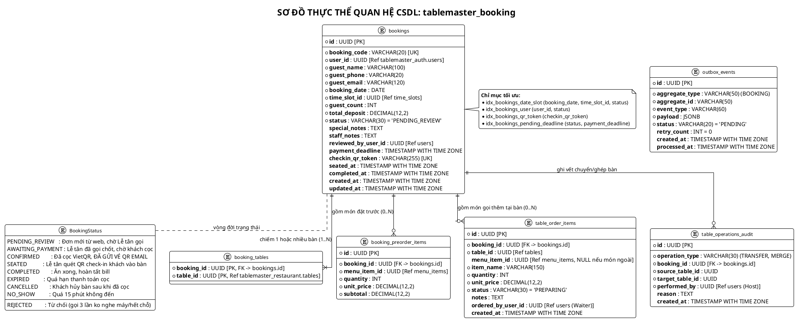
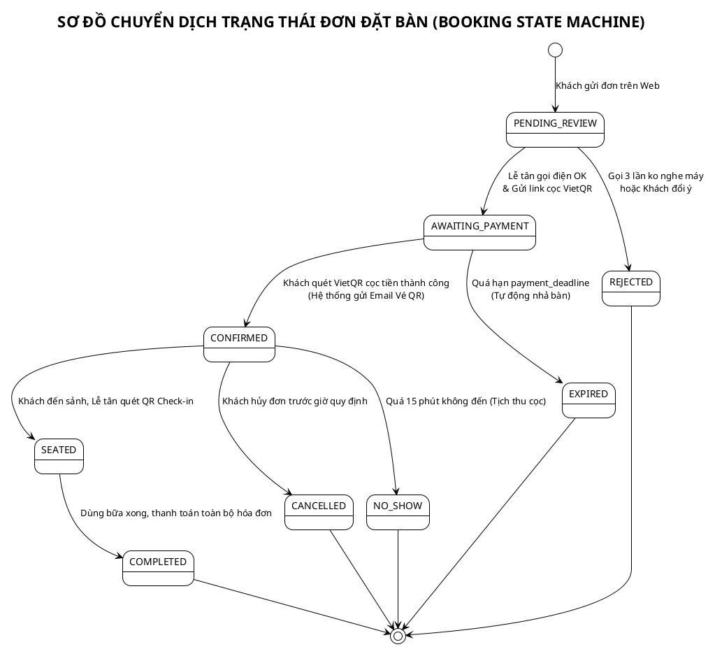
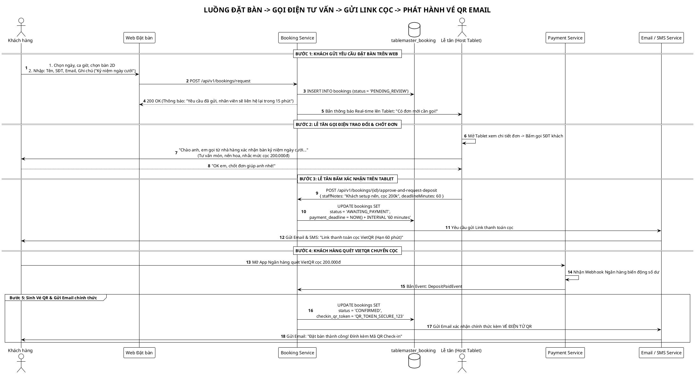
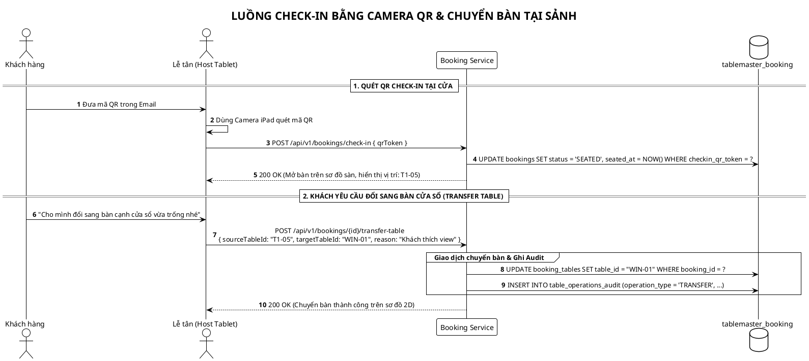
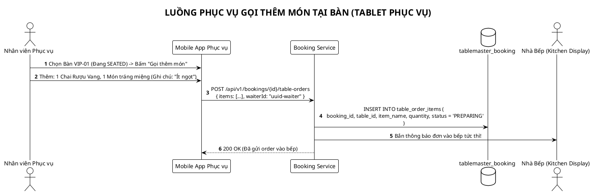

# TÀI LIỆU THIẾT KẾ CƠ SỞ DỮ LIỆU (BOOKING SERVICE)
# DỊCH VỤ: BOOKING & DISPATCH SERVICE (`tablemaster_booking`)
## HỆ THỐNG: TABLEMASTER – NỀN TẢNG ĐẶT BÀN & ĐIỀU PHỐI MẶT BẰNG 2D

> **Mã tài liệu:** DB-SPEC-BOOK-01  
> **Phiên bản:** 2.1.0 (Quy trình Telesales Gọi điện Xác nhận, Gửi Link Cọc & Vé QR Email)  
> **Hệ quản trị CSDL:** PostgreSQL 16+ & Redis 7.2 (Redlock 5p & Trạng thái bàn)  
> **Đặc tả kiến trúc:** Quản lý Đơn đặt bàn, Ghép nhiều bàn, Đặt trước món ăn, Gọi thêm món tại bàn (Tablet Phục vụ), Nhật ký chuyển bàn & Transactional Outbox Pattern.

---

## MỤC LỤC
1. [BỐI CẢNH & QUY TRÌNH NGHIỆP VỤ TELESALES XÁC NHẬN](#1-bối-cảnh--quy-trình-nghiệp-vụ-telesales-xác-nhận)
2. [SƠ ĐỒ THỰC THỂ QUAN HỆ CSDL (PLANTUML ERD)](#2-sơ-đồ-thực-thể-quan-hệ-csdl-plantuml-erd)
3. [ĐẶC TẢ CHI TIẾT CÁC BẢNG DỮ LIỆU (POSTGRESQL DDL)](#3-đặc-tả-chi-tiết-các-bảng-dữ-liệu-postgresql-ddl)
   * [3.1. Bảng `bookings` (Đơn đặt bàn chính & Vòng đời 9 trạng thái)](#31-bảng-bookings-đơn-đặt-bàn-chính--vòng-đời-9-trạng-thái)
   * [3.2. Bảng `booking_tables` (Liên kết Đặt 1 bàn hoặc Ghép nhiều bàn)](#32-bảng-booking_tables-liên-kết-đặt-1-bàn-hoặc-ghép-nhiều-bàn)
   * [3.3. Bảng `booking_preorder_items` (Món ăn đặt trước từ Web)](#33-bảng-booking_preorder_items-món-ăn-đặt-trước-từ-web)
   * [3.4. Bảng `table_order_items` (Món gọi thêm tại bàn qua Tablet Phục vụ)](#34-bảng-table_order_items-món-gọi-thêm-tại-bàn-qua-tablet-phục-vụ)
   * [3.5. Bảng `table_operations_audit` (Nhật ký Chuyển bàn & Ghép bàn)](#35-bảng-table_operations_audit-nhật-ký-chuyển-bàn--ghép-bàn)
   * [3.6. Bảng `outbox_events` (Transactional Outbox Pattern chống mất tin nhắn)](#36-bảng-outbox_events-transactional-outbox-pattern-chống-mất-tin-nhắn)
4. [VÒNG ĐỜI TRẠNG THÁI ĐƠN ĐẶT BÀN (STATE MACHINE)](#4-vòng-đời-trạng-thái-đơn-đặt-bàn-state-machine)
5. [CÁC SƠ ĐỒ LUỒNG NGHIỆP VỤ CHI TIẾT (PLANTUML SEQUENCES)](#5-các-sơ-đồ-luồng-nghiệp-vụ-chi-tiết-plantuml-sequences)
   * [5.1. Luồng Telesales Gọi điện -> Link Cọc -> Gửi Vé QR Email](#51-luồng-telesales-gọi-điện---link-cọc---gửi-vé-qr-email)
   * [5.2. Luồng Lễ tân Quét QR Check-in & Chuyển bàn tại Sảnh](#52-luồng-lễ-tân-quét-qr-check-in--chuyển-bàn-tại-sảnh)
   * [5.3. Luồng Phục vụ Gọi thêm món tại bàn (In-Dining Orders)](#53-luồng-phục-vụ-gọi-thêm-món-tại-bàn-in-dining-orders)
6. [CHIẾN LƯỢC ĐÁNH CHỈ MỤC & TỐI ƯU HIỆU NĂNG](#6-chiến-lược-đánh-chỉ-mục--tối-ưu-hiệu-năng)
7. [SCRIPT KHỞI TẠO SQL HOÀN CHỈNH (DDL & SEED DATA)](#7-script-khởi-tạo-sql-hoàn-chỉnh-ddl--seed-data)

---

## 1. BỐI CẢNH & QUY TRÌNH NGHIỆP VỤ TELESALES XÁC NHẬN

Khác với các ứng dụng đặt bàn thông thường, phân khúc nhà hàng cao cấp (Fine Dining / Steakhouse) áp dụng quy trình **Concierge Verification**:
1. **Khách gửi yêu cầu trên web:** Chọn vị trí/bàn 2D và món ăn, nhập thông tin liên lạc $\rightarrow$ Đơn tạo ở trạng thái `PENDING_REVIEW`.
2. **Lễ tân (`ROLE_HOST`) gọi điện xác nhận:**
   * Kiểm tra số lượng khách (người lớn, trẻ em).
   * Ghi nhận sở thích: Bàn kỷ niệm ngày cưới, sinh nhật, set hoa nến, dị ứng hải sản/gluten.
   * Trao đổi và thông báo mức tiền cọc VietQR.
3. **Lễ tân bấm "Duyệt & Gửi yêu cầu cọc" trên Tablet:**
   * Đơn chuyển sang `AWAITING_PAYMENT` (có hạn chót `payment_deadline`, ví dụ 60 phút).
   * Hệ thống tự động gửi Link thanh toán VietQR qua Email & SMS/Zalo.
4. **Khách hàng quét VietQR cọc tiền:**
   * Ngân hàng báo Webhook thành công $\rightarrow$ Đơn chuyển sang `CONFIRMED`.
   * Hệ thống sinh mã Token bảo mật `checkin_qr_token` và **gửi Email vé điện tử đính kèm Mã QR Check-in**.
5. **Check-in tại sảnh:** Khách đến cửa chỉ cần đưa mã QR trên điện thoại $\rightarrow$ Lễ tân quét trong 1 giây để mở bàn (`SEATED`).

---

## 2. SƠ ĐỒ THỰC THỂ QUAN HỆ CSDL (PLANTUML ERD)



---

## 3. ĐẶC TẢ CHI TIẾT CÁC BẢNG DỮ LIỆU (POSTGRESQL DDL)

```sql
CREATE EXTENSION IF NOT EXISTS "uuid-ossp";

-- 1. BẢNG ĐƠN ĐẶT BÀN CHÍNH (BOOKINGS)
CREATE TABLE bookings (
    id UUID PRIMARY KEY DEFAULT uuid_generate_v4(),
    booking_code VARCHAR(20) UNIQUE NOT NULL, -- Mã hiển thị cho khách: "PB-20261024-001"
    user_id UUID NOT NULL,                   -- Ref tablemaster_auth.users(id)
    
    -- Snapshot liên lạc người đặt thực tế (Độc lập & Bảo mật khi SIM đổi chủ)
    guest_name VARCHAR(100) NOT NULL,
    guest_phone VARCHAR(20) NOT NULL,        -- E.164 Format
    guest_email VARCHAR(120) NOT NULL,       -- Bắt buộc để gửi Vé QR qua Email
    
    booking_date DATE NOT NULL,
    time_slot_id UUID NOT NULL,              -- Ref tablemaster_restaurant.time_slots(id)
    guest_count INT NOT NULL CHECK (guest_count > 0),
    total_deposit DECIMAL(12, 2) NOT NULL DEFAULT 0.00,
    
    -- VÒNG ĐỜI 9 TRẠNG THÁI
    status VARCHAR(30) NOT NULL DEFAULT 'PENDING_REVIEW',
    
    special_notes TEXT,                      -- Ghi chú của khách: "Set nến kỷ niệm ngày cưới"
    staff_notes TEXT,                        -- Ghi chú của Lễ tân sau cuộc gọi Telesales
    reviewed_by_user_id UUID,                -- Lễ tân nào gọi xác nhận
    
    payment_deadline TIMESTAMP WITH TIME ZONE, -- Hạn chót cọc VietQR (VD: 60 phút)
    checkin_qr_token VARCHAR(255) UNIQUE,     -- Mã Token sinh mã QR gửi qua Email
    
    seated_at TIMESTAMP WITH TIME ZONE,
    completed_at TIMESTAMP WITH TIME ZONE,
    created_at TIMESTAMP WITH TIME ZONE DEFAULT CURRENT_TIMESTAMP,
    updated_at TIMESTAMP WITH TIME ZONE DEFAULT CURRENT_TIMESTAMP
);

-- 2. BẢNG LIÊN KẾT ĐẶT BÀN & GHÉP BÀN (BOOKING TABLES)
CREATE TABLE booking_tables (
    booking_id UUID NOT NULL REFERENCES bookings(id) ON DELETE CASCADE,
    table_id UUID NOT NULL,                  -- Ref tablemaster_restaurant.tables(id)
    PRIMARY KEY (booking_id, table_id)
);

-- 3. BẢNG MÓN ĂN ĐẶT TRƯỚC (PRE-ORDER ITEMS)
CREATE TABLE booking_preorder_items (
    id UUID PRIMARY KEY DEFAULT uuid_generate_v4(),
    booking_id UUID NOT NULL REFERENCES bookings(id) ON DELETE CASCADE,
    menu_item_id UUID NOT NULL,              -- Ref tablemaster_restaurant.menu_items(id)
    quantity INT NOT NULL CHECK (quantity > 0),
    unit_price DECIMAL(12, 2) NOT NULL,
    subtotal DECIMAL(12, 2) NOT NULL
);

-- 4. BẢNG MÓN GỌI THÊM TẠI BÀN (TABLE ORDER ITEMS)
CREATE TABLE table_order_items (
    id UUID PRIMARY KEY DEFAULT uuid_generate_v4(),
    booking_id UUID NOT NULL REFERENCES bookings(id) ON DELETE CASCADE,
    table_id UUID NOT NULL,                  -- Ref tablemaster_restaurant.tables(id)
    menu_item_id UUID,                      -- Ref menu_items (NULL nếu là món nhập ngoài menu)
    item_name VARCHAR(150) NOT NULL,
    quantity INT NOT NULL CHECK (quantity > 0),
    unit_price DECIMAL(12, 2) NOT NULL,
    status VARCHAR(30) NOT NULL DEFAULT 'PREPARING', -- 'PREPARING', 'SERVED', 'CANCELLED'
    notes TEXT,                             -- Ghi chú chế biến bếp (Medium-rare, ít đá...)
    ordered_by_user_id UUID,                -- Ref tablemaster_auth.users(id) (Nhân viên phục vụ)
    created_at TIMESTAMP WITH TIME ZONE DEFAULT CURRENT_TIMESTAMP
);

-- 5. BẢNG LỊCH SỬ CHUYỂN BÀN & GHÉP BÀN (OPERATIONS AUDIT)
CREATE TABLE table_operations_audit (
    id UUID PRIMARY KEY DEFAULT uuid_generate_v4(),
    operation_type VARCHAR(30) NOT NULL,    -- 'TRANSFER' (Chuyển bàn), 'MERGE' (Ghép bàn)
    booking_id UUID NOT NULL REFERENCES bookings(id) ON DELETE CASCADE,
    source_table_id UUID NOT NULL,
    target_table_id UUID NOT NULL,
    performed_by UUID NOT NULL,             -- Ref tablemaster_auth.users(id) (Lễ tân)
    reason TEXT,
    created_at TIMESTAMP WITH TIME ZONE DEFAULT CURRENT_TIMESTAMP
);

-- 6. BẢNG TRANSACTIONAL OUTBOX (KAFKA EVENTS)
CREATE TABLE outbox_events (
    id UUID PRIMARY KEY DEFAULT uuid_generate_v4(),
    aggregate_type VARCHAR(50) NOT NULL,    -- 'BOOKING'
    aggregate_id VARCHAR(50) NOT NULL,
    event_type VARCHAR(60) NOT NULL,        -- 'BookingCreated', 'DepositRequested', 'BookingConfirmed'
    payload JSONB NOT NULL,
    status VARCHAR(20) NOT NULL DEFAULT 'PENDING',
    retry_count INT DEFAULT 0,
    created_at TIMESTAMP WITH TIME ZONE DEFAULT CURRENT_TIMESTAMP,
    processed_at TIMESTAMP WITH TIME ZONE
);
```

---

## 4. VÒNG ĐỜI TRẠNG THÁI ĐƠN ĐẶT BÀN (STATE MACHINE)



---

## 5. CÁC SƠ ĐỒ LUỒNG NGHIỆP VỤ CHI TIẾT (PLANTUML SEQUENCES)

### 5.1. Luồng Telesales Gọi điện -> Link Cọc -> Gửi Vé QR Email



---

### 5.2. Luồng Lễ tân Quét QR Check-in & Chuyển bàn tại Sảnh



---

### 5.3. Luồng Phục vụ Gọi thêm món tại bàn (In-Dining Orders)



---

## 6. CHIẾN LƯỢC ĐÁNH CHỈ MỤC & TỐI ƯU HIỆU NĂNG

```sql
-- 1. Tối ưu tìm kiếm bàn trống và lọc đơn theo ca giờ
CREATE INDEX idx_bookings_date_slot ON bookings(booking_date, time_slot_id, status);

-- 2. Tối ưu quét mã QR Check-in tại sảnh (< 5ms)
CREATE INDEX idx_bookings_qr_token ON bookings(checkin_qr_token) WHERE checkin_qr_token IS NOT NULL;

-- 3. Tối ưu Cronjob quét các đơn quá hạn cọc để tự động nhả bàn
CREATE INDEX idx_bookings_pending_deadline ON bookings(status, payment_deadline) WHERE status = 'AWAITING_PAYMENT';

-- 4. Tối ưu tra cứu đơn theo khách hàng
CREATE INDEX idx_bookings_user ON bookings(user_id, status);

-- 5. Tối ưu xử lý sự kiện Transactional Outbox
CREATE INDEX idx_outbox_pending ON outbox_events(status, created_at) WHERE status = 'PENDING';
```

---

## 7. SCRIPT KHỞI TẠO SQL HOÀN CHỈNH (DDL & SEED DATA)

```sql
\c tablemaster_booking;

-- SEED DATA MẪU
INSERT INTO bookings (
    id, booking_code, user_id, guest_name, guest_phone, guest_email,
    booking_date, time_slot_id, guest_count, total_deposit, status,
    special_notes, staff_notes, payment_deadline, checkin_qr_token
) VALUES (
    'c0000000-0000-0000-0000-000000000001',
    'PB-20261024-001',
    'a0000000-0000-0000-0000-000000000005',
    'Nguyễn Văn A',
    '+84901234567',
    'khachvip@gmail.com',
    '2026-10-24',
    'b1000000-0000-0000-0000-000000000002',
    4,
    200000.00,
    'CONFIRMED',
    'Setup nến sinh nhật góc cửa sổ',
    'Đã gọi anh Tuấn chốt cọc 200k, tặng bánh kem sinh nhật',
    NOW() + INTERVAL '60 minutes',
    'QR_TOKEN_DEMO_PB001'
);

-- Gắn bàn cho đơn
INSERT INTO booking_tables (booking_id, table_id) VALUES
('c0000000-0000-0000-0000-000000000001', 'b2000000-0000-0000-0000-000000000001');
