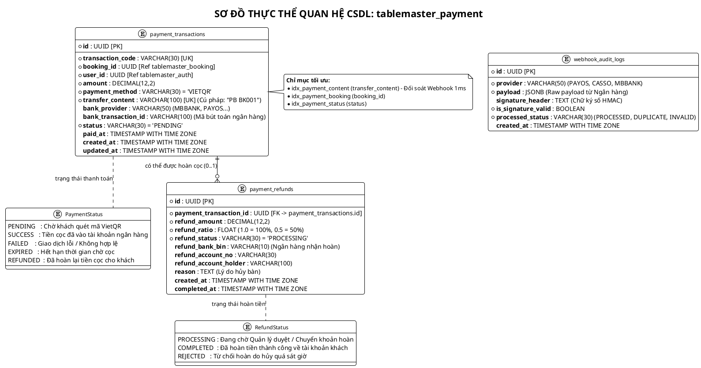
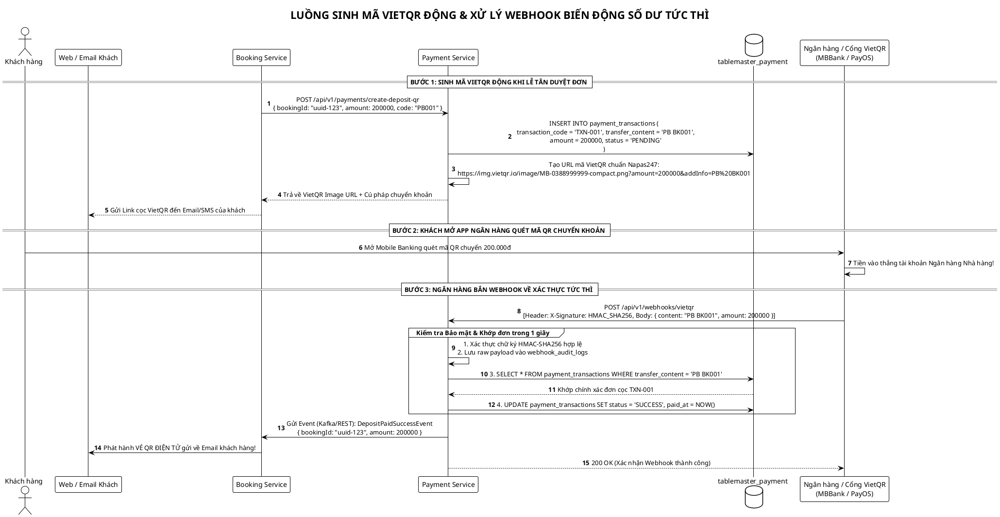
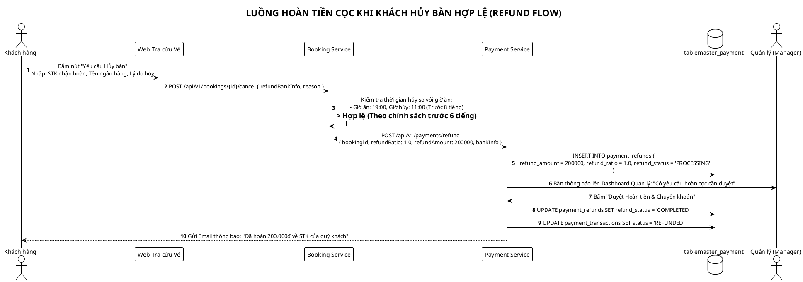

# TÀI LIỆU THIẾT KẾ CƠ SỞ DỮ LIỆU (PAYMENT SERVICE)
# DỊCH VỤ: PAYMENT & TRANSACTION SERVICE (`tablemaster_payment`)
## HỆ THỐNG: TABLEMASTER – NỀN TẢNG ĐẶT BÀN & ĐIỀU PHỐI MẶT BẰNG 2D

> **Mã tài liệu:** DB-SPEC-PAY-01  
> **Phiên bản:** 2.1.0 (Bản đặc tả Thanh toán VietQR Trực tiếp, Xử lý Webhook & Hoàn Cọc)  
> **Hệ quản trị CSDL:** PostgreSQL 16+ (Database-per-Service + JSONB Audit)  
> **Đặc tả kiến trúc:** Thanh toán cọc trực tiếp về tài khoản Ngân hàng của Nhà hàng (không qua trung gian), Đối soát biến động số dư tự động qua Webhook, Xử lý Idempotency & Quản lý Hoàn tiền cọc khi hủy bàn hợp lệ.

---

## MỤC LỤC
1. [BỐI CẢNH & ĐẶC THÙ DÒNG TIỀN SINGLE-TENANT OUTSOURCE](#1-bối-cảnh--đặc-thù-dòng-tiền-single-tenant-outsource)
2. [SƠ ĐỒ THỰC THỂ QUAN HỆ CSDL (PLANTUML ERD)](#2-sơ-đồ-thực-thể-quan-hệ-csdl-plantuml-erd)
3. [ĐẶC TẢ CHI TIẾT CÁC BẢNG DỮ LIỆU (POSTGRESQL DDL)](#3-đặc-tả-chi-tiết-các-bảng-dữ-liệu-postgresql-ddl)
   * [3.1. Bảng `payment_transactions` (Giao dịch Thanh toán Cọc VietQR)](#31-bảng-payment_transactions-giao-dịch-thanh-toán-cọc-vietqr)
   * [3.2. Bảng `payment_refunds` (Giao dịch Hoàn tiền Cọc khi Hủy bàn)](#32-bảng-payment_refunds-giao-dịch-hoàn-tiền-cọc-khi-hủy-bàn)
   * [3.3. Bảng `webhook_audit_logs` (Nhật ký Webhook & Chống gian lận)](#33-bảng-webhook_audit_logs-nhật-ký-webhook--chống-gian-lận)
4. [CƠ CHẾ BẢO MẬT & XỬ LÝ IDEMPOTENCY TRONG THANH TOÁN](#4-cơ-chế-bảo-mật--xử-lý-idempotency-trong-thanh-toán)
5. [CÁC SƠ ĐỒ LUỒNG THANH TOÁN & HOÀN TIỀN (PLANTUML SEQUENCES)](#5-các-sơ-đồ-luồng-thanh-toán--hoàn-tiền-plantuml-sequences)
   * [5.1. Luồng Sinh mã VietQR Động & Nhận Webhook Ngân hàng](#51-luồng-sinh-mã-vietqr-động--nhận-webhook-ngân-hàng)
   * [5.2. Luồng Xử lý Hoàn cọc tự động khi Khách Hủy bàn](#52-luồng-xử-lý-hoàn-cọc-tự-động-khi-khách-hủy-bàn)
6. [CHIẾN LƯỢC ĐÁNH CHỈ MỤC & TỐI ƯU HIỆU NĂNG](#6-chiến-lược-đánh-chỉ-mục--tối-ưu-hiệu-năng)
7. [SCRIPT KHỞI TẠO SQL HOÀN CHỈNH (DDL & SEED DATA)](#7-script-khởi-tạo-sql-hoàn-chỉnh-ddl--seed-data)

---

## 1. BỐI CẢNH & ĐẶC THÙ DÒNG TIỀN SINGLE-TENANT OUTSOURCE

Dự án **TableMaster** được gia công độc quyền cho 01 thương hiệu Nhà hàng, do đó dòng tiền thanh toán cọc có 3 ưu điểm vượt trội so với các sàn SaaS đại trà (PasGo, TableNow):

1. **Tiền cọc chuyển thẳng vào tài khoản Nhà hàng:** 
   * Khi khách quét VietQR, tiền về thẳng tài khoản ngân hàng của Chủ nhà hàng (MBBank/Vietcombank cấu hình trong `restaurant_profile`).
   * Nhà hàng **không bị giam tiền cọc** đến cuối tháng và **không mất phí hoa hồng 10% – 15%** cho sàn trung gian.
2. **Đối soát tự động tức thì (Real-time Webhook Reconciliation):**
   * Mỗi giao dịch sinh ra một **Cú pháp chuyển khoản DUY NHẤT** (VD: `PB BK001`).
   * Ngân hàng/Cổng Open API (PayOS, Casso, MBBank) bắn Webhook về hệ thống trong **1 giây** $\rightarrow$ Hệ thống tự động khớp tiền và kích hoạt phát hành Vé QR qua Email.
3. **Chính sách Hoàn cọc minh bạch (Automated Refund Policy):**
   * Nếu khách hủy trước hạn quy định (`cancellation_grace_hours`, ví dụ 6 tiếng trước giờ ăn): Khách được hoàn 100% tiền cọc.
   * Nếu khách hủy sát giờ hoặc không đến (`NO_SHOW`): Toàn bộ tiền cọc được giữ lại cho nhà hàng bù đắp chi phí nguyên liệu.

---

## 2. SƠ ĐỒ THỰC THỂ QUAN HỆ CSDL (PLANTUML ERD)



---

## 3. ĐẶC TẢ CHI TIẾT CÁC BẢNG DỮ LIỆU (POSTGRESQL DDL)

```sql
CREATE EXTENSION IF NOT EXISTS "uuid-ossp";

-- 1. BẢNG GIAO DỊCH TIỀN CỌC (PAYMENT TRANSACTIONS)
CREATE TABLE payment_transactions (
    id UUID PRIMARY KEY DEFAULT uuid_generate_v4(),
    transaction_code VARCHAR(30) UNIQUE NOT NULL, -- Mã giao dịch: "TXN-20261024-001"
    booking_id UUID NOT NULL,                     -- Ref tablemaster_booking.bookings(id)
    user_id UUID NOT NULL,                        -- Ref tablemaster_auth.users(id)
    amount DECIMAL(12, 2) NOT NULL,               -- Số tiền cọc cần chuyển
    payment_method VARCHAR(30) NOT NULL DEFAULT 'VIETQR',
    transfer_content VARCHAR(100) UNIQUE NOT NULL, -- Cú pháp duy nhất định danh: "PB BK001"
    bank_provider VARCHAR(50) DEFAULT 'MBBANK',
    bank_transaction_id VARCHAR(100),              -- Mã bút toán phía Ngân hàng bắn về
    status VARCHAR(30) NOT NULL DEFAULT 'PENDING',
    -- 'PENDING'  : Chờ khách quét mã VietQR cọc tiền
    -- 'SUCCESS'  : Tiền cọc đã vào tài khoản ngân hàng thành công
    -- 'FAILED'   : Chuyển sai số tiền hoặc sai cú pháp
    -- 'EXPIRED'  : Hết hạn thời gian chờ cọc
    -- 'REFUNDED' : Đã hoàn cọc cho khách do hủy đúng hạn
    paid_at TIMESTAMP WITH TIME ZONE,
    created_at TIMESTAMP WITH TIME ZONE DEFAULT CURRENT_TIMESTAMP,
    updated_at TIMESTAMP WITH TIME ZONE DEFAULT CURRENT_TIMESTAMP
);

-- 2. BẢNG HOÀN TIỀN CỌC KHI HỦY BÀN HỢP LỆ (REFUNDS)
CREATE TABLE payment_refunds (
    id UUID PRIMARY KEY DEFAULT uuid_generate_v4(),
    payment_transaction_id UUID NOT NULL REFERENCES payment_transactions(id) ON DELETE RESTRICT,
    refund_amount DECIMAL(12, 2) NOT NULL,
    refund_ratio FLOAT NOT NULL DEFAULT 1.0,      -- 1.0 = Hoàn 100% (hủy trước 6 tiếng), 0.5 = Hoàn 50%
    refund_status VARCHAR(30) NOT NULL DEFAULT 'PROCESSING',
    -- 'PROCESSING' : Đang xử lý hoàn tiền
    -- 'COMPLETED'  : Đã chuyển tiền hoàn thành công về tài khoản khách
    -- 'REJECTED'   : Từ chối hoàn cọc (hủy quá sát giờ quy định)
    refund_bank_bin VARCHAR(10),                  -- Mã ngân hàng khách nhận hoàn (VD: 970422)
    refund_account_no VARCHAR(30),                -- Số tài khoản nhận tiền hoàn
    refund_account_holder VARCHAR(100),           -- Tên chủ tài khoản nhận tiền hoàn
    reason TEXT,                                  -- Lý do khách hủy bàn
    created_at TIMESTAMP WITH TIME ZONE DEFAULT CURRENT_TIMESTAMP,
    completed_at TIMESTAMP WITH TIME ZONE
);

-- 3. BẢNG NHẬT KÝ WEBHOOK NGÂN HÀNG (AUDIT LOG & IDEMPOTENCY)
CREATE TABLE webhook_audit_logs (
    id UUID PRIMARY KEY DEFAULT uuid_generate_v4(),
    provider VARCHAR(50) NOT NULL,                -- "PAYOS", "CASSO", "MBBANK"
    payload JSONB NOT NULL,                       -- Toàn bộ nội dung thô ngân hàng bắn về
    signature_header TEXT,                        -- Chữ ký HMAC-SHA256 để chống giả mạo
    is_signature_valid BOOLEAN NOT NULL,
    processed_status VARCHAR(30) NOT NULL DEFAULT 'PROCESSED', -- 'PROCESSED', 'DUPLICATE', 'INVALID'
    created_at TIMESTAMP WITH TIME ZONE DEFAULT CURRENT_TIMESTAMP
);
```

---

## 4. CƠ CHẾ BẢO MẬT & XỬ LÝ IDEMPOTENCY TRONG THANH TOÁN

### 4.1. Xác thực Chữ ký số Webhook (HMAC Signature Verification)
* Mọi request Webhook từ Cổng thanh toán/Ngân hàng bắn về đều có Header chứa chữ ký HMAC-SHA256.
* Payment Service tính toán lại chữ ký bằng `SecretKey` của nhà hàng. Nếu chữ ký không khớp $\rightarrow$ Từ chối ngay lập tức, ngăn chặn hoàn toàn kẻ xấu tự gửi request giả mạo đã thanh toán!

### 4.2. Cơ chế Idempotency (Chống xử lý trùng lặp giao dịch)
* Trong thực tế mạng Internet, Ngân hàng có thể bắn Webhook **2-3 lần cho cùng 1 giao dịch** nếu gặp độ trễ mạng.
* **Xử lý:**
  1. Kiểm tra trạng thái hiện tại của `payment_transactions.status`.
  2. Nếu `status == 'SUCCESS'` $\rightarrow$ Bỏ qua và trả về `200 OK` cho ngân hàng mà không cộng tiền hay kích hoạt vé lần 2.

---

## 5. CÁC SƠ ĐỒ LUỒNG THANH TOÁN & HOÀN TIỀN (PLANTUML SEQUENCES)

### 5.1. Luồng Sinh mã VietQR Động & Nhận Webhook Ngân hàng



---

### 5.2. Luồng Xử lý Hoàn cọc tự động khi Khách Hủy bàn



---

## 6. CHIẾN LƯỢC ĐÁNH CHỈ MỤC & TỐI ƯU HIỆU NĂNG

```sql
-- 1. Tìm kiếm giao dịch cực nhanh khi nhận Webhook ngân hàng (< 1ms)
CREATE INDEX idx_payment_content ON payment_transactions(transfer_content);

-- 2. Tra cứu lịch sử thanh toán theo Đơn đặt bàn
CREATE INDEX idx_payment_booking ON payment_transactions(booking_id);

-- 3. Lọc danh sách giao dịch theo trạng thái và ngày tạo
CREATE INDEX idx_payment_status_created ON payment_transactions(status, created_at DESC);

-- 4. Tra cứu đơn hoàn tiền theo giao dịch gốc
CREATE INDEX idx_refund_payment_id ON payment_refunds(payment_transaction_id);
```

---

## 7. SCRIPT KHỞI TẠO SQL HOÀN CHỈNH (DDL & SEED DATA)

```sql
\c tablemaster_payment;

-- SEED DATA MẪU
INSERT INTO payment_transactions (
    id, transaction_code, booking_id, user_id, amount,
    payment_method, transfer_content, bank_provider,
    bank_transaction_id, status, paid_at
) VALUES (
    'd0000000-0000-0000-0000-000000000001',
    'TXN-20261024-001',
    'c0000000-0000-0000-0000-000000000001',
    'a0000000-0000-0000-0000-000000000005',
    200000.00,
    'VIETQR',
    'PB BK001',
    'MBBANK',
    'MB_FT261024999988',
    'SUCCESS',
    NOW()
);

-- Seed Log Webhook mẫu
INSERT INTO webhook_audit_logs (
    provider, payload, signature_header, is_signature_valid, processed_status
) VALUES (
    'PAYOS',
    '{"code": "00", "desc": "success", "data": {"orderCode": "PB001", "amount": 200000, "description": "PB BK001"}}'::jsonb,
    'hmac_sha256_valid_signature_example',
    TRUE,
    'PROCESSED'
);
```
