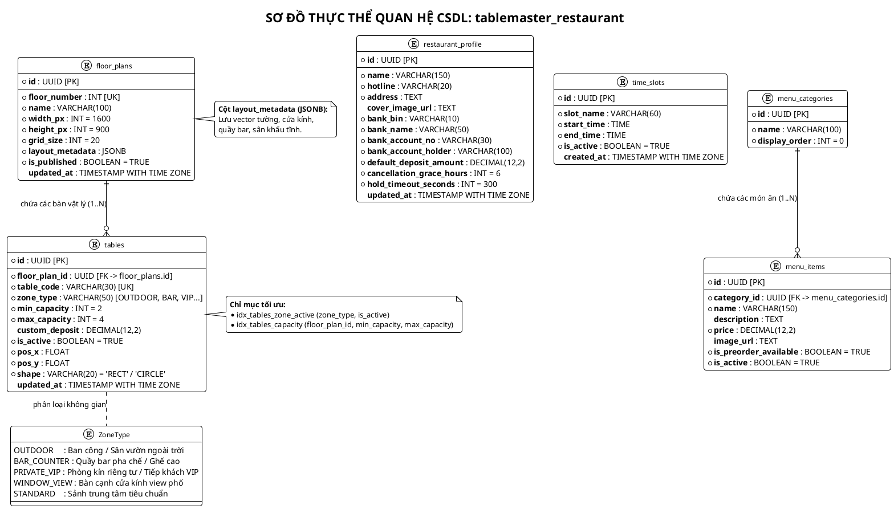
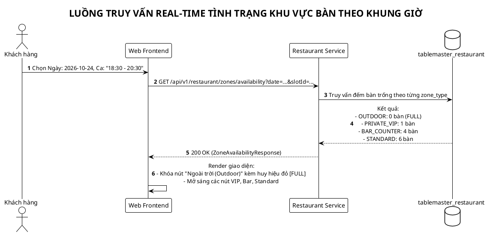

# TÀI LIỆU THIẾT KẾ CƠ SỞ DỮ LIỆU (RESTAURANT SERVICE)
# DỊCH VỤ: RESTAURANT & FLOOR SERVICE (`tablemaster_restaurant`)
## HỆ THỐNG: TABLEMASTER – NỀN TẢNG ĐẶT BÀN & ĐIỀU PHỐI MẶT BẰNG 2D

> **Mã tài liệu:** DB-SPEC-REST-01  
> **Phiên bản:** 2.1.0 (Bổ sung Real-time Zone/Table-Type Availability & Tinh gọn Bàn cố định)  
> **Hệ quản trị CSDL:** PostgreSQL 16+ & Redis 7.2  
> **Đặc tả kiến trúc:** Quản lý Hồ sơ quán, Sơ đồ Đa tầng 2D (JSONB), Vị trí không gian Real-time (Outdoor, Bar, Private VIP, Window View), Ca phục vụ cố định & Thực đơn đặt trước.

---

## MỤC LỤC
1. [BỐI CẢNH & TRIẾT LÝ THIẾT KẾ KHÔNG GIAN BÀN](#1-bối-cảnh--triết-lý-thiết-kế-không-gian-bàn)
2. [SƠ ĐỒ THỰC THỂ QUAN HỆ CSDL (PLANTUML ERD)](#2-sơ-đồ-thực-thể-quan-hệ-csdl-plantuml-erd)
3. [ĐẶC TẢ CHI TIẾT CÁC BẢNG DỮ LIỆU (POSTGRESQL DDL)](#3-đặc-tả-chi-tiết-các-bảng-dữ-liệu-postgresql-ddl)
   * [3.1. Bảng `restaurant_profile` (Hồ sơ quán & Cấu hình Ngân hàng)](#31-bảng-restaurant_profile-hồ-sơ-quán--cấu-hình-ngân-hàng)
   * [3.2. Bảng `time_slots` (Khung giờ / Ca phục vụ cố định)](#32-bảng-time_slots-khung-giờ--ca-phục-vụ-cố-định)
   * [3.3. Bảng `floor_plans` (Mặt bằng các tầng & JSONB Kiến trúc tĩnh)](#33-bảng-floor_plans-mặt-bằng-các-tầng--jsonb-kiến-trúc-tĩnh)
   * [3.4. Bảng `tables` (Bàn ăn vật lý & Phân loại Không gian)](#34-bảng-tables-bàn-ăn-vật-lý--phân-loại-không-gian)
   * [3.5. Bảng `menu_categories` & `menu_items` (Thực đơn đặt trước)](#35-bảng-menu_categories--menu_items-thực-đơn-đặt-trước)
4. [CƠ CHẾ TÍNH TOÁN REAL-TIME ZONE AVAILABILITY](#4-cơ-chế-tính-toán-real-time-zone-availability)
5. [CÁC SƠ ĐỒ LUỒNG NGHIỆP VỤ (PLANTUML SEQUENCES)](#5-các-sơ-đồ-luồng-nghiệp-vụ-plantuml-sequences)
6. [CHIẾN LƯỢC ĐÁNH CHỈ MỤC & TỐI ƯU HIỆU NĂNG](#6-chiến-lược-đánh-chỉ-mục--tối-ưu-hiệu-năng)
7. [SCRIPT KHỞI TẠO SQL HOÀN CHỈNH (DDL & SEED DATA)](#7-script-khởi-tạo-sql-hoàn-chỉnh-ddl--seed-data)

---

## 1. BỐI CẢNH & TRIẾT LÝ THIẾT KẾ KHÔNG GIAN BÀN

### 1.1. Tinh gọn Quản trị Bàn ăn (Không làm Drag & Drop Builder phức tạp)
* Tại nhà hàng thực tế, vị trí bàn sau khi setup nội thất là **cố định**.
* Admin quản lý bàn theo **danh mục bảng CRUD tiêu chuẩn** (Mã bàn, Loại không gian, Sức chứa ghế, Giá cọc, Bật/Tắt bảo trì `is_active`).
* Bỏ qua tính năng kéo thả xoay bàn phức tạp giúp giảm 70% độ phức tạp của Frontend Canvas.

### 1.2. Cơ chế Real-time Availability theo Vị trí & Loại không gian (`zone_type`)
* Khách hàng đặt bàn luôn quan tâm đến loại trải nghiệm không gian:
  * `OUTDOOR`: Ban công ngoài trời, thoáng đãng ngắm phố.
  * `BAR_COUNTER`: Quầy bar pha chế, phong cách hiện đại.
  * `PRIVATE_VIP`: Phòng kín riêng tư tiếp đối tác / tiệc gia đình.
  * `WINDOW_VIEW`: Bàn cạnh cửa kính lớn ngắm hoàng hôn / đường phố.
  * `STANDARD`: Bàn sảnh chính tiêu chuẩn.
* Khi khách chọn Ngày & Ca giờ: Hệ thống **tính toán ngay lập tức số bàn trống của từng Zone**. Nếu Zone nào hết bàn (VD: `OUTDOOR` = 0) $\rightarrow$ Khóa không cho chọn và hiện nhãn đỏ **"ĐÃ KÍN CHỖ (FULL)"**.

---

## 2. SƠ ĐỒ THỰC THỂ QUAN HỆ CSDL (PLANTUML ERD)



---

## 3. ĐẶC TẢ CHI TIẾT CÁC BẢNG DỮ LIỆU (POSTGRESQL DDL)

```sql
CREATE EXTENSION IF NOT EXISTS "uuid-ossp";

-- 1. BẢNG HỒ SƠ & TÀI KHOẢN NGÂN HÀNG VIETQR CỦA NHÀ HÀNG
CREATE TABLE restaurant_profile (
    id UUID PRIMARY KEY DEFAULT uuid_generate_v4(),
    name VARCHAR(150) NOT NULL DEFAULT 'The Prime Bistro & Steakhouse',
    hotline VARCHAR(20) NOT NULL DEFAULT '0901234567',
    address TEXT NOT NULL DEFAULT '123 Nguyễn Huệ, Quận 1, TP. Hồ Chí Minh',
    cover_image_url TEXT,
    bank_bin VARCHAR(10) NOT NULL DEFAULT '970422', -- Mã MBBank 970422
    bank_name VARCHAR(50) NOT NULL DEFAULT 'MBBank (Ngân hàng Quân Đội)',
    bank_account_no VARCHAR(30) NOT NULL DEFAULT '0388999999',
    bank_account_holder VARCHAR(100) NOT NULL DEFAULT 'CONG TY TNHH THE PRIME BISTRO',
    default_deposit_amount DECIMAL(12, 2) NOT NULL DEFAULT 200000.00,
    cancellation_grace_hours INT NOT NULL DEFAULT 6,
    hold_timeout_seconds INT NOT NULL DEFAULT 300,
    updated_at TIMESTAMP WITH TIME ZONE DEFAULT CURRENT_TIMESTAMP
);

-- 2. BẢNG KHUNG GIỜ / CA PHỤC VỤ CỐ ĐỊNH
CREATE TABLE time_slots (
    id UUID PRIMARY KEY DEFAULT uuid_generate_v4(),
    slot_name VARCHAR(60) NOT NULL, -- "Ca trưa 1 (11:00 - 13:00)", "Ca tối Giờ Vàng (18:30 - 20:30)"
    start_time TIME NOT NULL,
    end_time TIME NOT NULL,
    is_active BOOLEAN NOT NULL DEFAULT TRUE,
    created_at TIMESTAMP WITH TIME ZONE DEFAULT CURRENT_TIMESTAMP,
    CONSTRAINT uq_slot_time UNIQUE (start_time, end_time)
);

-- 3. BẢNG SƠ ĐỒ MẶT BẰNG CÁC TẦNG LẦU (FLOOR PLANS)
CREATE TABLE floor_plans (
    id UUID PRIMARY KEY DEFAULT uuid_generate_v4(),
    floor_number INT UNIQUE NOT NULL, -- 1: Trệt, 2: VIP, 3: Rooftop
    name VARCHAR(100) NOT NULL,
    width_px INT NOT NULL DEFAULT 1600,
    height_px INT NOT NULL DEFAULT 900,
    grid_size INT NOT NULL DEFAULT 20,
    layout_metadata JSONB NOT NULL DEFAULT '{"walls":[], "windows":[], "doors":[], "facilities":[]}'::jsonb,
    is_published BOOLEAN NOT NULL DEFAULT TRUE,
    updated_at TIMESTAMP WITH TIME ZONE DEFAULT CURRENT_TIMESTAMP
);

-- 4. BẢNG BÀN ĂN VẬT LÝ & VỊ TRÍ REAL-TIME (TABLES)
CREATE TABLE tables (
    id UUID PRIMARY KEY DEFAULT uuid_generate_v4(),
    floor_plan_id UUID NOT NULL REFERENCES floor_plans(id) ON DELETE CASCADE,
    table_code VARCHAR(30) UNIQUE NOT NULL, -- "OUT-01", "BAR-02", "VIP-01", "T1-05"
    zone_type VARCHAR(50) NOT NULL DEFAULT 'STANDARD', -- 'OUTDOOR', 'BAR_COUNTER', 'PRIVATE_VIP', 'WINDOW_VIEW', 'STANDARD'
    min_capacity INT NOT NULL DEFAULT 2,
    max_capacity INT NOT NULL DEFAULT 4,
    custom_deposit DECIMAL(12, 2), -- Tiền cọc riêng theo bàn (VD: Phòng VIP 500k)
    is_active BOOLEAN NOT NULL DEFAULT TRUE,
    pos_x FLOAT NOT NULL DEFAULT 100.0,
    pos_y FLOAT NOT NULL DEFAULT 100.0,
    shape VARCHAR(20) NOT NULL DEFAULT 'RECT', -- 'RECT', 'CIRCLE'
    updated_at TIMESTAMP WITH TIME ZONE DEFAULT CURRENT_TIMESTAMP
);

-- 5. BẢNG THỰC ĐƠN & MÓN ĐẶT TRƯỚC (PRE-ORDER MENU)
CREATE TABLE menu_categories (
    id UUID PRIMARY KEY DEFAULT uuid_generate_v4(),
    name VARCHAR(100) NOT NULL,
    display_order INT DEFAULT 0
);

CREATE TABLE menu_items (
    id UUID PRIMARY KEY DEFAULT uuid_generate_v4(),
    category_id UUID NOT NULL REFERENCES menu_categories(id) ON DELETE CASCADE,
    name VARCHAR(150) NOT NULL,
    description TEXT,
    price DECIMAL(12, 2) NOT NULL,
    image_url TEXT,
    is_preorder_available BOOLEAN DEFAULT TRUE,
    is_active BOOLEAN DEFAULT TRUE
);
```

---

## 4. CƠ CHẾ TÍNH TOÁN REAL-TIME ZONE AVAILABILITY

Khi khách chọn Ngày và Ca giờ, Backend chạy truy vấn tổng hợp trạng thái từng Zone:

```sql
SELECT 
    t.zone_type,
    COUNT(t.id) AS total_tables,
    COUNT(t.id) - COUNT(occupied.table_id) AS available_tables,
    CASE 
        WHEN (COUNT(t.id) - COUNT(occupied.table_id)) <= 0 THEN 'FULL'
        ELSE 'AVAILABLE'
    END AS status
FROM tables t
LEFT JOIN (
    SELECT bt.table_id
    FROM booking_tables bt
    JOIN bookings b ON bt.booking_id = b.id
    WHERE b.booking_date = :selectedDate
      AND b.time_slot_id = :selectedSlotId
      AND b.status IN ('PENDING_REVIEW', 'AWAITING_PAYMENT', 'CONFIRMED', 'SEATED')
) occupied ON t.id = occupied.table_id
WHERE t.is_active = TRUE
GROUP BY t.zone_type;
```

---

## 5. CÁC SƠ ĐỒ LUỒNG NGHIỆP VỤ (PLANTUML SEQUENCES)



---

## 6. CHIẾN LƯỢC ĐÁNH CHỈ MỤC & TỐI ƯU HIỆU NĂNG

```sql
-- 1. Tối ưu đếm số bàn trống theo Zone
CREATE INDEX idx_tables_zone_active ON tables(zone_type, is_active);

-- 2. Tối ưu lọc bàn theo tầng và sức chứa
CREATE INDEX idx_tables_floor_capacity ON tables(floor_plan_id, min_capacity, max_capacity) WHERE is_active = TRUE;

-- 3. Tối ưu đọc layout kiến trúc JSONB
CREATE INDEX idx_floor_layout_gin ON floor_plans USING GIN (layout_metadata);
```

---

## 7. SCRIPT KHỞI TẠO SQL HOÀN CHỈNH (DDL & SEED DATA)

```sql
\c tablemaster_restaurant;

-- SEED DATA MẪU
INSERT INTO restaurant_profile (id, name, bank_bin, bank_name, bank_account_no, bank_account_holder, default_deposit_amount)
VALUES ('b0000000-0000-0000-0000-000000000001', 'The Prime Bistro & Steakhouse', '970422', 'MBBank', '0388999999', 'CONG TY TNHH THE PRIME BISTRO', 200000.00);

-- Ca giờ
INSERT INTO time_slots (id, slot_name, start_time, end_time) VALUES
('b1000000-0000-0000-0000-000000000001', 'Ca trưa 1 (11:00 - 13:00)', '11:00:00', '13:00:00'),
('b1000000-0000-0000-0000-000000000002', 'Ca tối Giờ Vàng (18:30 - 20:30)', '18:30:00', '20:30:00'),
('b1000000-0000-0000-0000-000000000003', 'Ca đêm Rooftop (21:00 - 23:30)', '21:00:00', '23:30:00');

-- Tầng
INSERT INTO floor_plans (id, floor_number, name) VALUES
('b2000000-0000-0000-0000-000000000001', 1, 'Tầng 1 - Sảnh Vòm & Bar'),
('b2000000-0000-0000-0000-000000000002', 2, 'Tầng 2 - Phòng VIP Riêng Tư'),
('b2000000-0000-0000-0000-000000000003', 3, 'Tầng 3 - Sky Lounge Ngoài Trời (Outdoor)');

-- Bàn ăn mẫu
INSERT INTO tables (floor_plan_id, table_code, zone_type, min_capacity, max_capacity, custom_deposit, pos_x, pos_y) VALUES
('b2000000-0000-0000-0000-000000000001', 'BAR-01', 'BAR_COUNTER', 1, 2, 100000.00, 200, 300),
('b2000000-0000-0000-0000-000000000001', 'WIN-01', 'WINDOW_VIEW', 2, 4, 200000.00, 400, 100),
('b2000000-0000-0000-0000-000000000002', 'VIP-01', 'PRIVATE_VIP', 6, 12, 500000.00, 150, 150),
('b2000000-0000-0000-0000-000000000003', 'OUT-01', 'OUTDOOR', 2, 4, 300000.00, 300, 200),
('b2000000-0000-0000-0000-000000000003', 'OUT-02', 'OUTDOOR', 4, 6, 300000.00, 500, 200);
